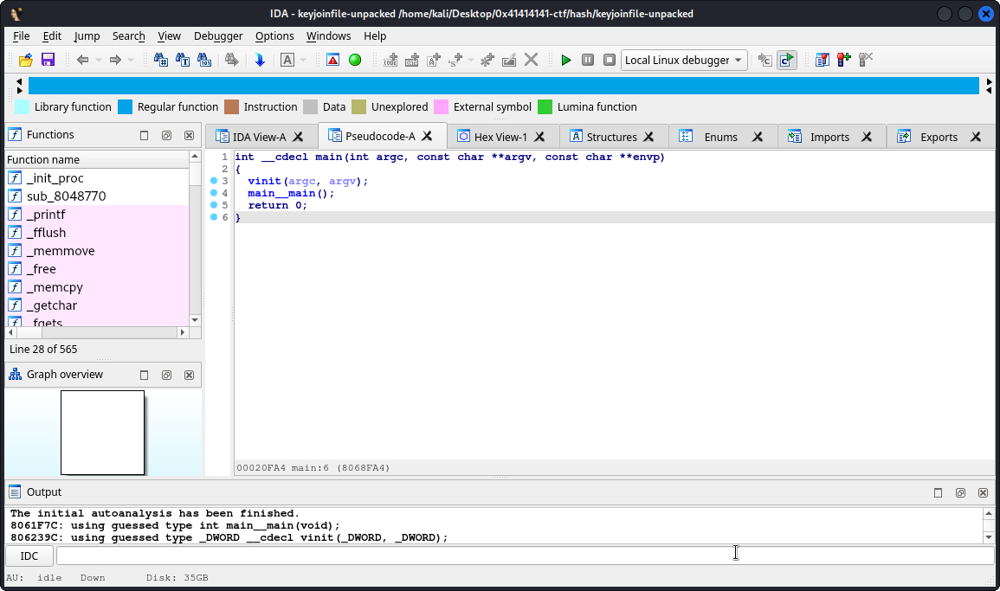
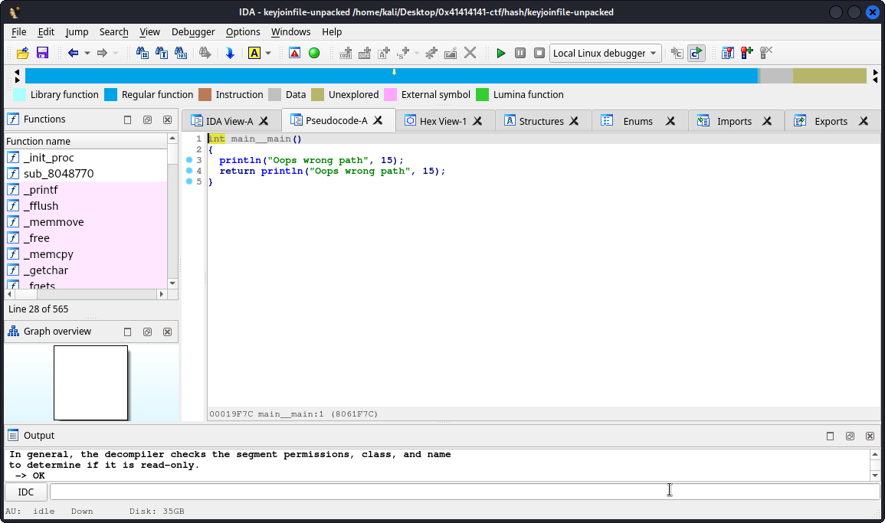
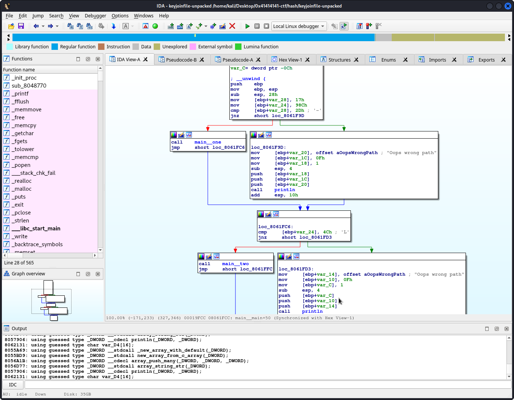
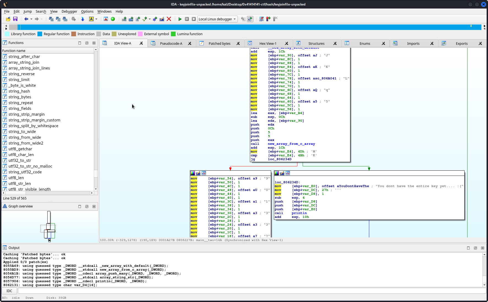

# Hash

> I received a corrupted program the keys are probably lost within the game can you just find it for me to get the flag?.

> Flag format: `flag{key1+key2}`

It's not immediately clear to me what the given file does, but it's an executable:

```
$ ./keyjoinfile 
Oops wrong path
Oops wrong path

$ file keyjoinfile               
keyjoinfile: ELF 32-bit LSB executable, Intel 80386, version 1 (GNU/Linux), statically linked, no section header
```

From the `strings` result, I figured out the executable was packed using UPX. I used `upx -d` to unpack the executable, and then checked it out in IDA.

Something strange is going on (in the pseudocode-view):





However, the pseudocode view is hiding some complexity in this `main__main` function. It hides the existence of `main__one` and `main__two` simply because it is never called.



I patched the program (In IDA that's *Edit > Patch Bytes*) so that the hidden branch of `main__main` gets called (= patching it so that the `cmp` operation returns 1). This trick was repeated within `main_one` itself it seems, so I patched it again. 

Now, executing the program yields the following:

```
$ ./keyjoinfile-unpacked 
[4, 5, 6, 7, 8, 9]
Oops wrong path
```

Let's assume this is the first *key*.

Then, I started from the original program again and patched it (the same tricks using `cmp` calls were used again) towards executing `main_two`. Within `main_two`, again there is a similar trick, but using `gt` instead of `cmp` this time. Then executing the patched program gave me the second *key*.

As an alternative to patching, reverse engineering the parts of the code of the executable that would never execute, also shows what the key that's printed is:



That makes the flag:

```
flag{456789+JKLq59U1337}
```
