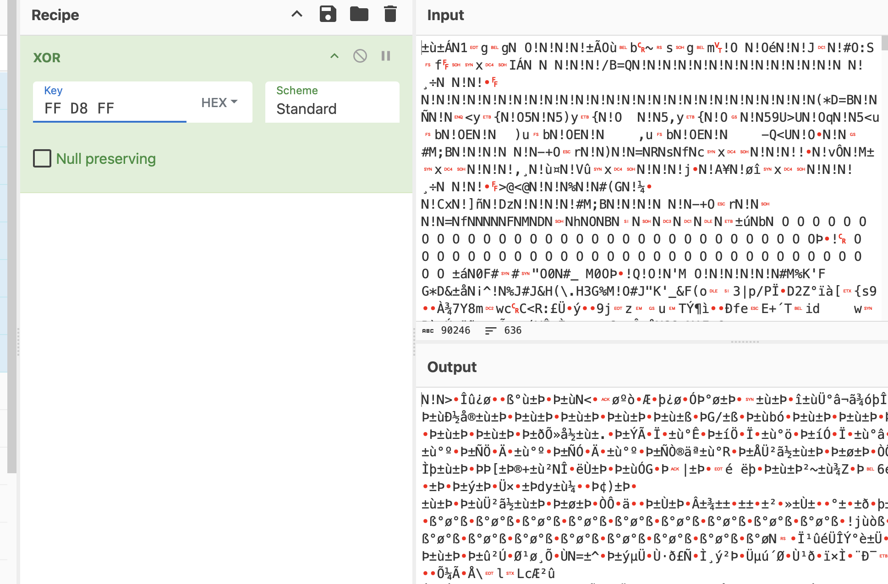
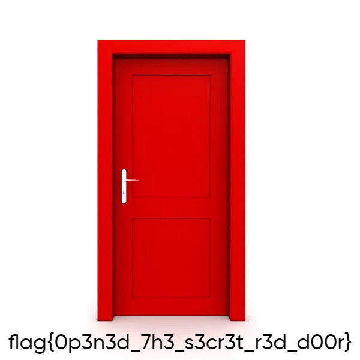

# BackdoorCTF 2023: Secret Door

> Sorry to have lost the key of the secret Gate like this... But believe me there is a way if you follow the Right Path...

Agggrh, C++ reversing... 

The following code all seems relevant for checking the given input:

```cpp
  v12[0] = 'B';
  v12[1] = 'w';
  v12[2] = 'e';
  v12[3] = 'q';
  v12[4] = '{';
  v12[5] = 'b';
  v12[6] = 'r';
  v12[7] = '}';
  v12[8] = 'w';
  v12[9] = 'Y';
  v12[10] = 's';
  v12[11] = '}';
  v12[12] = 'o';
  v12[13] = 'm';
  v12[14] = '>';
  v12[15] = '\x01';
  v12[16] = 0;
  while ( v6 <= 16 )
  {
    std::__cxx11::basic_string<char,std::char_traits<char>,std::allocator<char>>::push_back(
      v8,
      (unsigned int)(char)(LOBYTE(v12[v6]) ^ (v6 + 0x11)));
    ++v6;
  }
  std::allocator<char>::allocator(&v5);
  std::__cxx11::basic_string<char,std::char_traits<char>,std::allocator<char>>::basic_string<std::allocator<char>>(
    v9,
    "ThatsHardcoded!!!",
    &v5);
  std::allocator<char>::~allocator(&v5);
  std::__cxx11::basic_string<char,std::char_traits<char>,std::allocator<char>>::basic_string(v11, v9);
  std::__cxx11::basic_string<char,std::char_traits<char>,std::allocator<char>>::basic_string(v10, v8);
  func_5(v10, v11);
  std::__cxx11::basic_string<char,std::char_traits<char>,std::allocator<char>>::~basic_string(v10);
  std::__cxx11::basic_string<char,std::char_traits<char>,std::allocator<char>>::~basic_string(v11);
  v7 = (int *)operator new[](0x44uLL);
  v3 = func_4(v8, argv[1]);
  v7 = (int *)func_3(v3, v9);
  if ( (unsigned __int8)func_2(v7) )
    func_1(*v7, v7[16]);
  else
    std::operator<<<std::char_traits<char>>(&std::cout, "Wrong door");
```

After this, I'd also have to reverse `func_2`, `func_3`, ... which admittedly, do look simpler, but not dead simple. However, the very last function that executes when giving the right input is `func_1`. It takes the bytes in `encoded.bin` and creates a JPG called `the_door.jpg`. It seemingly does so by XOR decoding using only two different keys (`a1` and `a2`).

```cpp
__int64 __fastcall func_1(char a1, char a2)
{
  _BYTE *v2; // rax
  _BYTE *v3; // rax
  __int64 v4; // rbx
  const char *v5; // rsi
  char v7; // [rsp+1Bh] [rbp-485h] BYREF
  int i; // [rsp+1Ch] [rbp-484h]
  __int64 v9[2]; // [rsp+20h] [rbp-480h] BYREF
  __int64 v10[2]; // [rsp+30h] [rbp-470h] BYREF
  char v11[32]; // [rsp+40h] [rbp-460h] BYREF
  char v12[32]; // [rsp+60h] [rbp-440h] BYREF
  char v13[512]; // [rsp+80h] [rbp-420h] BYREF
  char v14[520]; // [rsp+280h] [rbp-220h] BYREF
  unsigned __int64 v15; // [rsp+488h] [rbp-18h]

  v15 = __readfsqword(0x28u);
  std::allocator<char>::allocator(v11);
  std::__cxx11::basic_string<char,std::char_traits<char>,std::allocator<char>>::basic_string<std::allocator<char>>(
    v12,
    "encoded.bin",
    v11);
  std::allocator<char>::~allocator(v11);
  std::basic_ifstream<char,std::char_traits<char>>::basic_ifstream(v14, v12, 4LL);
  std::allocator<char>::allocator(&v7);
  std::istreambuf_iterator<char,std::char_traits<char>>::istreambuf_iterator(v10);
  std::istreambuf_iterator<char,std::char_traits<char>>::istreambuf_iterator(v9, v14);
  std::vector<char,std::allocator<char>>::vector<std::istreambuf_iterator<char,std::char_traits<char>>,void>(
    v11,
    v9[0],
    v9[1],
    v10[0],
    v10[1],
    &v7);
  std::allocator<char>::~allocator(&v7);
  for ( i = 0; i <= 90245; ++i )
  {
    if ( (i & 1) != 0 )
    {
      v3 = (_BYTE *)std::vector<char,std::allocator<char>>::operator[](v11, i);
      *v3 ^= a2;
    }
    else
    {
      v2 = (_BYTE *)std::vector<char,std::allocator<char>>::operator[](v11, i);
      *v2 ^= a1;
    }
  }
  std::basic_ofstream<char,std::char_traits<char>>::basic_ofstream(v13, "the_door.jpg", 4LL);
  v4 = std::vector<char,std::allocator<char>>::size(v11);
  v5 = (const char *)std::vector<char,std::allocator<char>>::data(v11);
  std::ostream::write((std::ostream *)v13, v5, v4);
  std::basic_ofstream<char,std::char_traits<char>>::close(v13);
  std::basic_ofstream<char,std::char_traits<char>>::~basic_ofstream(v13);
  std::vector<char,std::allocator<char>>::~vector(v11);
  std::basic_ifstream<char,std::char_traits<char>>::~basic_ifstream(v14);
  std::__cxx11::basic_string<char,std::char_traits<char>,std::allocator<char>>::~basic_string(v12);
  return 0LL;
}
```

Given the [magic number](https://en.wikipedia.org/wiki/List_of_file_signatures) of JPG files, I might be able to figure out `a1` and `a2` without having to understand all code leading up to the `func_1` call... I used CyberChef to do the XOR operation. 



If I'm right, it looks like the bytes used to XOR are `N!`. And indeed, decoding with this key gives me the following image:



