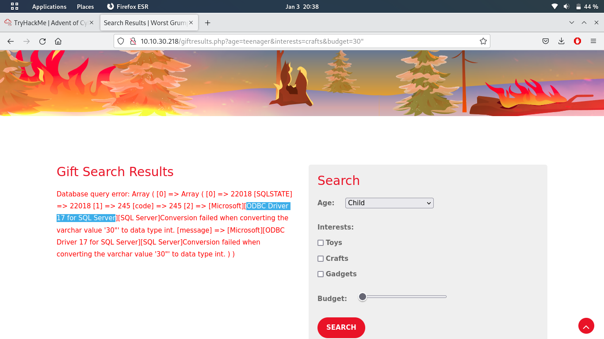
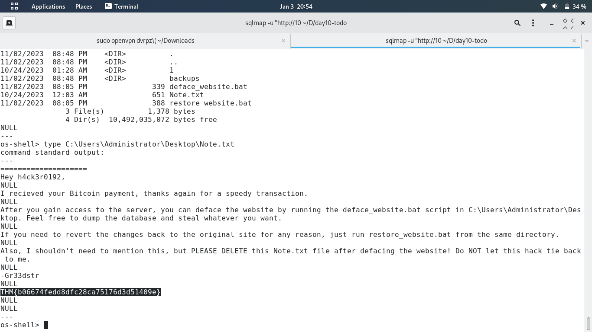
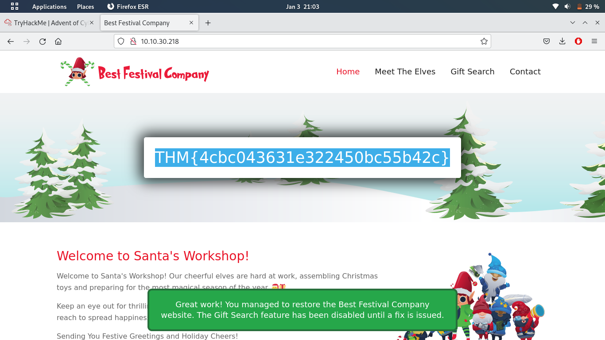

# Day 10:  Inject the Halls with EXEC Queries

* **Manually navigate the defaced website to find the vulnerable search form. What is the first webpage you come across that contains the gift-finding feature?** `giftsearch.php`

* **Analyze the SQL error message that is returned. What ODBC Driver is being used in the back end of the website?**

* **Inject the 1=1 condition into the Gift Search form. What is the last result returned in the database?** `THM{a4ffc901c27fb89efe3c31642ece4447}`. I made this one quite easy by using SQLMap instead. (First get the database and table names using `--dbs` and `--tables`, then `--dump` the gifts table.)

* **What flag is in the note file Gr33dstr left behind on the system?** As SQLMap had already found the injection, simply calling `--os-shell`  got me a reverse shell. This is why I chose SQLMap: it's a lot easier than setting up the payload and a server myself.

* **What is the flag you receive on the homepage after restoring the website?** I noticed a `deface_website.bat` and `restore_website.bat` in the administrator' Desktop folder. By executing this, my reverse shell dropped out, but the website seems to be restored:

