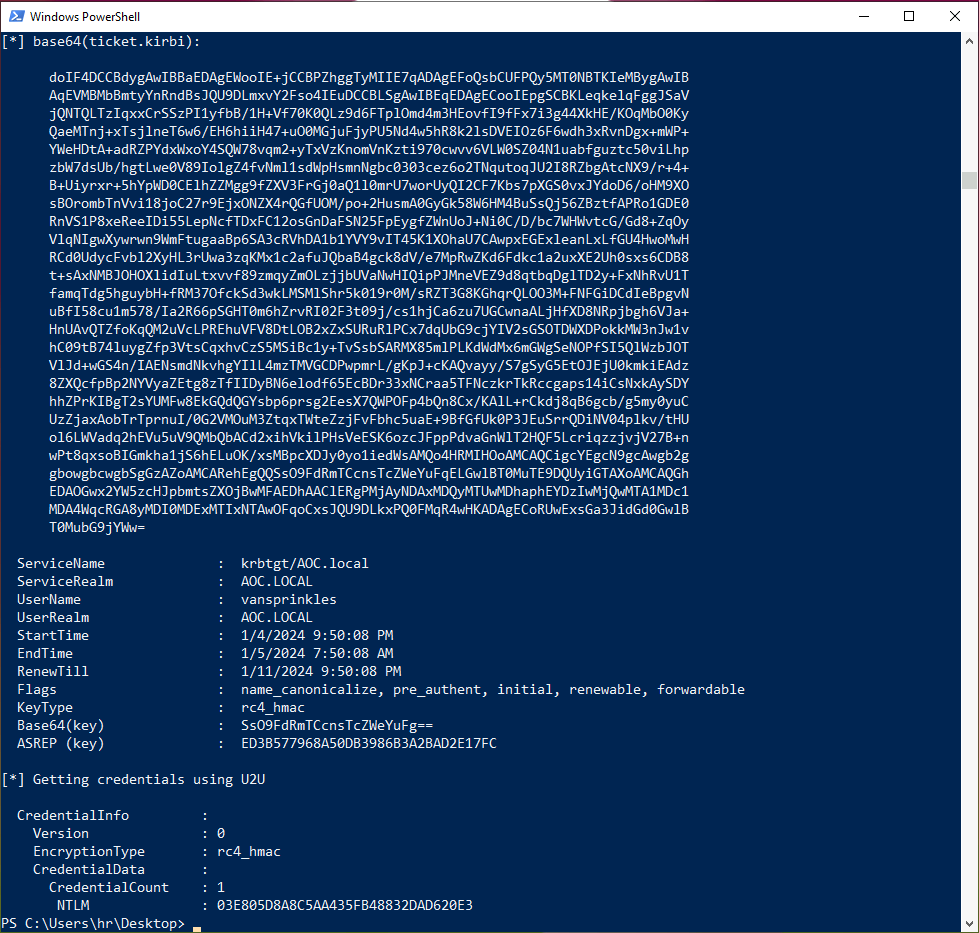
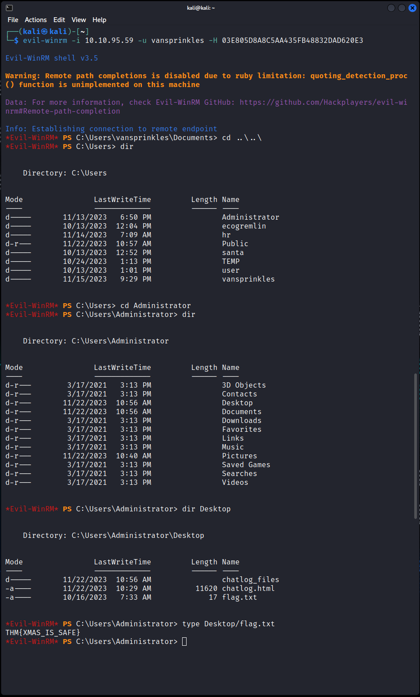

# Day 11:  Jingle Bells, Shadow Spells

Everything for this question about Active Directory exploitation is exactly like the THM guide, except that, in the challenge the vulnerable user is `vansprinkles`, not `Administrator`.

* **What is the hash of the vulnerable user?** `03E805D8A8C5AA435FB48832DAD620E3`
* **What is the content of flag.txt on the Administrator Desktop?** `THM{XMAS_IS_SAFE}`

