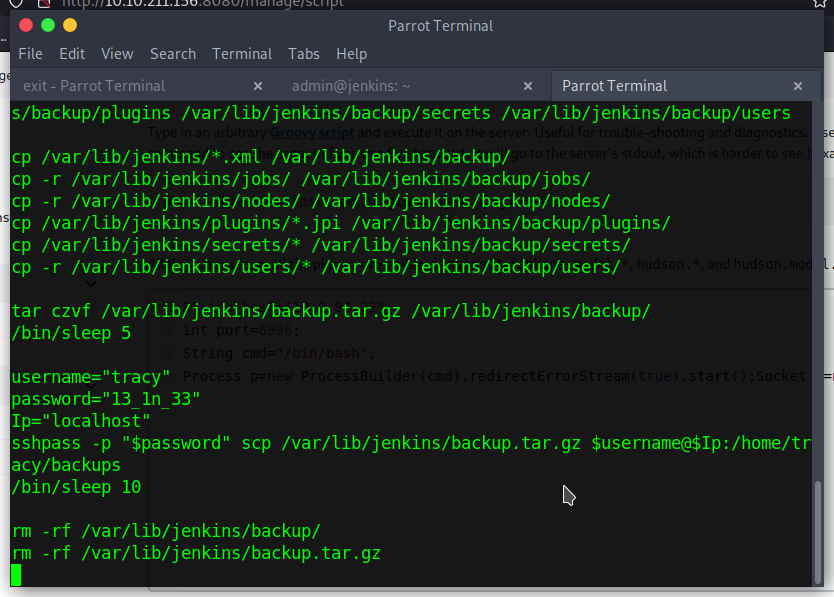
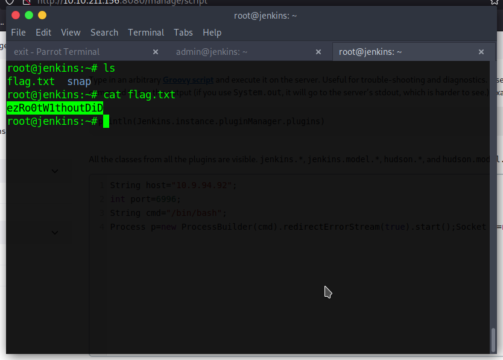
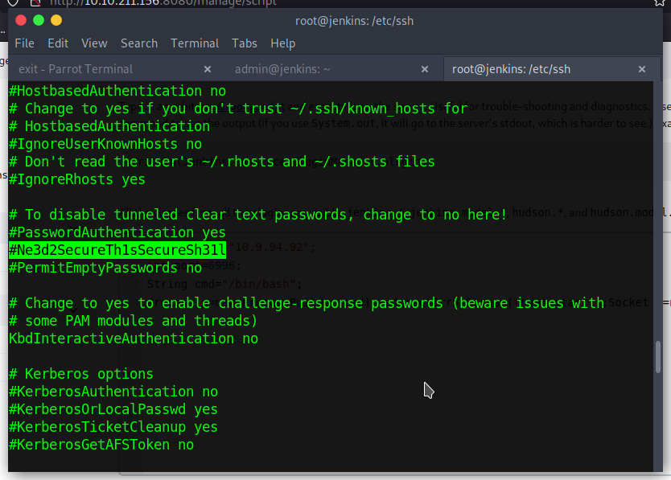
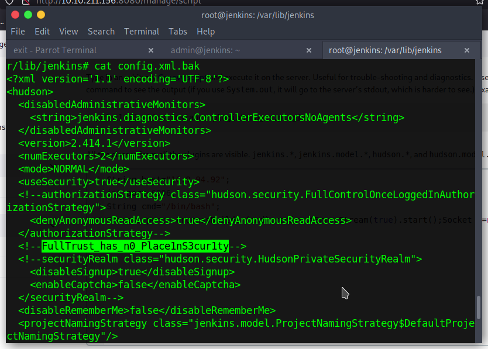

# Day 12: Sleighing Threats, One Layer at a Time

Entry to the machine is straightforward when exactly following the walkthrough text. Then, it takes some digging around on the machine to find all the flags. Annoyingly, a grep-search didn't work because the flags don't have the typical `THM{ .. }` format.

* **What is the default port for Jenkins?** 8080
* **What is the password of the user tracy?** `13_1n_33`

* **What's the root flag?** `ezRo0tW1thoutDiD`

* **What is the error message when you login as tracy again and try `sudo -l` after its removal from the sudoers group?** `Sorry, tracy may not run sudo on jenkins`

* **What's the SSH flag?** `Ne3d2SecureTh1sSecureSh31l`

* **What's the Jenkins flag?** `FullTrust_has_n0_Place1nS3cur1ty`

