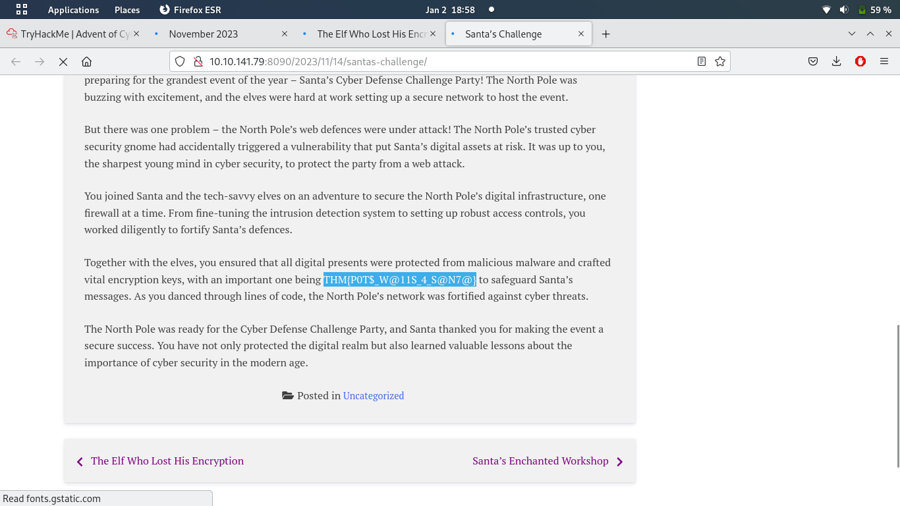

# Day 13: To the Pots, Through the Walls

* **Which security model is being used to analyse the breach and defence strategies?** Diamond Model
* **Which defence capability is used to actively search for signs of malicious activity?** Threat Hunting
* **What are our main two infrastructure focuses?** firewalls and honeypots
* **Which firewall command is used to block traffic?** deny
* **There is a flag in one of the stories. Can you find it?** I logged into the machine with SSH, and edited `Van_Twinkle_rules.sh` using `sudo vim`. I simply changed every `deny` to `allow`. Then, after executing the script, the web server at port 8090 became accessible. It had the following flag in a blog post:

