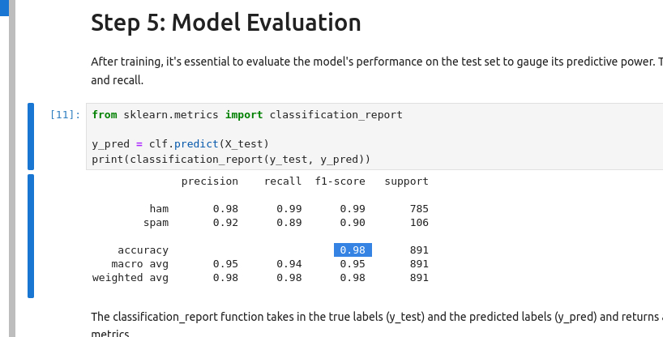
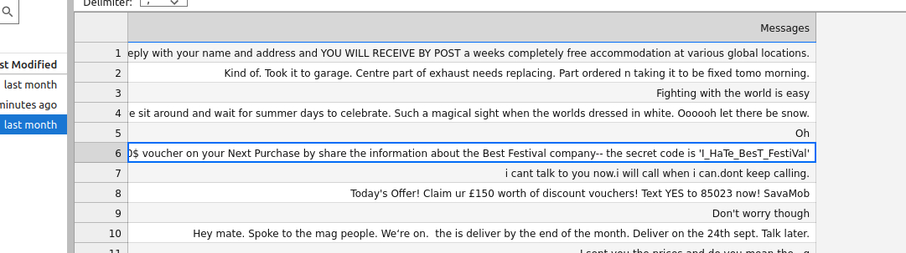

# Day 15: Jingle Bell SPAM: Machine Learning Saves the Day!

I just followed the walkthrough. All the code is already there, except for the one csv-file you have to enter.

* **What is the key first step in the Machine Learning pipeline?** Data collection.
* **Which data preprocessing feature is used to create new features or modify existing ones to improve model performance?** Feature engineering.
* **During the data splitting step, 20% of the dataset was split for testing. What is the percentage weightage avg of precision of spam detection?** 0.98

* **How many of the test emails are marked as spam?** 3.
* **One of the emails that is detected as spam contains a secret code. What is the code?** `i_hate_best_festival`

