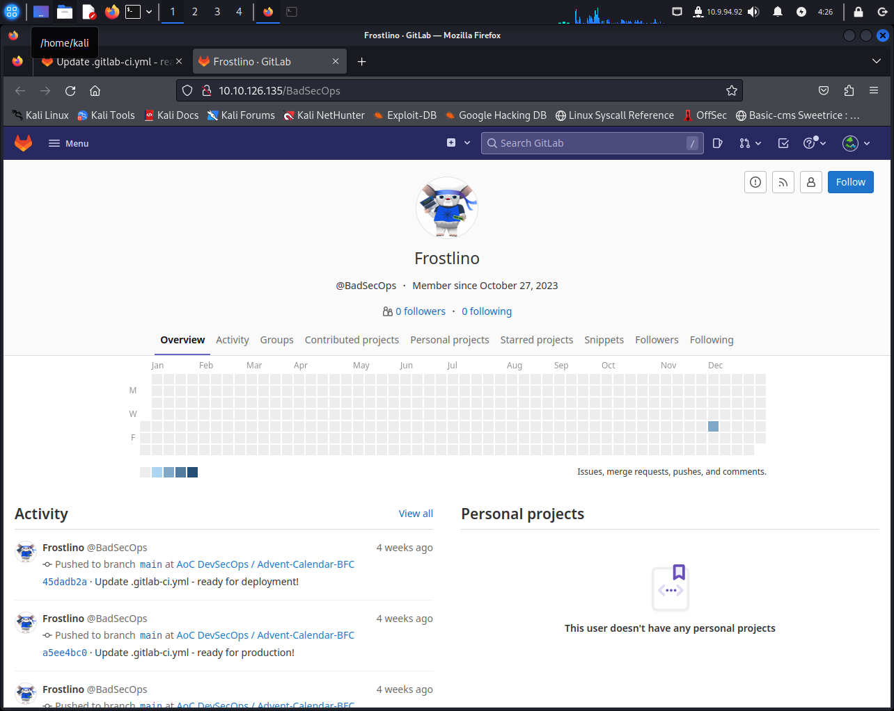
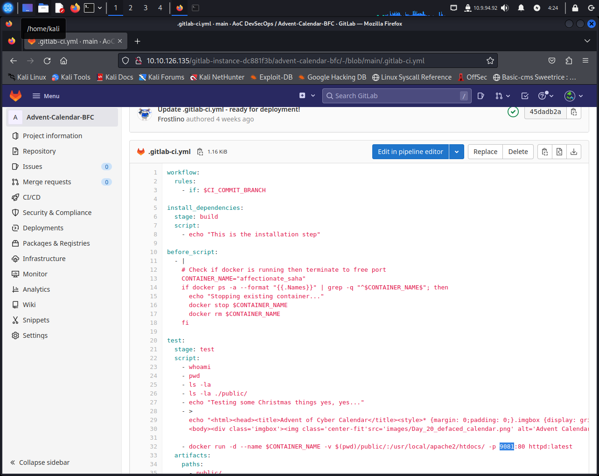
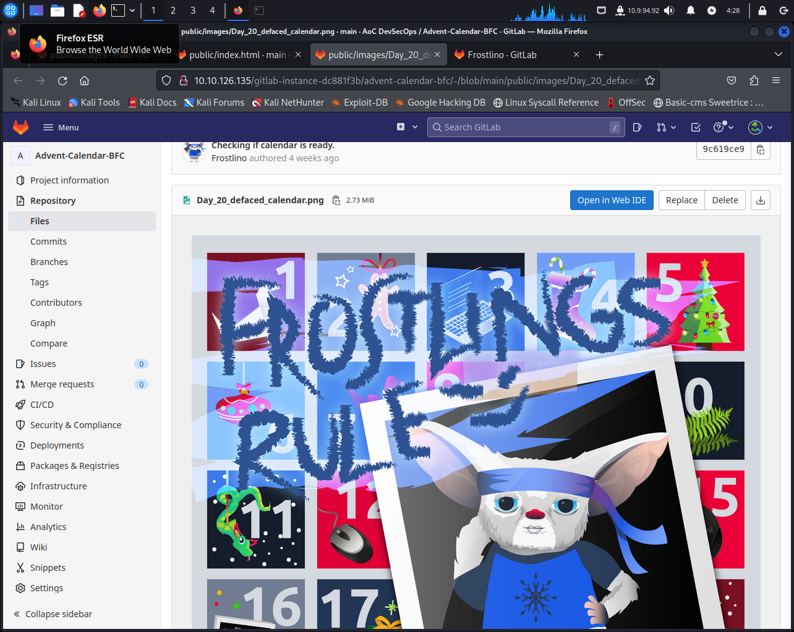
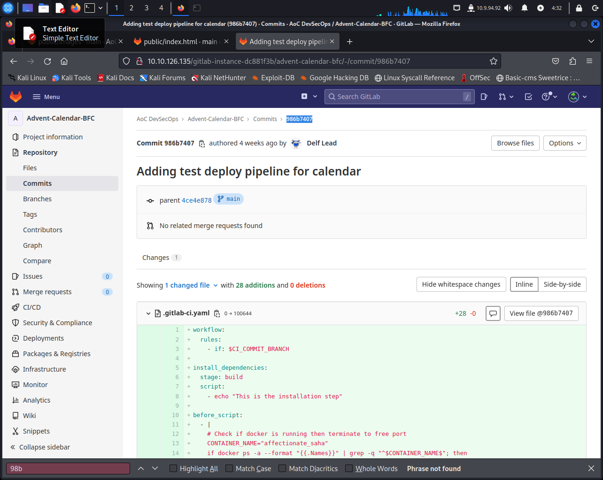

# Day 20: Advent of Frostlings

You're given a repository on GitLab and have to find out some stuff.

* **What is the handle of the developer responsible for the merge changes?** `BadSecOps`

* **What port is the defaced calendar site server running on?** `9081`
* **What server is the malicious server running on?** `apache`

* **What message did the Frostlings leave on the defaced site?** `frostlings rule`

* **What is the commit ID of the original code for the Advent Calendar site?** `986b7407`

