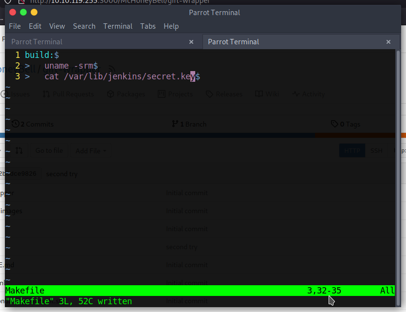

# Day 21: Yule be Poisoned: A Pipeline of Insecure Code!

The walkthrough text already showed me how to execute arbitrary commands on the server by changing the right Makefile. For answering the given questions, I made it execute the following:

* **What Linux kernel version is the Jenkins node?** `5.4.0-1029-aws`
* **What value is found from /var/lib/jenkins/secret.key?** `90e748eafdd2af4746a5ef7941e63272f24f1e33a2882f614ebfa6742e772ba7`
