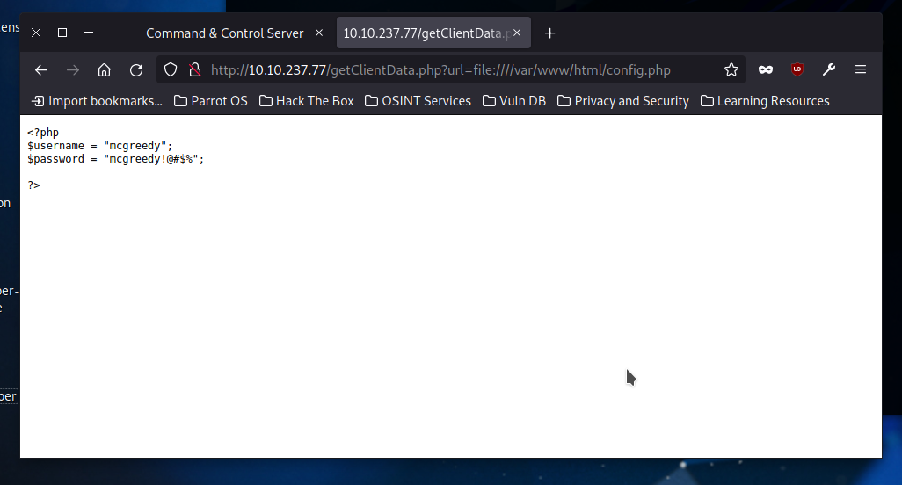

# Day 22: Jingle Your SSRF Bells: A Merry Command & Control Hackventure

Accessing files like explained in the tutorial, I first checked out `index.php`, and then found out it was `config.php` I needed:

* **Is SSRF the process in which the attacker tricks the server into loading only external resources (yea/nay)?** Nay.

* **What is the C2 version?** It's version 1.1. This is visible in the bottom right corner of the C2 panel.

* **What is the username for accessing the C2 panel?** `mcgreedy`

* **What is the flag value after accessing the C2 panel?** `THM{EXPLOITED_31001}`

* **What is the flag value after stopping the data exfiltration from the McSkidy computer?** I simply clicked the *remove* button next to *McSkidy PC*, this got me the flag `THM{AGENT_REMOVED_1001}`.

