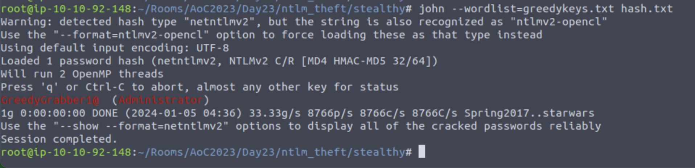
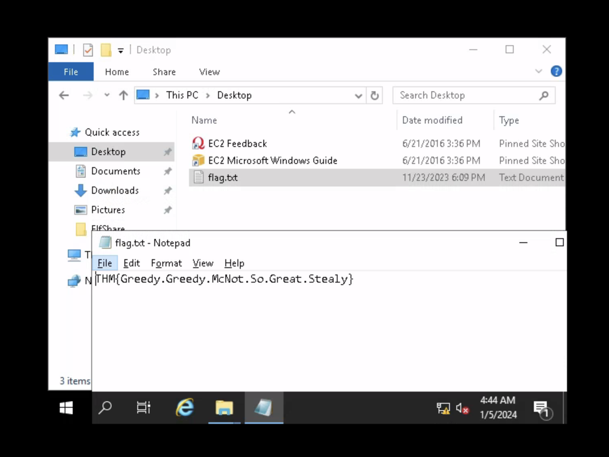

# Day 23: Relay All the Way

This is another challenge on Active Directory.

Questions 1, 2 and 3 are literally found in the given text. The fourth question is done exactly like the walkthrough text too: create a payload for your own IP, drop it on the machine, listen using responder, crack the hash using john the ripper. For the last question, I logged into the target machine with `remmina`.

* **What is the name of the AD authentication protocol that makes use of tickets?** Kerberos
* **What is the name of the AD authentication protocol that makes use of the NTLM hash?** NetNTLM
* **What is the name of the tool that can intercept these authentication challenges?** Responder
* **What is the password that McGreedy set for the Administrator account?** `GreedyGrabber1@`
* **What is the value of the flag that is placed on the Administrator’s desktop?** `THM{Greedy.Greedy.McNot.So.Great.Stealy}`

