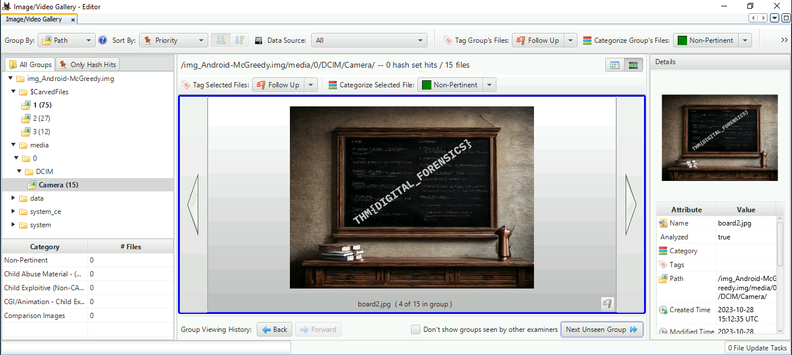
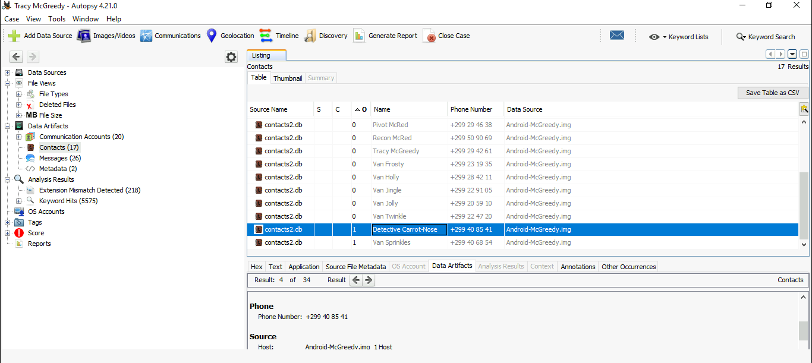
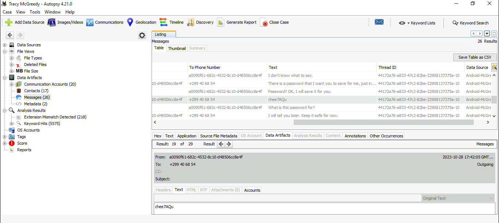

# Day 24: You Are on the Naughty List, McGreedy

This is a digital forensics challenge using the [Autopsy](https://www.autopsy.com/) tool on an Android image. They're relatively simple: (because autopsy is such a great tool!)

* **One of the photos contains a flag. What is it?** 

* **What name does Tracy use to save Detective Frost-eau’s phone number?**

* **One SMS exchanged with Van Sprinkles contains a password. What is it?**

