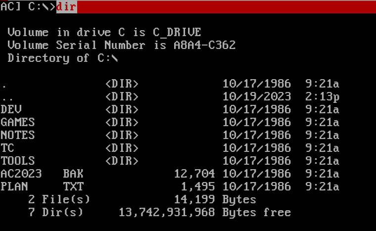
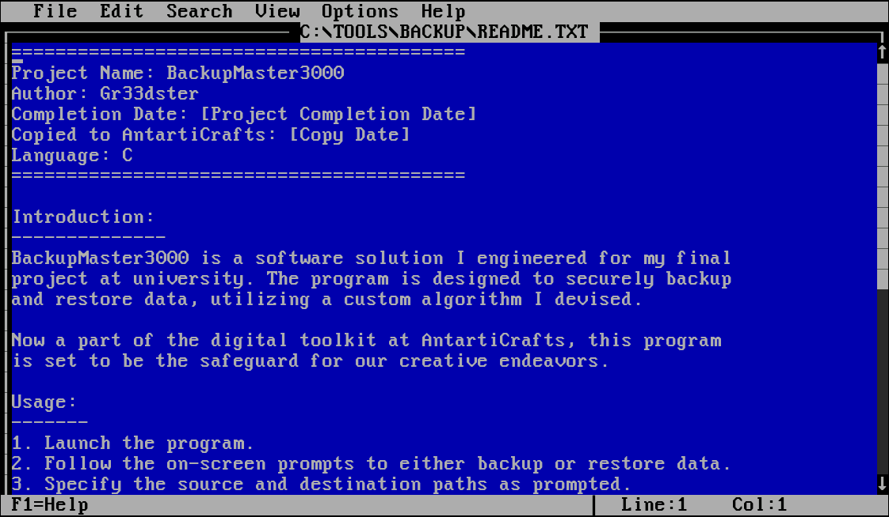
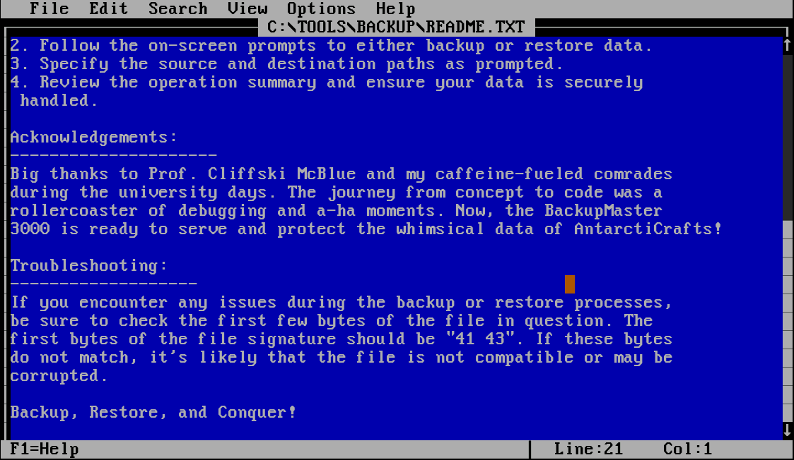

# Day 5: A Christmas DOScovery: Tapes of Yule-tide Past

This is an exercise in some basic MS-DOS commands, executed in an emulator. You're supposed to restore a back-up file using a given `.exe`. This can be done by simply calling the executable with the backup as parameter. After, you have to edit a few bytes in the file using the DOS editor. 

You can't scroll in the DOS *"terminal"*, so use `edit` (which has scrolling) instead of `type`, to read the README file.

* **How large (in bytes) is the AC2023.BAK file?** `12,704`
* **What is the name of the backup program?** `BackupMaster3000`
* **What should the correct bytes be in the backup's file signature to restore the backup properly?** `41 43`
* **What is the flag after restoring the backup successfully?** `THM{0LD_5CH00L_C00L_d00D}`
