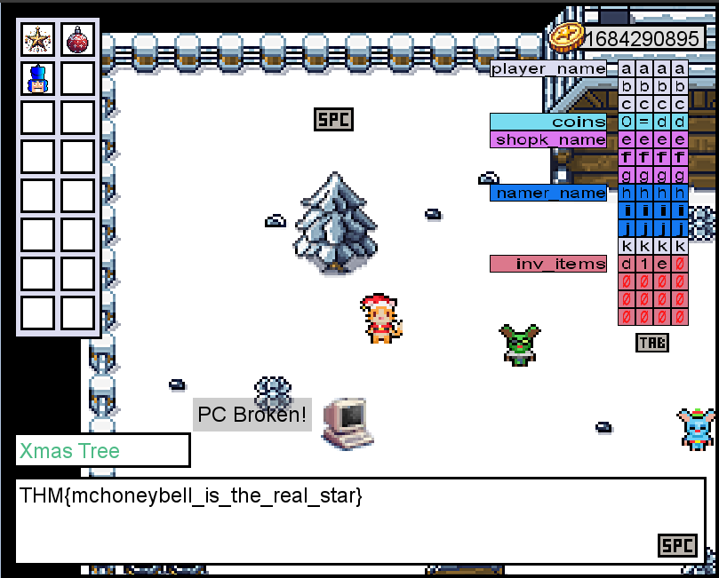

# Day 6: Memories of Christmas Past

* **If the coins variable had the in-memory value in the image below, how many coins would you have in the game?** 0x53504f4f = 1397772111.

* **What is the value of the final flag?** First get yourself 16 coins (this was annoying as it takes a while). Then go to the green figure and enter `aaaaaaaaaaaaffff` as name to get a near-infinite amount of coins. Repeat that but now enter `aaaabbbbccccddddeeeeffffgggghhhhhiiiiijjjjkkkkd` as name to overwrite the inventory. This `d` character is the ID of the star. After this, interact with the tree to get the flag

