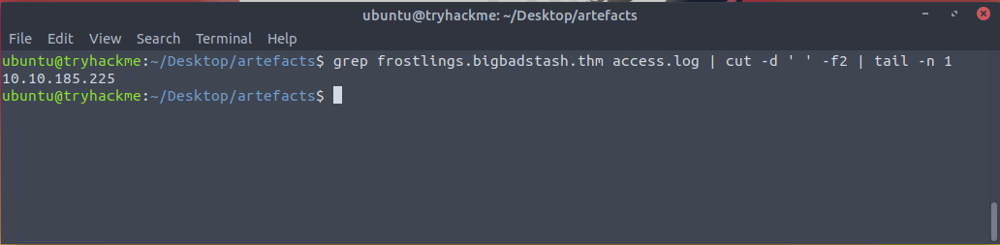

# Day 7: Log Chopping v1.0

A log file is given, and *chopping* refers to the `cut` command. The questions are exercises on `cat`, `less`, `head`, `tail`, and `wc`.

**How many unique IP addresses are connected to the proxy server?**

**How many unique domains were accessed by all workstations?**

**What status code is generated by the HTTP requests to the least accessed domain?**

**Based on the high count of connection attempts, what is the name of the suspicious domain?**

**What is the source IP of the workstation that accessed the malicious domain?**

**How many requests were made on the malicious domain in total?**

**Having retrieved the exfiltrated data, what is the hidden flag?**

