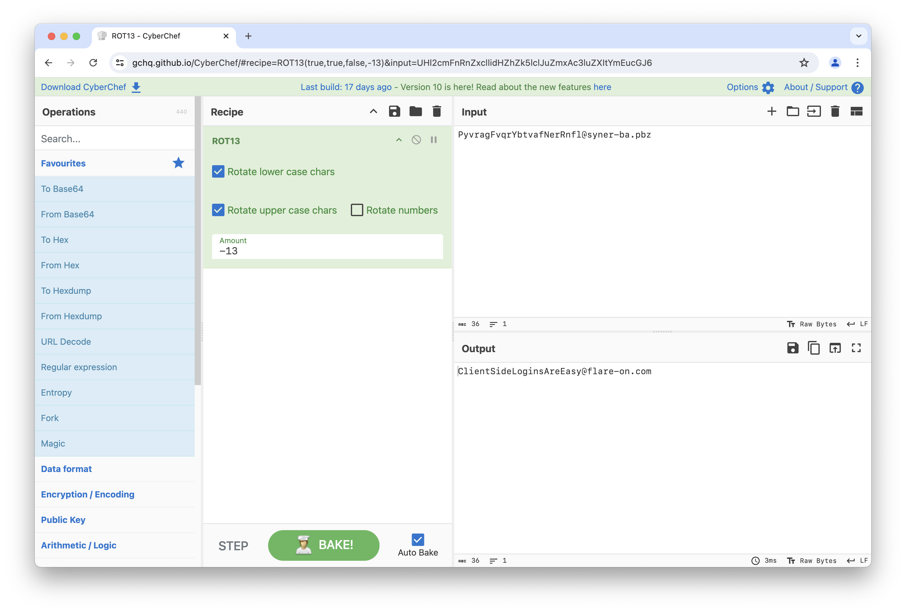

# Challenge 1: 00-login.html

The `login.html` page contains not much else than a JavaScript [ROT13](https://en.wikipedia.org/wiki/ROT13) implementation. A dead simple cipher to implement myself, but I used CyberChef. I set the `amount` in the ROT13 recipe to `-13` to invert ROT13. The result is `ClientSideLoginsAreEasy@flare-on.com`.

