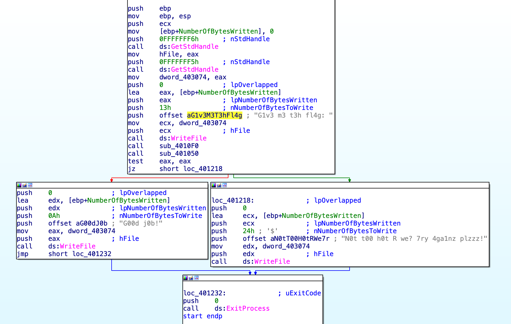
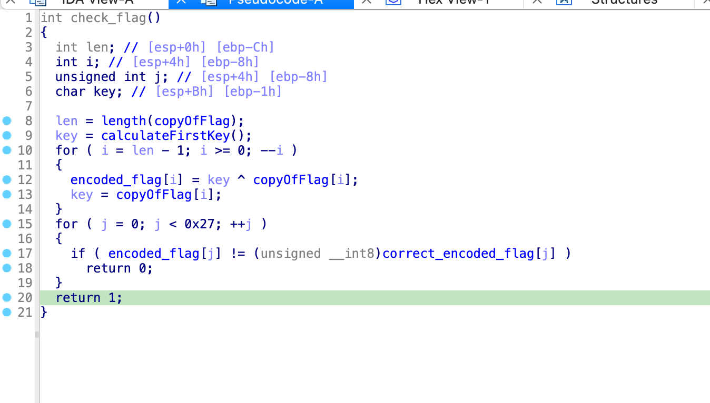
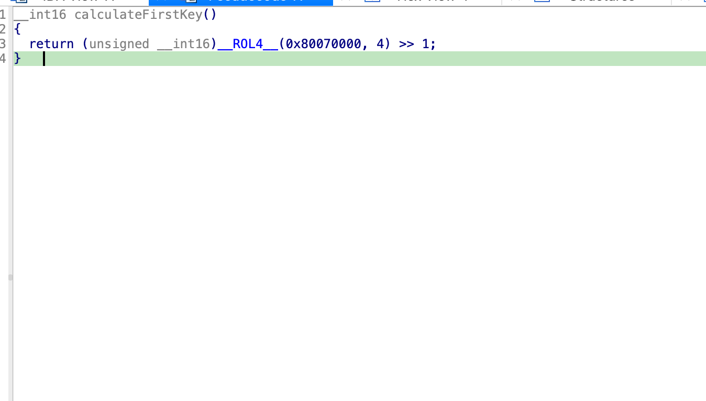

# Challenge 2: IgniteMe.exe

I've been getting into Ghidra lately, but IDA is still my tool of choice for reversing this kind of executables. I tend to open executables up in a reversing tool first, even before executing anything. The entry point is the following:

Which does the following:

1. Print `G1v3 m3 t3h fl4g:` in an alert window and play some kind of sound. See [this page](https://learn.microsoft.com/en-us/dotnet/api/system.windows.forms.accessibleobject.usestdaccessibleobjects?view=windowsdesktop-8.0) on the Microsoft documentation for the `0xFFFFFFF6` and `0xFFFFFFF5 `_StdHandle_'s.
2. Call `sub_4010F0`, with the length of the passed flag as argument. This seems to copy the given flag (until the first newline character) to a place in memory I called `copyOfFlag`.
3. Call `sub_401050` (I called this function `checkFlag`)
    - If this returns anything non-zero, write `G00d j0b!` in the same kind of alert window.
    - If this returns `0` write `N0t t00 h0t R we? 7ry 4ga1nz plzzz!` in an alert window.

So this `checkFlag` is what I decided to focus at. It contains the following XOR-based decoding procedure for a series of bytes stored in memory.

1. It computes the length of `copyOfFlag`. 
2. Executes some function without parameters to calculate a simple unsigned `__uint16`. This number is used as XOR key.
3. Does a XOR decoding of the flag in a loop, first using the key from the previous function, and then always using the previous result as key.
4. Checks this against a series of bytes in memory which I called `correct_encoded_flag`.
5. If any of the characters don't match, return 0.

The first key that's used, from step 2, is important. The following happens to calculate it:

1. Rotate 0x8007000 four steps to the left.
2. Shift it one to the right.
3. Truncate this 32-bit result to an unsigned `__int16`.

I think the result of this will be `0x4`, but I used a Python implementation of `__ROL4__` to check this (see `solution.py`).

I replicated this complete procedure in `solution.py`. The flag this script computes is `R_y0u_H0t_3n0ugH_t0_1gn1t3@flare-on.com`.
