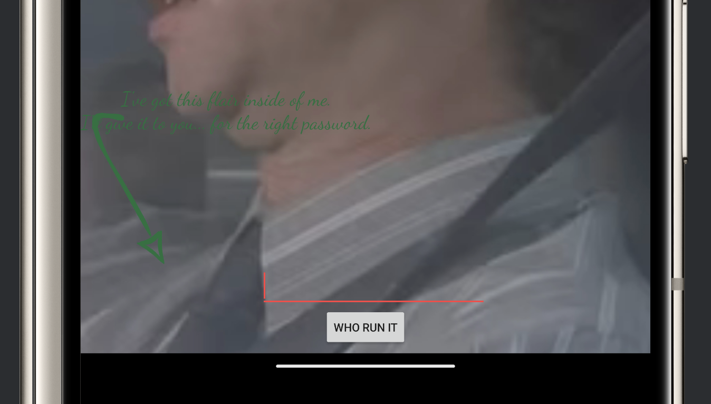
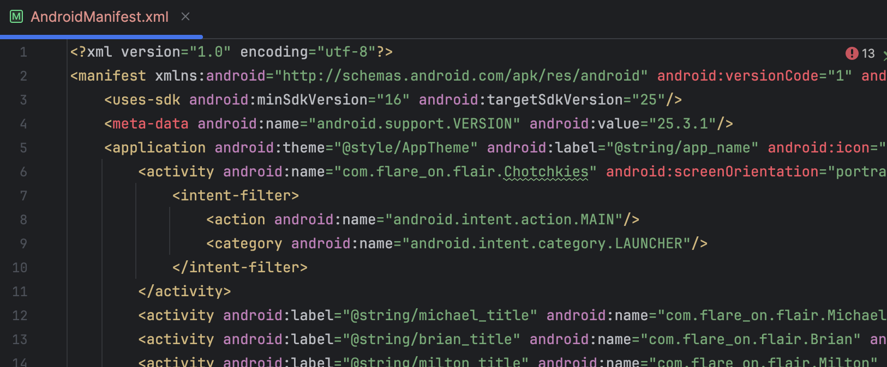

# Challenge 8: flair.apk

I started by decompiling the given APK file. For CTFs, instead of installing recent decompilers locally, I often use [online tools](https://www.decompiler.com) for this.

For actually executing the app, I could have used a save spare device, Android Studio, but I went with [Bluestacks emulation](https://www.bluestacks.com/blog/bluestacks-exclusives/install-apk-pc-en.html) now as I already had that installed.

After a quick introduction pop-up, the following password entry looks essential.



The `AndroidManifest.xml` file contains a hint for where we should start looking for relevant code.



## `Michael` class

The class called `Michael` looked the easiest to reverse engineer, and contained a function called `checkPassword`, so I considered this a good starting point.

```java
private boolean checkPassword(String pw) {
    if (pw.isEmpty() || pw.length() != 12) {
        return false;
    }
    boolean result = true;
    if (!pw.startsWith("M")) {
        result = false;
    }
    if (pw.indexOf(89) != 1) {
        result = false;
    }
    if (!pw.substring(2, 5).equals("PRS")) {
        result = false;
    }
    if (!(pw.codePointAt(5) == 72 && pw.codePointAt(6) == 69)) {
        result = false;
    }
    if (!(pw.charAt(7) == pw.charAt(8) && pw.substring(7, 9).hashCode() == 3040)) {
        result = false;
    }
    if (pw.indexOf("FT") != 9) {
        result = false;
    }
    if (pw.lastIndexOf(87) != pw.length() - 1) {
        return false;
    }
    return result;
}
```

All these if-statements are not hard to read, and clearly make up a complete password of length 12. These make the password `MYPRSHE__FTW`, which is correct. Judging by the pop-up I'm shown there are more stages coming up:


## `Brian` class

Checking out `Brain` next seemed to make sense. As the first flag was in `Michael`, I thought the name-classes were the important ones. Also, this one again looked reletively simple compared to the other names. However, I just kept in mind that there are probably more stages, so reversing this is probably useful for another one if it isn't the next.

The following two methods produce a string which is later compared with another string (probably the password, but that was a guess again):

```java
private String dfysadf(String t, int p, String c, String y) {
    return String.format("%s_%s%x_%s!", new Object[]{t, y, Integer.valueOf(p), c});
}
```

```java
private String asdjfnhaxshcvhuw(TextView d, ImageView p) {
    int a = d.getCurrentTextColor() & SupportMenu.USER_MASK;
    String z = d.getText().toString().split(" ")[4];
    try {
        return dfysadf(p.getTag().toString(), a, z, getApplicationContext().getPackageManager().getApplicationInfo(getApplicationContext().getPackageName(), 128).metaData.getString("vdf"));
    } catch (PackageManager.NameNotFoundException e) {
        e.printStackTrace();
        return null;
    }
}
```

* The current text colour of `d` is set as `@color/colorSecondary`. That's defined in `res/values/colors.xml` as `#ffc0fefe`.
* `a` becomes `d.getCurrentTextColor() & SupportMenu.USER_MASK` = `0xffc0fefe & 65535 = 0xfefe`.
* `p.getTag().toString()` becomes `hashtag` (see `activity_brian.xml`)
* `d.getText().toString()` becomes `"Shrimp Poppers or Extreme Fajitas"`, so `z` is `Fajitas`.
* `...metaData.getString("vdf")` of our application info is found in `AndroidManifest.xml`. It is `cov`.

Combining this all: I think `dfysadf` will return `hashtag_covfefe_Fajitas`. Again, I got lucky with the order as this is the next stage password.


## `Milton` class

The following part is an anti-debugger function, which I [recognised](https://developer.android.com/reference/android/content/pm/ApplicationInfo.html#FLAG_DEBUGGABLE) and then renamed:

```java
public static boolean trsbd(Context context) {
    return (context.getApplicationContext().getApplicationInfo().flags & 2) != 0;
}
```

But Bluestacks does not set this flag, only Android Studio does :) _(Even there, it's easy to put off though!

The function `drdfg` is clearly some string decoding function. It always gets called with an obfuscated base64 string and then some integer. I wrote the following Python function replicate how `drdfg` works.

```python
import base64

def drdfg(obfuscated_string, key):
    decoded = base64.b64decode(obfuscated_string) 
    result = ""
    for b in decoded:
        result += chr(b ^ key)
    return result


print(drdfg("BBcGcQ==", 69)) # "ARC4"
print(drdfg("0cLTpA==", 144)) # "ARC4"
print(drdfg("JT43W0c=", 118)) # "SHA-1"
```

Filling in these, makes the function program a lot more readable: whatever gets assigned to `this.hild` gets hashed using SHA1 and compared to the string we enter as password. Again, I can replicate `vutfs` like this, to find out what `this.hild` is:

```python
import base64
from Crypto.Cipher import ARC4

def drdfg(obfuscated_string, key):
    decoded = base64.b64decode(obfuscated_string) 
    result = bytearray()
    for b in decoded:
        result.append(b ^ key)
    return result


def vutfs(a,b,c):
    return ARC4.new(bytes(c, encoding="utf-8")).decrypt(drdfg(a,b))

print(vutfs("JP+98sTB4Zt6q8g=", 56, "State"))
print(vutfs("rh6HkuflHmw5Rw==", 96, "Chile"))
print(vutfs("+BNtTP/6", 118, "eagle"))
print(vutfs("oLLoI7X/jIp2+w==", 33, "wind"))
print(vutfs("w/MCnPD68xfjSCE=", 148, "river"))

# Result: "A rich man is nothing but a poor man with money."
```

Which, hashed using SHA1, becomes `10aea594831e0b42b956c578ef9a6d44ee39938d`. This is the next-stage password.

## `Printer` class

No more names, but `Printer` seemed obfuscated in a very similar way as the previosu function.

Again, de-obfuscating strings seems important. Now, the function `Stapler.iemm()` is used to obfuscate strings.

```python
import base64
from Crypto.Cipher import ARC4

def drdfg(obfuscated_string, key):
    decoded = base64.b64decode(obfuscated_string) 
    result = bytearray()
    for b in decoded:
        result.append(b ^ key)
    return result


def vutfs(a,b,c):
    return ARC4.new(bytes(c, encoding="utf-8")).decrypt(drdfg(a,b))

def iemm(obfuscated_string):
    alphabet_in = vutfs("Zcj30d9jroqAN2mtzayVK0awaVTLnoXVcsjl9ujUAd22JiI9xfhqEW1BbkG3LsgQRoStjh+Eb6wTD4BwD9Kypa5ggXfHLWmFjFgERViV+5IRU4RbUPDUwYTivhsdZnA=", 17, "for")
    alphabet_out = " !\"#$%&'()*+,-./0123456789:;<=>?@ABCDEFGHIJKLMNOPQRSTUVWXYZ[\\]^_`abcdefghijklmnopqrstuvwxyz{|}~"

    result = ""
    for c in obfuscated_string:
        result += alphabet_out[alphabet_in.find(c)]

    return result


print(iemm(b"Gv@H")) # tspe
print(iemm(b",e}e8yGS!8Dev)-e@")) # java.util.HashMap
print(iemm(b"vSBH")) # size
print(iemm(b"LHG")) # get
print(iemm(b",e}e8yGS!81PPe(v")) # java.util.Arrays
print(iemm(b"H?ye!v")) # equals
print(iemm(b",e}e8S98*eGeu.@yG5GPHed")) # java.io.DataInputStream
print(iemm(b"e.RP9SR8x9.GH.G8PHv81vvHG-e.eLHP")) # android.content.res.AssetManager
print(iemm(b"9@H.")) # open
print(iemm(b",e}e8S98u.@yG5GPHed")) # java.io.InputStream
print(iemm(b"PHeR")) # read
print(iemm(b"PHeRu.G")) # readInt
print(iemm(b",e}e8yGS!8Dev)-e@")) # java.util.HashMap
print(iemm(b"@yG")) # put
print(iemm(b"PHeR\"(GH")) # readByte
print(iemm(b"PHeR5)9PG")) # readShort
print(iemm(b"e.RP9SR8x9.GH.G8M9.GHkG")) # android.content.Context
print(iemm(b"e.RP9SR8x9.GH.G8@d81@@!SxeGS9.u.g9")) # android.content.pm.ApplicationInfo
print(iemm(b"g!eLv")) # flags
print(iemm(b"LHG1@@!SxeGS9.u.g9")) # getApplicationInfo
print(iemm(b"LHG1@@!SxeGS9.M9.GHkG")) # getApplicationContext
```

Filling these in, the function `wJPBw` becomes the following:

```java
private Object wJPBw(String filename) throws Exception {
    Object bytes = new byte[8];
    int i = 0;
    Class dataInputStream = Class.forName("java.io.DataInputStream");
    dataInputStreamInstance = dataInputStream.getConstructor( new Class[] { Class.forName("java.io.InputStream") }).newInstance(new Object[] {
        Class.forName("android.content.res.AssetManager")
            .getMethod("open", new Class[] { String.class })
            .invoke(getAssets(), new Object[] { filename })
        }
    );

...
```

The function does the following:
* Read the file called `tspe` from the resources directory
* Skip 8 bytes.
* Read an integer from the file and divide it by three (That's `0x144 / 3 = 0x6C = 108`, see script below.)
* Repeat the following while i <= that size:
    - Read a short A
    - Read an byte B
    - Store (A, B) in a hashmap as (key, value)
* Obtain the size of the hashmap
* Append the values of the hashmap with key 0...size to eachother as a string

Which I can, again, recreate in Python:

```python
import struct

resource_file = open("./flair/resources/assets/tspe", "rb")
resource_file_data = resource_file.read()
resource_file.close()

# ===================================================
# Find Size
# ===================================================
size = struct.unpack(">I", resource_file_data[8:12])[0]
print("Size: ", size / 3)

# ===================================================
# Create hashmap
# ===================================================
hashmap = {}
for i in range(12, 12 + size, 3):
    key, value = struct.unpack(">HB", resource_file_data[i:i + 3])
    hashmap[int(key)] = value

# ===================================================
# Appending keys
# ===================================================
print("".join([ chr(hashmap[i]) for i in range(len(hashmap)) ]))
```

This results in `Give a man a fire and he'll be warm for a day. Set a man on fire and he'll be warm for the rest of his life.`. As a last step, this is hashed using SHA1 again: `5f1be3c9b081c40ddfc4a0238156008ee71e24a4`. Entering this in the last dialog field, gets me the flag: `pc_lo4d_l3tt3r_gl1tch@flare-on.com`.
