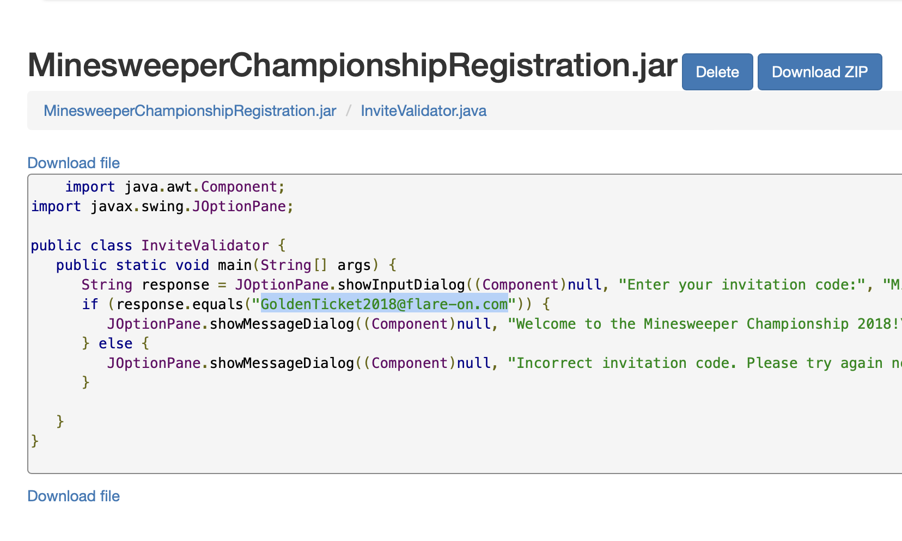

# Challenge 1: Minesweeper Championship Registration

> Welcome to the Fifth Annual Flare-On Challenge! The Minesweeper World Championship is coming soon and we found the registration app. You weren't *officially* invited but if you can figure out what the code is you can probably get in anyway. Good luck!
>
> 7zip Password: infected

The given archive contains only 1 `jar` file. I decompiled it using FernFlower, but I think any decompiler would have done the trick. The flag is inside the one short Java file:

