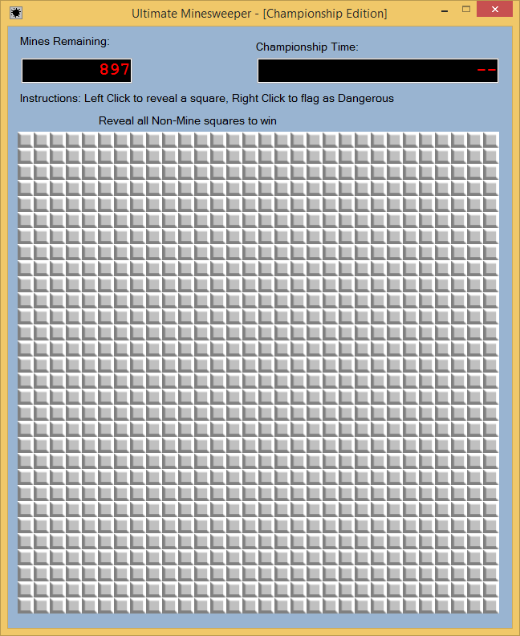
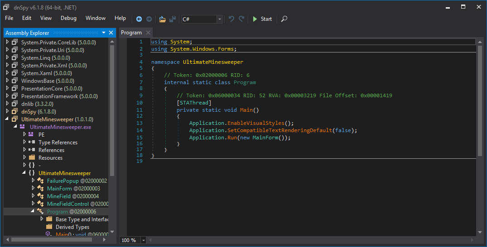
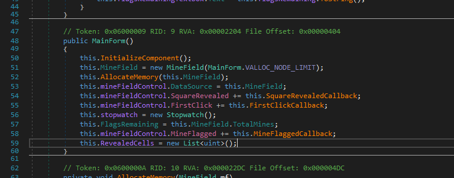
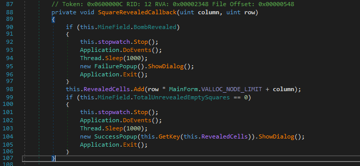
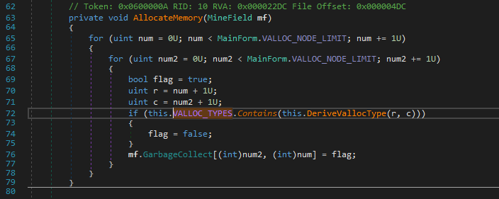
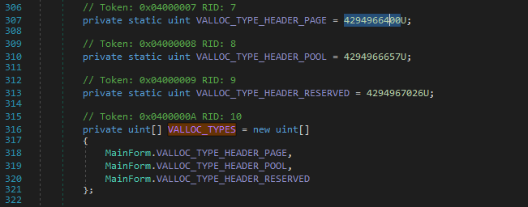
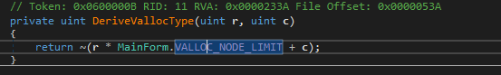
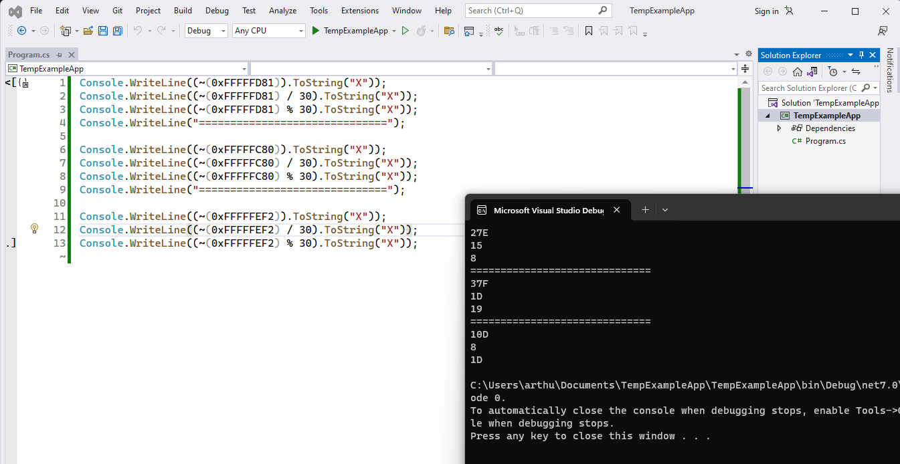

# Challenge 2: Ultimate Minesweeper

> You hacked your way into the Minesweeper Championship, good job. Now its time to compete. Here is the Ultimate Minesweeper binary. Beat it, win the championship, and we'll move you on to greater challenges.
>
> 7zip password: infected

The challenge seems to be a 30x30 minesweeper game (that's 900 squares), with 897 mines to avoid. That's not too big to brute force, but reverse engineering to find the right squares, or to find the flag immediately, will be a more elegant solution. 



As I found out it's a .NET app, my tool of choice is dnspy. The starting point of the application is this `Program` class, which immediately starts a `MainForm`. 



The `MainForm` constructor does the following:



The callback `SquareRevealedCallback` is the one that checks whether we hit a mine. Notice how a cell is represented using this `row * VALLOC_NODE_LIMIT + column` integer, with `VALLOC_NODE_LIMIT` being 30, the size of the grid.



However, which squares we must click exactly seems to be integrated in the grid, and are put there when initializing it and allocating memory:



Whether `flag = false` depends on whether the three numbers in `VALLOC_TYPES` match the calculation done by `DeriveVallocType(row, column)`. 





With that simple calculation known, and the numbers to match clearly visible in `VALLOC_TYPES`, this makes for equations we can solve:

```
4294966400 = 0xFFFFFC80 = ~0x27E = ~(0x15 * 30 + 0x8)
4294966657 = 0xFFFFFD81 = ~0x37F = ~(0x1d * 30 + 0x19)
4294967026 = 0xFFFFFEF2 = ~0x10D = ~(0x8  * 30 + 0x1d)
```

To make sure that these are correctly solved for .NET integer arithmatic, I did these calculations using a .NET script:



That means the non-mine squares, the squares a player is supposed to click, are:

* Row 21, column 8
* Row 29, column 25
* Row 8, column 29

Clicking these squares results in a new pop-up that includes a flag.


The flag indeed is `Ch3aters_Alw4ys_W1n@flare-on.com`.