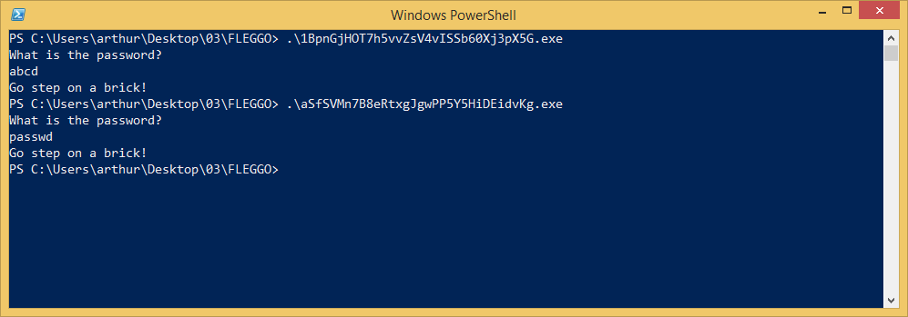
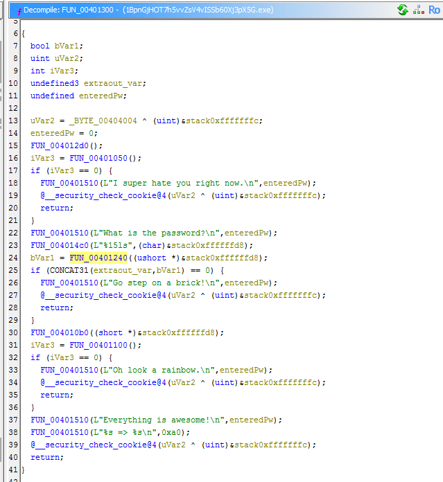
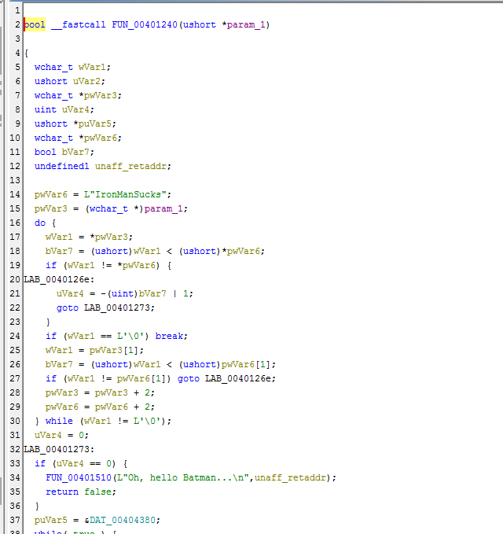
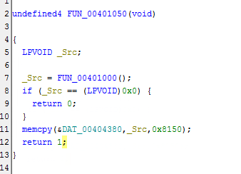
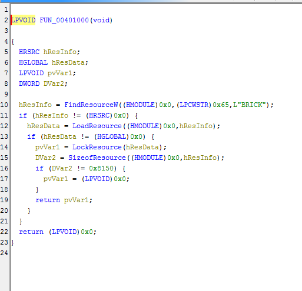
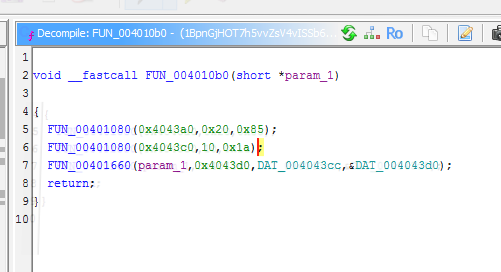
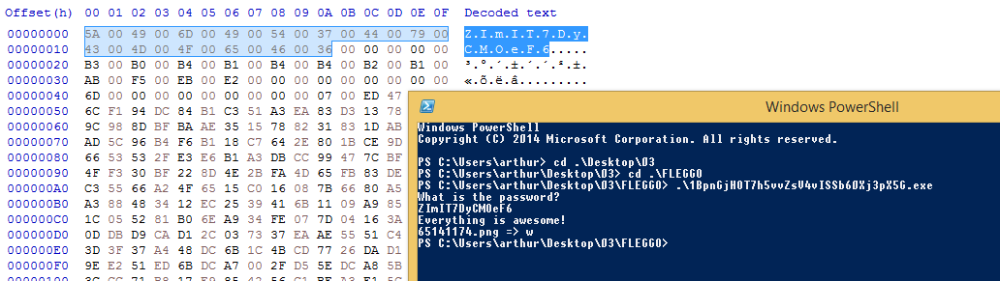
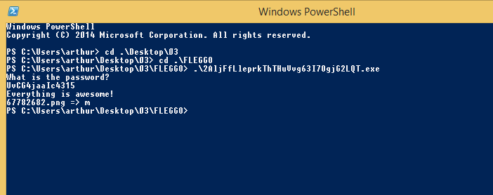
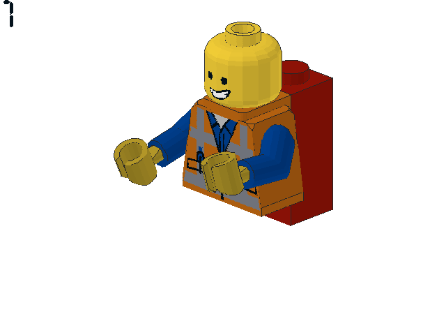
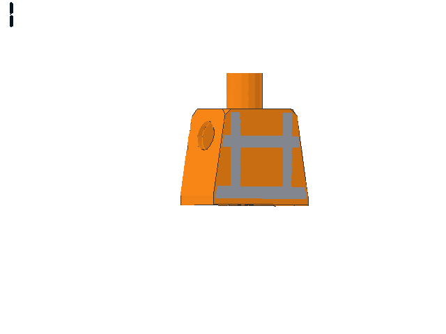

# Challenge 3: FLEGGO

> When you are finished with your media interviews and talk show appearances after that crushing victory at the Minesweeper Championship, I have another task for you. Nothing too serious, as you'll see, this one is child's play.
>
> 7zip password: infected

This zip files contains a lot of executable -- all about the same size, so I figured this challenge must be about analyzing one and then automating the others. I quickly verified all programs behave the same:

I picked the first one to analyse (`1BpnGjHOT7h5vvZsV4vISSb60Xj3pX5G.exe`), and used IDA. The important parts seem to be these functions:

The program does the following:
1. Allocate and zero out memory.
2. Read from a resource called `BRICK` and store it in this allocated memory.
3. Compare the password to `IronManSucks` and print some message about batman if this message is entered. This seems to be a decoy. (However, reading this function is important as it hides some of the other logic!)
4. Compare the given password to the first 0x20 bytes of this memory.
5. If the password matches, decrypt the next few 0x20 bytes there using a XOR with key 0x85. This result in a png file name.
6. Decrypt the next 10 bytes using the key 0x1a now. In practice, this appears to result in a single letter.
7. Decrypt the next 0x47ED bytes in the allocated memory (using an algorithm that looks like RC4?)
8. Store the bytes from step 7 as an image on the location specified in 5.
9. Print the file name and the letter from step 7.

I verified this procedure is correct by saving the BRICK resource manually (using PE studio), copying the password there and entering it: 

Notice that I did not have to analyse this program in depth like this. I would have gotten to the logical conclusion by simply finding the right password and observing the executions of the program.

The resulting image looks like this (still, this is for the first exe file!):

The second `exe` file had a different password, but a similar result:

Now, I realised what was going on completely. The number in the image is the index of the resulting letter I got, in the flag. That means I must generate all the images -- a bit much to do manually -- so indeed I decided to automate it.

I wrote the Python script in `script.py`, that does the following:

1. For every exe file:
    * Use a package called `LIEF` to inspect the resource and extract the correct password.
    * Execute the executable, passing it that password. Save the resulting character.
    * Open the resulting image file
    * Ask the user what number is in the image. *(I tried to do this using OCR but it wasn't easy, manually entering the indices seemed easier here)*. Save this index.
2. Create a the flag by putting the letters at the corresponding indices.
3. Print the flag :)

It still took a good minute of reading and typing out the digits, but this finally got me the flag: `mor3_awes0m3_th4n_an_awes0me_p0ssum@flare-on.com`.