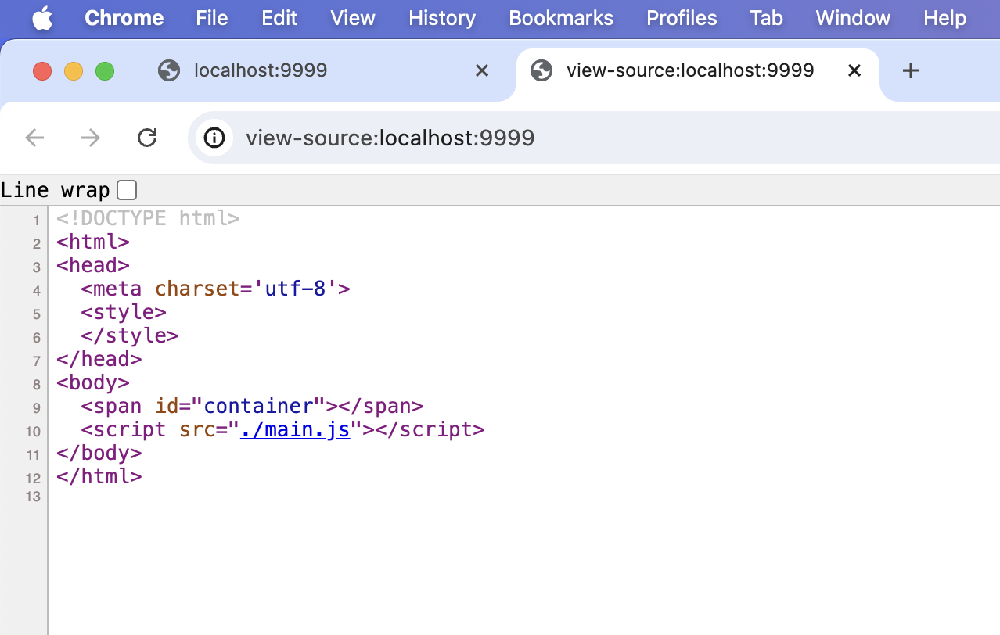
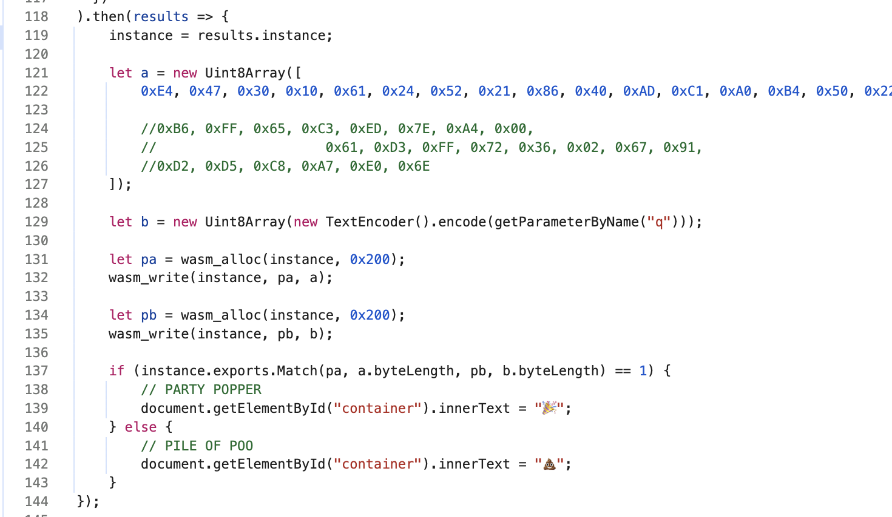
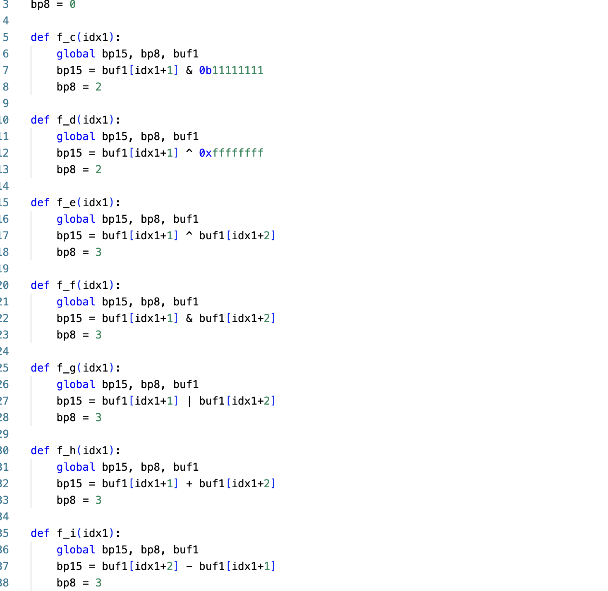
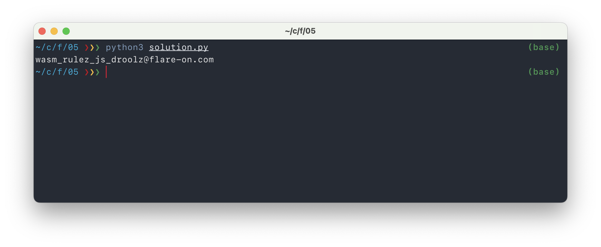

# Challenge 5: Web 2.0

> The future of the internet is here, again. This next challenge will showcase some the exciting new technologies paving the information super-highway for the next generation. 
>
> 7zip password: infected

The given web page is all about the JavaScript -- there's not much else:

Within that JavaScript file, this seems to be the most important code. There is some logic that checks the `q` URL parameter, together with a byte-array called `a`, using a procedure provided in a WebAssembly file.

That means the WebAssembly is where the logic is at. I downloaded `/test.was` and decompiled it using [wabt](https://github.com/WebAssembly/wabt). The result is saved here in `test-decompiled.c` (Note that it's not really C, just some C-like syntax). I simplified the functions in there a lot, while reimplementing them in Python. The `goto` jumps are no fun to read, but luckily the calculations in there are not terribly difficult. There are some safety assertions and checks, which I also skipped for readability.

All functions look very alike:

I simplified all of these and used them in a solver (a character-per-chareter one) instead of different functions, in `solution.py`.

