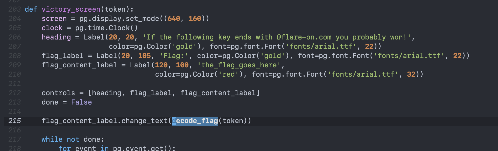
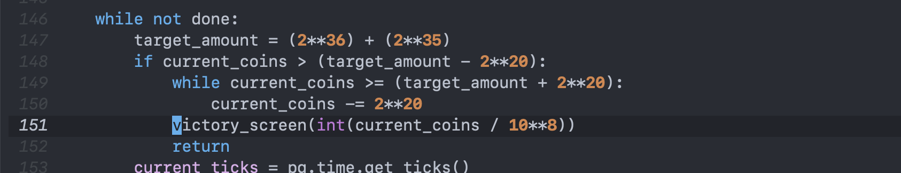
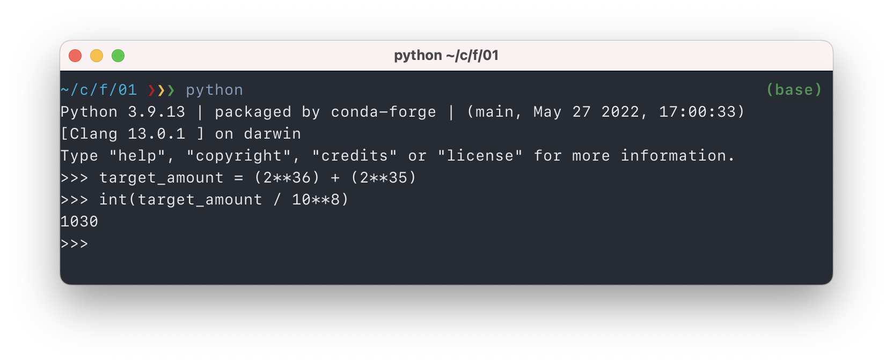

# Challenge 1: fidler.exe

> This is a simple game. Win it by any means necessary and the victory screen will
> reveal the flag. Enter the flag here on this site to score and move on to the next
> level.
>
> This challenge is written in Python and is distributed as a runnable EXE and matching
> source code for your convenience. You can run the source code directly on any Python
> platform with PyGame if you would prefer.

Before bothering to install PyGame and/or starting a VM to execute the program, I had a look at the source code. A function called `decode_flag` seems worth having a look at...


This decoding procedure does not seem that difficult, but the value of the `frob` parameter will be essential. The function is called from `victory_screen`:



So now it is the `token` parameter we are after. This `victory_screen` is only ever called from this line:



This calculation should always be the same number, or at least close. Even if the `current_coins` starts out different, the program gets it to be very close to `target_amount`... and then does a huge integer division. I think the result will always be 1030:



The value of that `frob` parameter is enough to copy the `decode_flag` function and execute it manually:

```python
def decode_flag(frob):
    last_value = frob
    encoded_flag = [1135, 1038, 1126, 1028, 1117, 1071, 1094, 1077, 1121, 1087, 1110, 1092, 1072, 1095, 1090, 1027,
                    1127, 1040, 1137, 1030, 1127, 1099, 1062, 1101, 1123, 1027, 1136, 1054]
    decoded_flag = []

    for i in range(len(encoded_flag)):
        c = encoded_flag[i]
        val = (c - ((i%2)*1 + (i%3)*2)) ^ last_value
        decoded_flag.append(val)
        last_value = c

    return ''.join([chr(x) for x in decoded_flag])


print(decode_flag(1030))
```

Executing that results in the flag: `idle_with_kitty@flare-on.com`. Didn't even have to execute the program or play the game :-)
