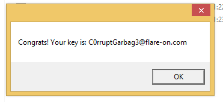

# Challenge 2: garbage.exe

> One of our team members developed a Flare-On challenge but accidentally deleted it. We recovered it using extreme digital forensic techniques but it seems to be corrupted. We would fix it but we are too busy solving today's most important information security threats affecting our global economy. You should be able to get it working again, reverse engineer it, and acquire the flag.

Opening up the given executable in PE Studio, immediately some hints show that it is packed with UPX:

However, unpacking it with UPX results in an error. That makes sense, the executable is clearly corrupted like the challenge text mentioned.

Given a corrupt executable, I usually try to work steps towards anything that will make the file execute. Whether everything still happens as it was supposed to is only my second concern. Opening up the executable in PE Explorer, there seem to be 732 bytes missing from a resource.

Updating the internal size of the resource (like PE Explorer suggests), didn't get me far. So I went with another approach: I manually added 732 missing bytes (null bytes in this case) at the end of the file (where the resource is). This is different from what PE Explorer will have attempted: this actually updates the file size, not the internal value of `SizeOfRawData`.

This did make UPX unpack the executable:

Executing this executable, however, still resulted in an error.

_(At this point, I also openend the executable in IDA, figuring I could maybe just get to the flag using the decompilation. Not much luck there; the program seems heavily obfuscated and there are still memory issues and unrecognised memory references.)_

I must admit: I don't exactly know what this error means. However, an error still being thrown makes sense: I made a resource equal to a whole lot of null bytes... I opened the unpacked executable up in PE explorer again now, simply deleted the resource, and saved a new copy of the executable.

Executing this one, another error was thrown:

I opened this up in the PE Explorer again, now checking out the DLL imports. The names of the DLL files seem missing, but the imported methods make it obvious that is should be `kernel32.dll` and `shell32.dll`. 

Apparently, this was the last problem with the file. Now, it executes and gives me the flag:

