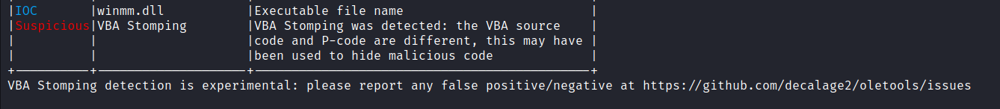

# Challenge 4: report.xls

> Nobody likes analysing infected documents, but it pays the bills. Reverse this macro thrill-ride to discover how to get it to show you the key.

I opened the given spreadsheet in OpenOffice. The typical _Please enable your macros_-scam is shown.


My usual approach is using [oletoosl](https://github.com/decalage2/oletools/wiki/olevba) (the CLI tool is called `obleva`) to extract the macros all at once. The macro editor within word is an option too, but it's a bit too easy to hide stuff in there. I stored the result here in `obleva-output.log`.

Obleva threw the following warning, which I had never seen before:



I read up on VBA stomping [here](https://medium.com/walmartglobaltech/vba-stomping-advanced-maldoc-techniques-612c484ab278). Apparently, the p-code is what it's all about, and I should ignore the plain text code. I found a tool called [pcode2code](https://github.com/Big5-sec/pcode2code) to decompile the p-code, as the p-code itself looked terrible to read. The result is stored in `pcode2code-result.log`. Apart from some decompilation artifacts, like mismatching types, the code is similar to the plain text version but there are some differences (obfuscating a next step or flag?). I decided to inspect both, including the plain text version, because this one looked more readable.


### Analysis of `Sub Workbook_Open` and `Sub Auto_Open` (in the plaintext VB)

```vb
Sub Workbook_Open()
Sheet1.folderol
End Sub

Sub Auto_Open()
Sheet1.folderol
End Sub
```

These are automatically executed when [opening the file](https://support.microsoft.com/en-us/office/automatically-run-a-macro-when-opening-a-workbook-1e55959b-e077-4c88-a696-c3017600db44). Both of these routines call the `folderol` function. 


### Analysis of `folderol` function (in the plaintext VB)

```vb
Function folderol()
    Dim wabbit() As Byte
    Dim fn As Integer: fn = FreeFile
    Dim onzo() As String
    Dim mf As String
    Dim xertz As Variant
    
    onzo = Split(F.L, ".")
    
    If GetInternetConnectedState = False Then
        MsgBox "Cannot establish Internet connection.", vbCritical, "Error"
        End
    End If

    Set fudgel = GetObject(rigmarole(onzo(7)))
    Set twattling = fudgel.ExecQuery(rigmarole(onzo(8)), , 48)
    For Each p In twattling
        Dim pos As Integer
        pos = InStr(LCase(p.Name), "vmw") + InStr(LCase(p.Name), "vmt") + InStr(LCase(p.Name), rigmarole(onzo(9)))
        If pos > 0 Then
            MsgBox rigmarole(onzo(4)), vbCritical, rigmarole(onzo(6))
            End
        End If
    Next
        
    xertz = Array(&H11, &H22, &H33, &H44, &H55, &H66, &H77, &H88, &H99, &HAA, &HBB, &HCC, &HDD, &HEE)

    wabbit = canoodle(F.T.Text, 0, 168667, xertz)
    mf = Environ(rigmarole(onzo(0))) & rigmarole(onzo(1))
    Open mf For Binary Lock Read Write As #fn
      Put #fn, , wabbit
    Close #fn
    
    mucolerd = mciSendString(rigmarole(onzo(2)) & mf, 0&, 0, 0)
End Function
```

This function:
* Checks if there's an active internet connection, terminates with a message box if there is not.
* Defines `onzo(n)` as a function to retrieve the n'th part of the `.` separated array stored in `F.L`.
* Gets an object `rigmarole(onzo(7))`.
* Executes a query `rigmarole(onzo(8))`.
* Writes a binary to disk. What it writes, seems to depend on some array, and more `rigmarole(onzo(x))` calls.
* Calls [`mciSendString`](https://learn.microsoft.com/en-us/previous-versions/dd757161(v=vs.85)).

### Analysis of `rigmarole` function (in the plaintext VB)

```vb
Function rigmarole(es As String) As String
    Dim furphy As String
    Dim c As Integer
    Dim s As String
    Dim cc As Integer
    furphy = ""
    For i = 1 To Len(es) Step 4
        c = CDec("&H" & Mid(es, i, 2))
        s = CDec("&H" & Mid(es, i + 2, 2))
        cc = c - s
        furphy = furphy + Chr(cc)
    Next i
    rigmarole = furphy
End Function
```

This is a string de-obfuscating/decoding procedure. Translated to Python, it does the following:

```py
def rigmarole(es):
furphy = ""
    for i in range(0, len(es), 4):
        c = int(es[i:i + 2], 0x10)
        s = int(es[i + 2:i + 2 + 2], 0x10)
        cc = c - s
        furphy += chr(cc)
return furphy
```

This function is consistently used on `onzo` calls (meaning parts of the `F.L` string as we previously estabished). I decoded these using this Python script, as shown in `decoding-rigmarole-script.py`. The results are:

```
rigmarole(orzo(0)) = AppData
rigmarole(orzo(1)) = \Microsoft\stomp.mp3
rigmarole(orzo(2)) = play 
rigmarole(orzo(3)) = FLARE-ON
rigmarole(orzo(4)) = Sorry, this machine is not supported.
rigmarole(orzo(5)) = FLARE-ON
rigmarole(orzo(6)) = Error
rigmarole(orzo(7)) = winmgmts:\\.\root\CIMV2
rigmarole(orzo(8)) = SELECT Name FROM Win32_Process
rigmarole(orzo(9)) = vbox
rigmarole(orzo(10)) = WScript.Network
rigmarole(orzo(11)) = \Microsoft\v.png
```

This makes the calls in `folderol` a lot more clear:

* First the program checks running process names and terminates if one of them contains `vmw`, `vmt`, or `vbox`: common anti-analysis techniques used by malware authors.
* The file being written is an `mp3` (an audio fragment).

### Analysis of `canoodle` (in the plaintext VB)

To actually recover the audio fragment, though, we need to know what `canoodle` does too. This seems to be the function that decodes the file contents itself.

```vb
Function canoodle(panjandrum As String, ardylo As Integer, s As Long, bibble As Variant) As Byte()
    Dim quean As Long
    Dim cattywampus As Long
    Dim kerfuffle() As Byte
    ReDim kerfuffle(s)
    quean = 0
    For cattywampus = 1 To Len(panjandrum) Step 4
        kerfuffle(quean) = CByte("&H" & Mid(panjandrum, cattywampus + ardylo, 2)) Xor bibble(quean Mod (UBound(bibble) + 1))
        quean = quean + 1
        If quean = UBound(kerfuffle) Then
            Exit For
        End If
    Next cattywampus
    canoodle = kerfuffle
End Function
```

God, VB isn't fun to read, but this translates to the following Python:

```py
def canoodle(panjandrum, arylo, s, bibble):
    kerfuffle = bytearray()
    quean = 0
    for cattywampus in range(0, len(panjandrum), 4):
        kerfuffle.append(int(panjandrum[cattywampus + arylo:cattywampus + arylo + 2], 0x10) ^ bibble[quean % len(bibble)])
        quean += 1
        if quean == s:
            break
    return kerfuffle
```

Now, using this function and the insights gained, I replicated the part of `folderol` that decodes and saves the mp3. This code is in `decoding-mp3-script.py`. The resulting mp3 file contains a hint in the title:


This makes sense... because now we should check out what the p-code actually says. We knew the plain text VB script was a decoy.

### The p-code

The differences with the decompiled p-code are:

* Some decompilation artifacts, like misrecognised types (byte's instead of byte-arrays, for example). I noticed those before, they're not really relevant as long as we keep in mind the type that was originally there :)
* A following code invereses the string `FLARE-ON`:

    ```vb
    n = Len(firkin)
    For i = 1 To n
        buff(n - i) = Asc(Mid$(firkin, i, 1))
    Next
    ```

    Which then acts as the last parameter to `canoodle` (instead of the xertz array we had).

* The second and third arguments to `canoodle` are also different: now it's `2` and `285729`.
* We now use a `png` file name to save the result.

Again, this is replicated in Python, now in `decoding-png-script.py`. And yes, this does generate an image, which contains the flag:

