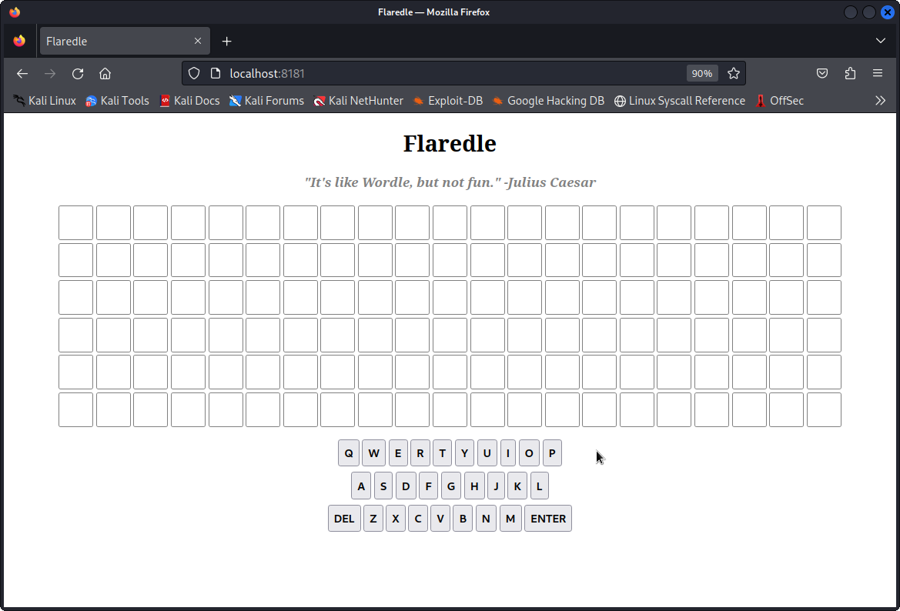

# Challenge 1: Flaredle

The files in the given zip are a website. I used the following command to start a simple HTTP server using PHP:

```
$ php -S localhost:8181
```

Opening this up in a browser reveals a simple guessing game:



The first few lines of the source code immediately reveal which one of the words in `words.js` is the winning one.

```js
import { WORDS } from "./words.js";

const NUMBER_OF_GUESSES = 6;
const WORD_LENGTH = 21;
const CORRECT_GUESS = 57;
let guessesRemaining = NUMBER_OF_GUESSES;
let currentGuess = [];
let nextLetter = 0;
let rightGuessString = WORDS[CORRECT_GUESS];
```

That word at index 57 is `flareonisallaboutcats`. Entering this, you get a pop-up with the flag, `flareonisallaboutcats@flare-on.com`.
