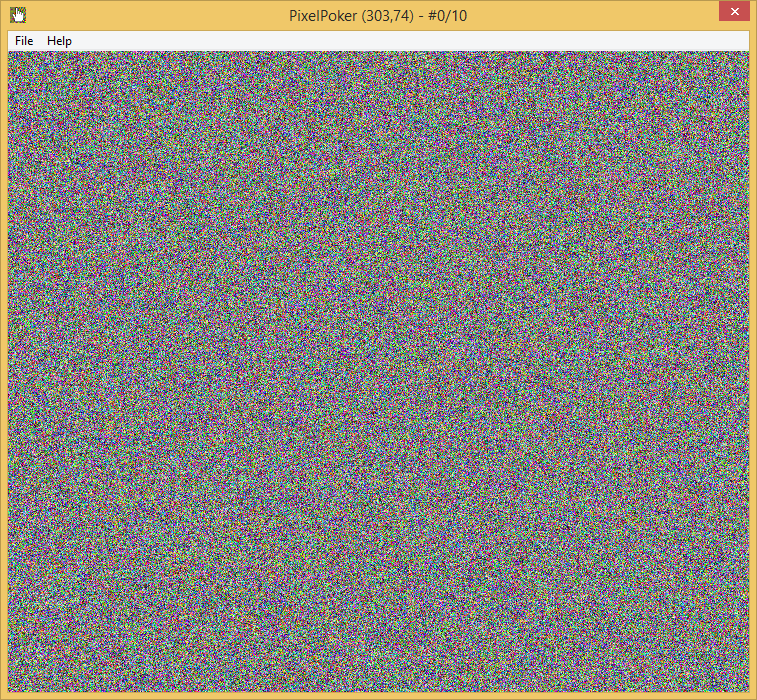
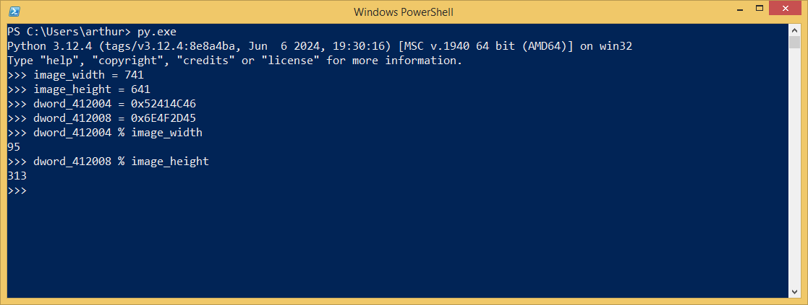
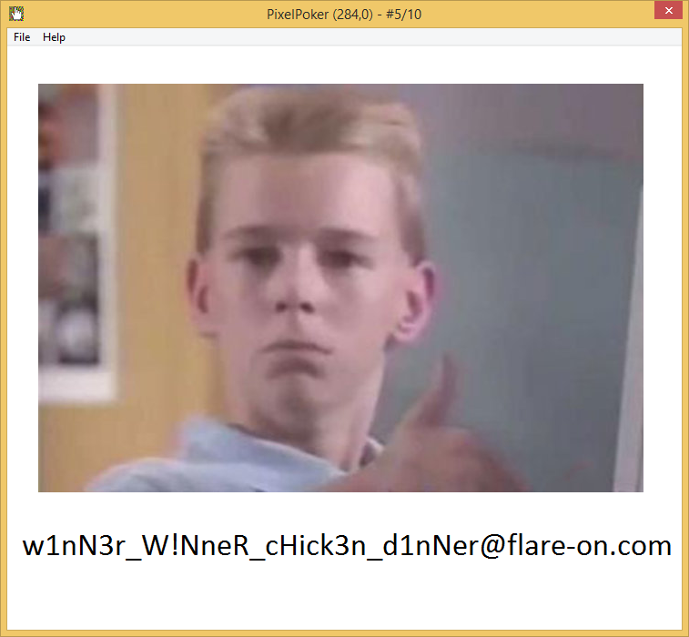

# Challenge 2: Pixel Poker

> Welcome to PixelPoker ^_^, the pixel game that's sweeping the nation!
>
> Your goal is simple: find the correct pixel and click it
>
> Good luck!

The game looks like this:



My first thought is that there aren't that much pixels... brute forcing might be an option.
I first opened the executable in a reversing tool though, I figured I could try to find out which pixel to click too.

IDA drops me into the following function as an entry point:

```c
int __stdcall wWinMain(HINSTANCE hInstance, HINSTANCE hPrevInstance, LPWSTR lpCmdLine, int nShowCmd)
{
  int result; // eax
  struct tagMSG Msg; // [esp+8h] [ebp-1Ch] BYREF
  HACCEL hInstancea; // [esp+2Ch] [ebp+8h]

  h = LoadImageW(hInstance, (LPCWSTR)0x81, 0, 0, 0, 0x2000u);
  LoadStringW(hInstance, 0x67u, &Buffer, 100);
  LoadStringW(hInstance, 0x6Du, &ClassName, 100);
  sub_401120(hInstance);
  result = sub_401040(hInstance, nShowCmd);
  if ( result )
  {
    hInstancea = LoadAcceleratorsW(hInstance, (LPCWSTR)0x6D);
    while ( GetMessageW(&Msg, 0, 0, 0) )
    {
      if ( !TranslateAcceleratorW(Msg.hwnd, hInstancea, &Msg) )
      {
        TranslateMessage(&Msg);
        DispatchMessageW(&Msg);
      }
    }
    return Msg.wParam;
  }
  return result;
}
```

Which does the following:

* Load a resource image.
* Call `sub_401120`, a function that sets some options for, and registers, a window class. 
* Call `sub_401040`. I don't recognise everything this function does, but it does set the width and height of the window to the width and height of the image. I renamed these variables for readability. Using the debugger, I found out the values of these. The image is 741x641.
* Load an accelerator table, enter a loop that endlessly waits and shows incoming messages.


The procedure used to register a window class, `sub_401120`, contains a reference to `sub_4012C0`, the window procedure. This usually defines the behaviour of the window, so it is what I had a look at next. It contains the following:
 
 ```c 
 LRESULT __stdcall window_procedure(HWND hWnd, UINT Msg, WPARAM wParam, LPARAM lParam)
{
  HDC v4; // eax
  HDC v5; // edi
  HANDLE ProcessHeap; // eax
  int v8; // edi
  unsigned int v9; // esi
  unsigned int v10; // ecx
  int v11; // edi
  int v12; // eax
  int v13; // esi
  HDC DC; // esi
  void *v15; // [esp-4h] [ebp-150h]
  CHAR String[260]; // [esp+8h] [ebp-144h] BYREF
  struct tagPAINTSTRUCT Paint; // [esp+10Ch] [ebp-40h] BYREF

  memset(String, 0, sizeof(String));
  if ( Msg > 0x111 )
  {
    if ( Msg == 512 )
    {
      _snprintf(String, 0x104u, "PixelPoker (%d,%d) - #%d/%d", (__int16)lParam, SHIWORD(lParam), dword_413298, 10);
      SetWindowTextA(hWnd, String);
      return 0;
    }
    if ( Msg != 513 )
      return DefWindowProcW(hWnd, Msg, wParam, lParam);
    v8 = (__int16)lParam;
    if ( dword_413298 == 10 )
    {
      MessageBoxA(0, "Womp womp... :(", "Please play again!", 0);
      DestroyWindow(hWnd);
LABEL_30:
      _snprintf(String, 0x104u, "PixelPoker (%d,%d) - #%d/%d", v8, SHIWORD(lParam), dword_413298, 10);
      SetWindowTextA(hWnd, String);
      DC = GetDC(hWnd);
      BitBlt(DC, 0, 0, image_width, image_height, hdc, 0, 0, 0xCC0020u);
      ReleaseDC(hWnd, DC);
      return 0;
    }
    ++dword_413298;
    v9 = image_width;
    if ( (__int16)lParam == dword_412004 % (unsigned int)image_width )
    {
      v10 = image_height;
      if ( SHIWORD(lParam) == dword_412008 % (unsigned int)image_height )
      {
        v11 = 0;
        if ( image_height > 0 )
        {
          v12 = image_width;
          do
          {
            v13 = 0;
            if ( v12 > 0 )
            {
              do
              {
                sub_4015D0(v13, v11);
                v12 = image_width;
                ++v13;
              }
              while ( v13 < image_width );
              v10 = image_height;
            }
            ++v11;
          }
          while ( v11 < (int)v10 );
        }
        v8 = (__int16)lParam;
        goto LABEL_30;
      }
      v9 = image_width;
    }
    else
    {
      v10 = image_height;
    }
    if ( (__int16)lParam < v9 && SHIWORD(lParam) < v10 )
      sub_4015D0((__int16)lParam, SHIWORD(lParam));
    goto LABEL_30;
  }
  if ( Msg == 273 )
  {
    if ( (unsigned __int16)wParam == 104 )
    {
      DialogBoxParamW(hInstance, (LPCWSTR)0x67, hWnd, DialogFunc, 0);
      return 0;
    }
    else if ( (unsigned __int16)wParam == 105 )
    {
      DestroyWindow(hWnd);
      return 0;
    }
    else
    {
      return DefWindowProcW(hWnd, 0x111u, wParam, lParam);
    }
  }
  if ( Msg != 2 )
  {
    if ( Msg == 15 )
    {
      v4 = BeginPaint(hWnd, &Paint);
      v5 = v4;
      if ( byte_412000 )
      {
        hdc = CreateCompatibleDC(v4);
        SelectObject(hdc, h);
        byte_412000 = 0;
      }
      BitBlt(v5, 0, 0, image_width, image_height, hdc, 0, 0, 0xCC0020u);
      EndPaint(hWnd, &Paint);
      return 0;
    }
    return DefWindowProcW(hWnd, Msg, wParam, lParam);
  }
  DeleteDC(hdc);
  if ( lpMem )
  {
    v15 = lpMem;
    ProcessHeap = GetProcessHeap();
    HeapFree(ProcessHeap, 0, v15);
  }
  PostQuitMessage(0);
  return 0;
}
 ```
 
 Judging by the `"PixelPoker (%d,%d) - #%d/%d"`, it seems like the x-co and the y-co of the mouse pointer position is calculated from the upper and lower bytes of the `lParam`. I think the following if-statement is the relevant one to find out the desired coordinates:
 
 ```
 if ( (__int16)lParam == dword_412004 % (unsigned int)image_width )
    {
      v10 = image_height;
      if ( SHIWORD(lParam) == dword_412008 % (unsigned int)image_height )
	  {
```

The value of `dword_412004` is `0x52414C46`, and the value of `dword_412008` is `0x6E4F2D45`. That makes the calculation:



And indeed, clicking this pixel got me the flag:

