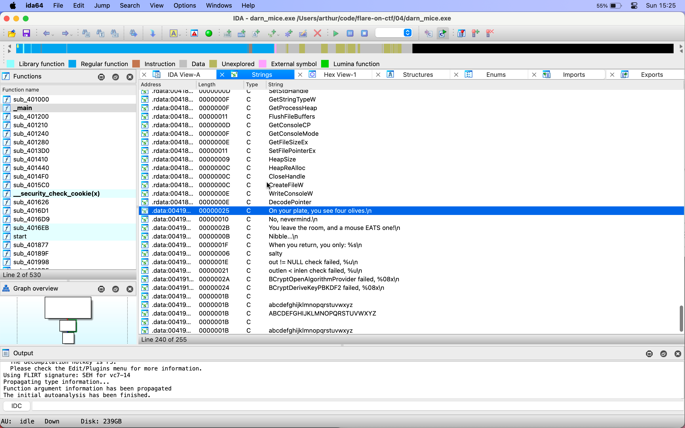
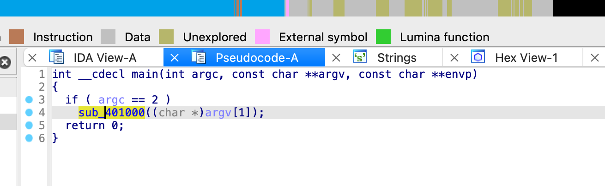
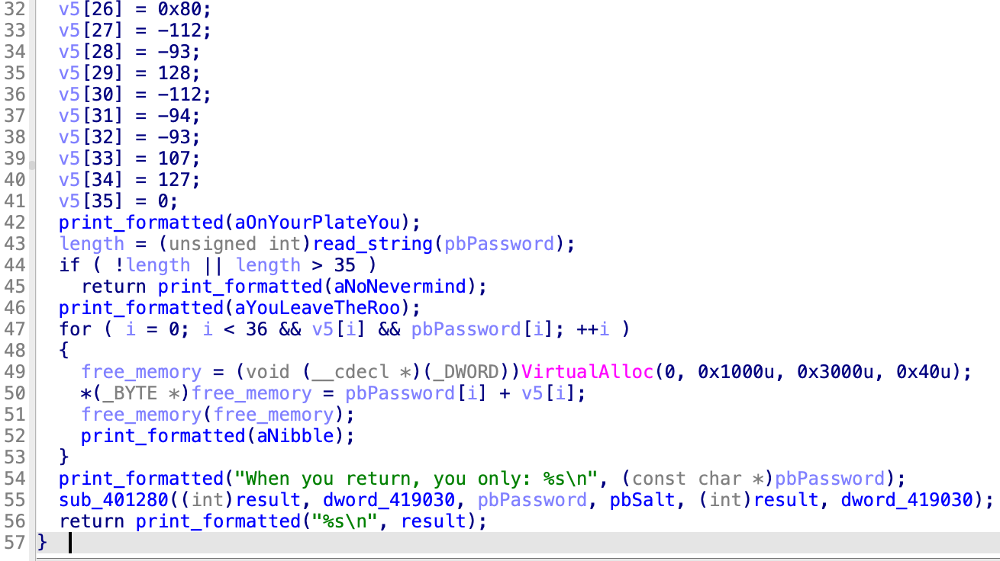

# Challenge 4: darn_mice

> "If it crashes its user error." - Flare Team

I started by investigating the given `exe` file in IDA. Like often, the _Strings_ subview took me to the interesting parts of the program.

The `main` function itself is quite simple: it checks if a command line argument is passed to the script. If there is such an argument we move on to another function. (Not two arguments, as one would be led to believe by `argc == 2`; the program name is one of the arguments.)

That function seems to be where the magic happens. It contains the following.

My analysis:

1. A 35-byte part of memory (here called `v5`) is allocated and filled with hardcoded values. The values don't seem random...
2. A message is printed and a password is read.
3. The characters of the password are added to the ones in `v5` byte-per-byte. After every one of these additions, the resulting bytes are executed as code, and some message is printed.
4. Another message is printed.
5. `sub_401280` is called, with the password, a salt and some other options. This seems like a properly good decryption function; I didn't spend much time looking at it but assumed the result must be the flag.
6. The result of this decryption(?) procedure is printed.

If my analysis of what's happening in that loop is correct, passing almost any string will result in errors... You can't simply execute any resulting string as if it were code. If if you could pass anything without causing problems, the last instruction bytes would need to be ones that take the program back to the main execution flow.

This last insight is important: NOP instructions won't do the trick. But I think putting a return statement there, will. I think the instruction I want is `0xC3`, a so called [near return](https://www.felixcloutier.com/x86/ret):

> Near return — A return to a calling procedure within the current code segment (the segment currently pointed to by the CS register), sometimes referred to as an intrasegment return.

I used python to calculate what I actually needed to enter for the addition to result in `0xC3`. This script is in `script.py`. It is apparently `see three, C3 C3 C3 C3 C3 C3 C3! XD`. The fact that this is readable text is already a good indicator... and indeed, entering this as password got me the flag back.

