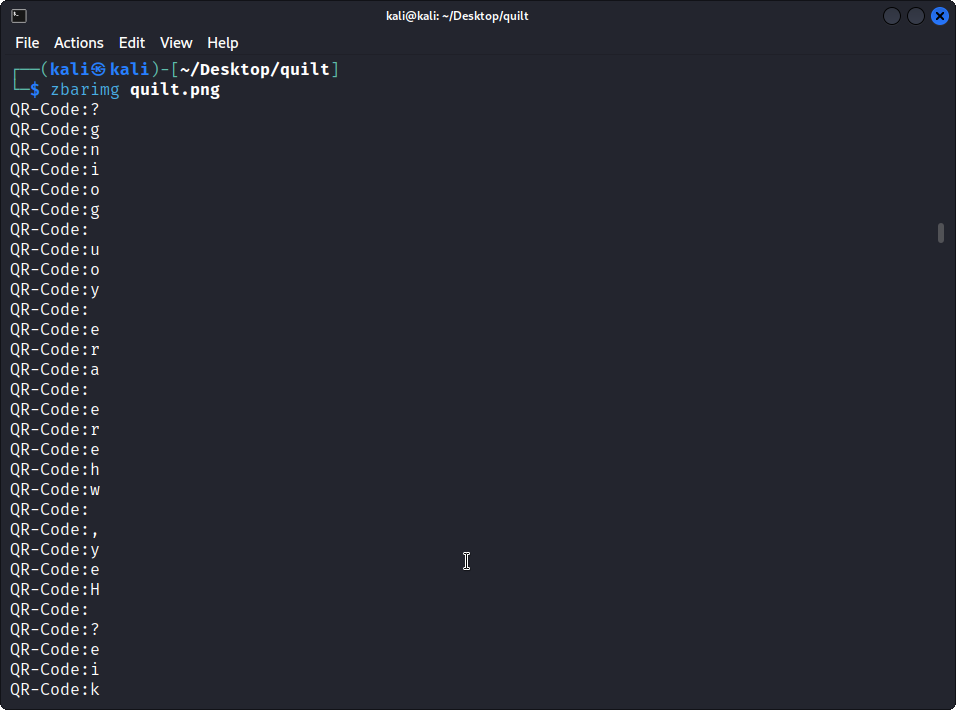
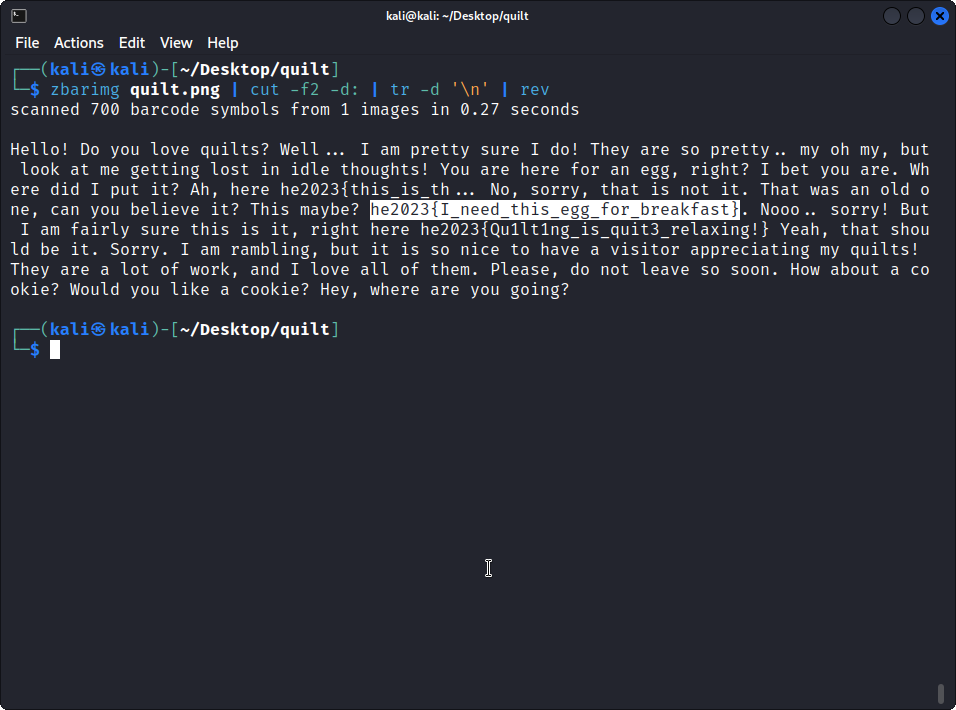

# Quilt

> A warm, sunny day - perfect weather for a picnic! But what's that - did the bunnies really bring the nice quilt from the living room as a blanket?

We don't have to split the image first, `zbarimg` will read all the codes at once. (I didn't know that... luckily I tried.)

The following command makes everything a lot more readable: It strips lots of text and concatinates everything to one line.

And there's our flag :)
