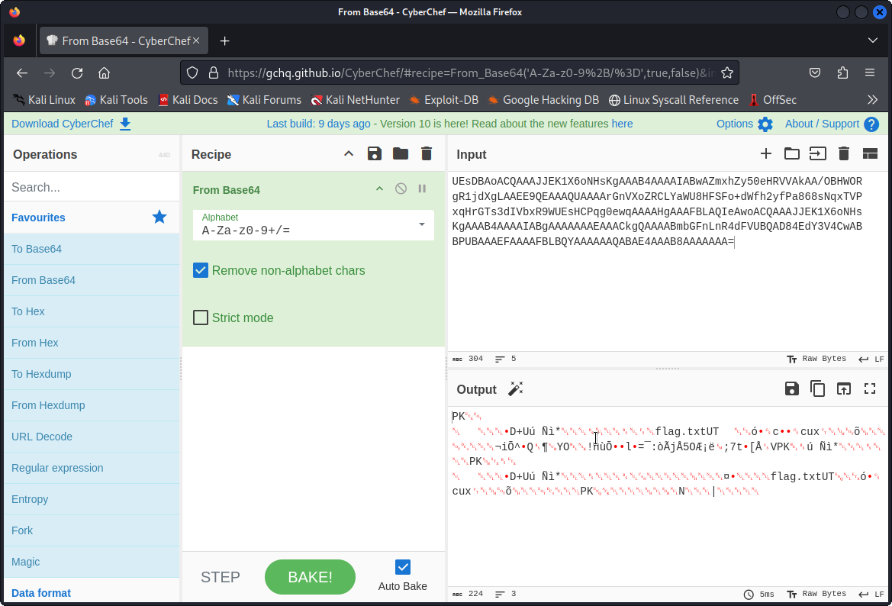
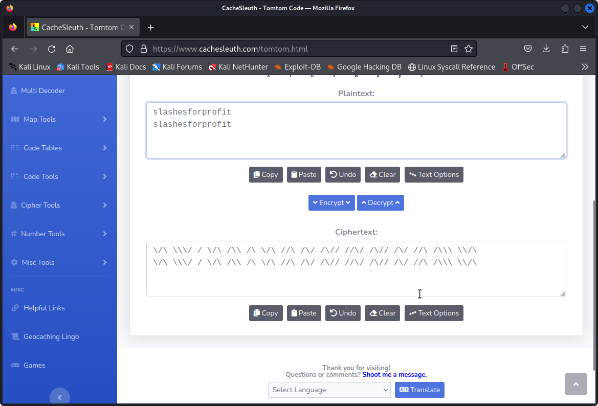

# Tom's Diary

> Tom found a flag and wrote something about it in his diary.
>
> Can you get the flag?

The given data is clearly base 64, I used CyberChef to decode it and the result clearly still looked like a file:

Cyberchef lets you easily save this as a file. `file` reveals this as an archive file, but the `flag.txt` inside is password protected. However, the characters in the header of the diary looked funny. Apparently -- this took some time as I didn't know TomTom -- it's TomTom. There's online utilities that can decode it:

This is the password to the zip file, with the flag (`he2023{sl4sh3s_m4k3_m3_h4ppy}`) inside.
