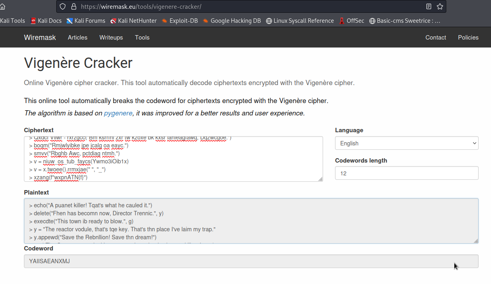
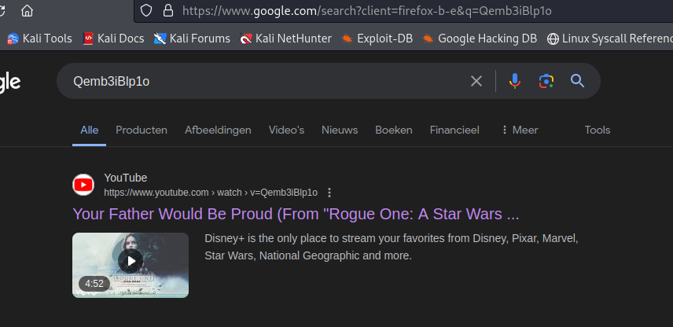

# EP 3.9 (Crypto)

> ???: is this in german?
> Operator: Lord, I dont exactly know. Its.. It..
> breathes
> chokes
> ...
> mechanical - whirring
> ???: You take over.
> Operator 2: Yes, my Lord.

## Solution

The text given in `transmission.txt` looked a lot like the given challenge text, but there also seem to be code fragments. The fact that the structure is still recognisable, made me think of a substitution cipher. I thought about [Vigenere](https://en.wikipedia.org/wiki/Vigen%C3%A8re_cipher) specifically, a popular choice for CTF competitions. 

There are a few web apps to help you crack such a cipher without a known key. I tried the following one, and only had to vary the length of the key to find the following:



There text itself seems star wars themed and the code fragments look like Python... makes sense. However, the text isn't perfect yet. The python call at the end, for example, clearly has to be `.lower().replace()`. I tried playing with key in Cyberchef and only had to change one letter. The right key is `YAIISANANXMJ`, making the resulting text:

```
> echo("A planet killer! That's what he called it.")
> delete("When has become now, Director Krennic.", y)
> execute("This town is ready to blow.", x)
> y = "The reactor module, that's the key. That's the place I've laid my trap."
> y.append("Save the Rebellion! Save the dream!")
> xor("The Force moves darkly near a creature that is about to kill.", "Luke")
> Darth Vader - execute("Be careful not to choke on your aspirations, Director.")
> echo("Rebellions are built on hope.")
> send("Rogue One, pulling away.")
> x = name_of_the_track(Qemb3iBlp1o)
> x = x.lower().replace(" ", "_")
> print(f"jadeCTF{x}")
```

Now, it took me a while to find out what this flag was supposed to be... I didn't know what `Qemb3iBlp1o` was. I'm stupid for not googling it immediately..



A track indeed, star wars one! A YouTube handle for one, that is.

The flag is `jadeCTF{your_father_would_be_proud}`.

