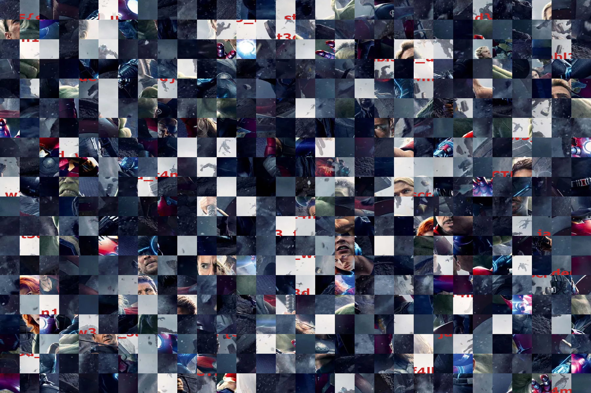

# Avengers Assemble!

> Yash loves playing Jigsaw puzzles. But he is stuck in this one. Can you help him?

The following image is given:

Clearly a jigsaw puzzle: we must re-arrange the pieces to something that makes sense.

I could manually do this using photoshop: in the end, only the relevant parts (which probably contain the flag...) must be reconstructed. However, I knew there was an [automated tool](https://github.com/nemanja-m/gaps) for this. Only took a few seconds :-)

