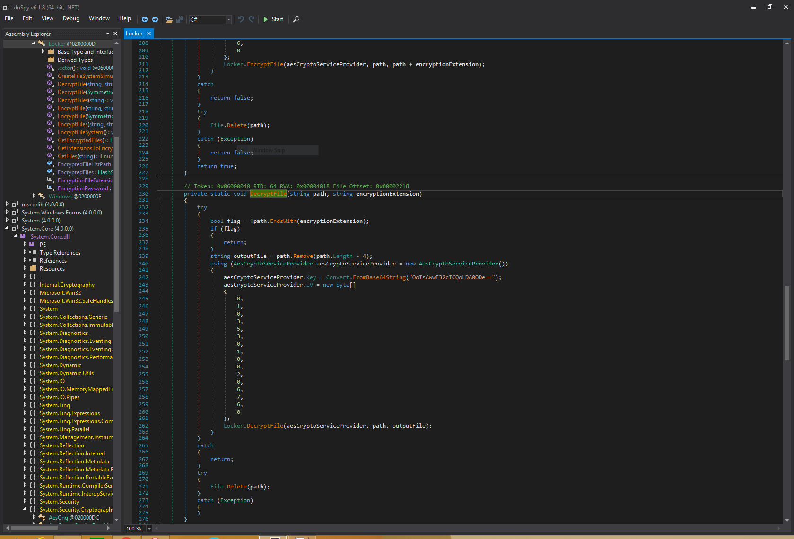
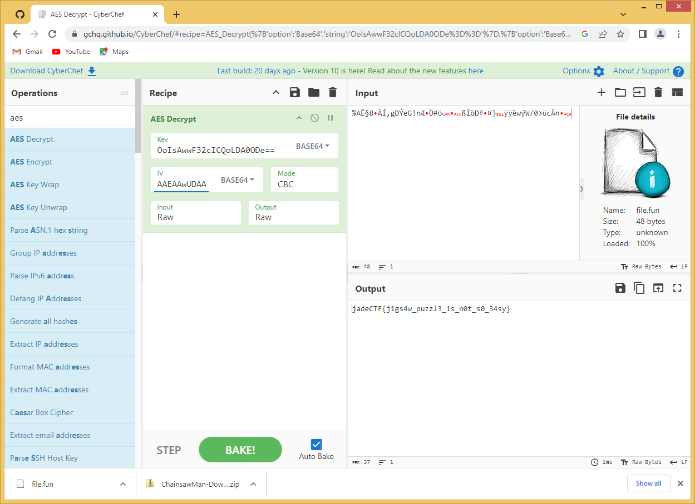

# Denji ex-machina

> Nick is a huge anime fan.
> Recently, he started watching Chainsaw Man and got really fascinated by it.
> He couldn\t wait for the new episodes, and downloaded an application which would "apparently" get him all the episodes straight away.
> Sadly, it turned out to be a malware, and encrypted all the files in his system.
> He needs your help. Provided is the malware and one of his files.
>
> WARNING! THIS CHALLENGE CONTAINS A LIVE MALWARE

It's a .NET executable, which makes dnSpy my tool of choice. The class called `Locker` immediately got my attention, and apparently even contains the instructions to decrypt files too:

I could compile my own .NET executable and use this class to decode the given file, but as it is simple AES, there are lots of tools that can help me instead of needing to compile something off my own. I used cyber chef to decrypt the file, 
and apparently it contains the flag:

