# ABNF: Grammer is fun

> There is binary provided, it check if flag is correct. However, it accepts more than just flag. From all accepted inputs, flag is (in that order):
>
> * correct (in sense of format),
> * shortest,
> * lexicographically first. So, shorter but not correct accepted input is not flag.
>
> Hint: all letters inside the brackets are small letters (all letters, except those which are forced by flag to be big).

First things first: I openend the given executable (`checker.out`) into IDA. I found the entry point of the program using the strings subview:

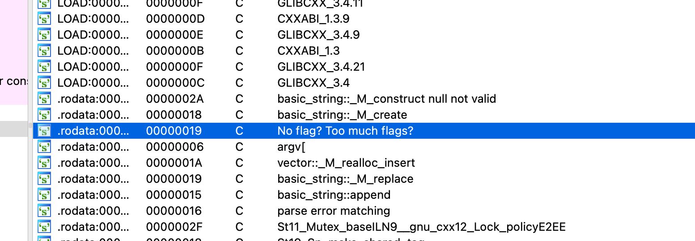

First, the program checks the amount of given arguments, a flag must be passed to the program.

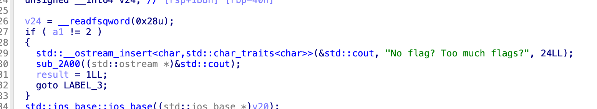

Now, the program seems to check against the string `"asia"`. 

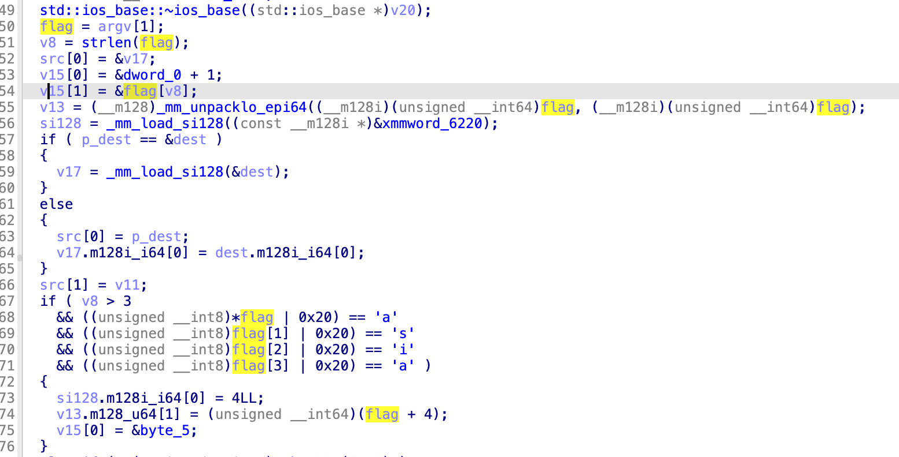

This does not make much sense: that's not the right flag format. Hence, I decided to focus on the procedure in the `else if` that followed. I assumed that's the function which will check the flag. Judging by the challenge text, this must be a procedure that matches a regular expression.

First, `justctf{` is matched. It probably has to be `justCTF{`, like the previous flags, but `| 0x20` converts everything to lower case. 

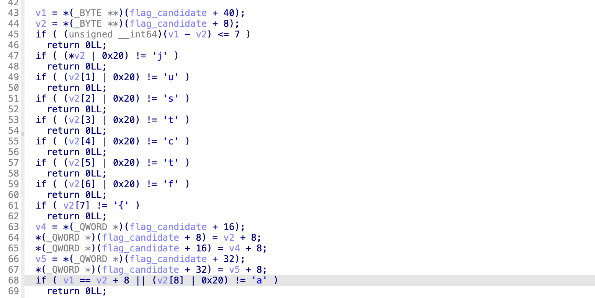

It must be followed by an `a` character, and possibly multiple `b` characters.

Then, there's a check in place for either `something_else`, `left` or `right`. 

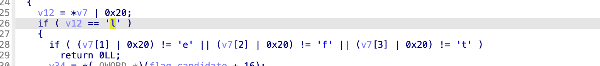

Then, an underscore-character follows, and either the word `short` or `long`.

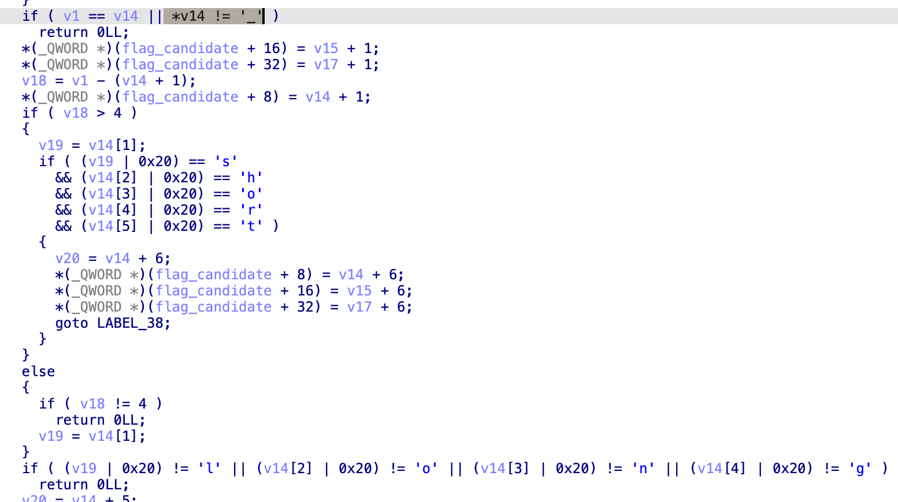

Now, optionally a sequence of `c` and `d` characters follows, followed by one more digits.

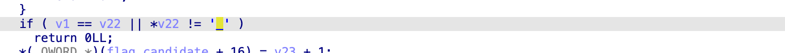

And again, an underscore, followed by either `simple` or `hard`.

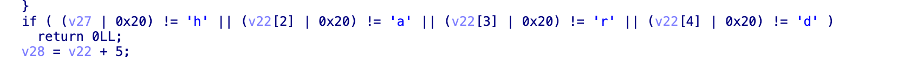

Now, as last part of the evaluation, I had to follow this subroutine.

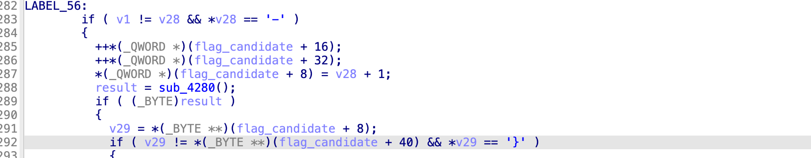

This subroutine looked like simple character checks, yet very repetitive ones.

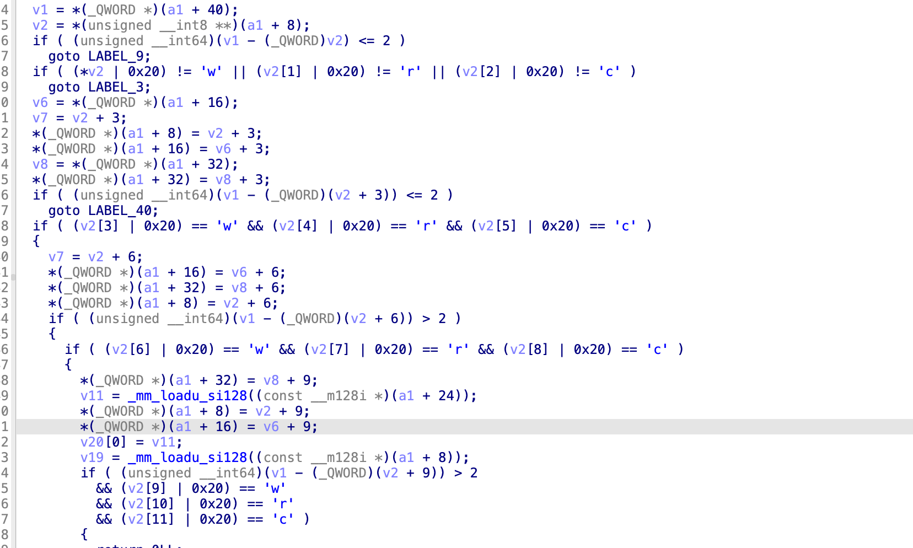
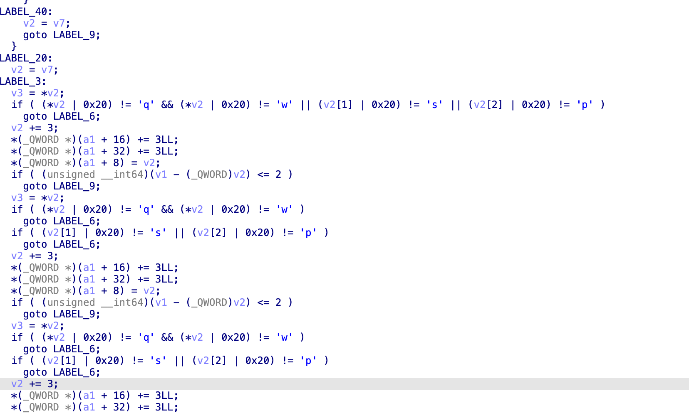
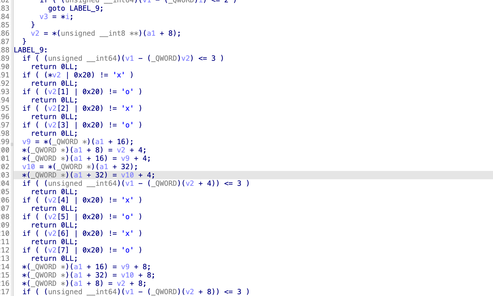

In summary, I think this last subroutine allows for:

* Zero, one, two, or three times `wrc`.
* Possibly repeating `qsp`, `wsp` or `cwr`.
* Four times `xo`.

## Regular Expression

I went fast over every part that looked optional (we're looking for the shortest possible flag anyway), so this might not be the exact regular expression. But it must be very much alike:

```
justCTF{a+b?(something_else|left|right)_(short|long)(c*)(d*)\d+_(simple|hard)-((wrc){0,3}(qsp|wsp|cwr)*)(xoxo){4}}
```

## Flag

That makes the flag they are looking for the following:

```
justCTF{aleft_long0_hard-xoxoxoxoxoxoxoxo}
```