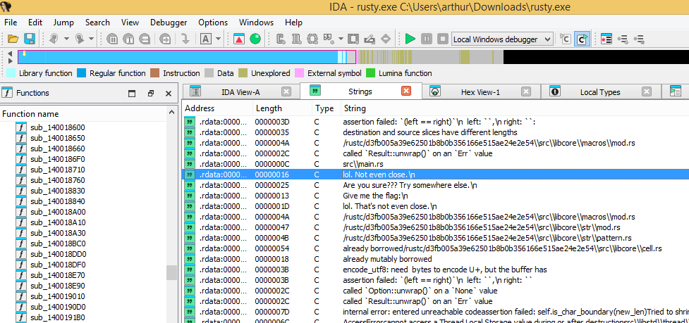
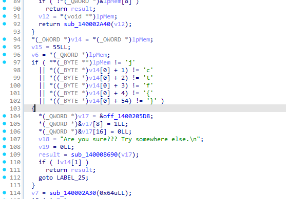
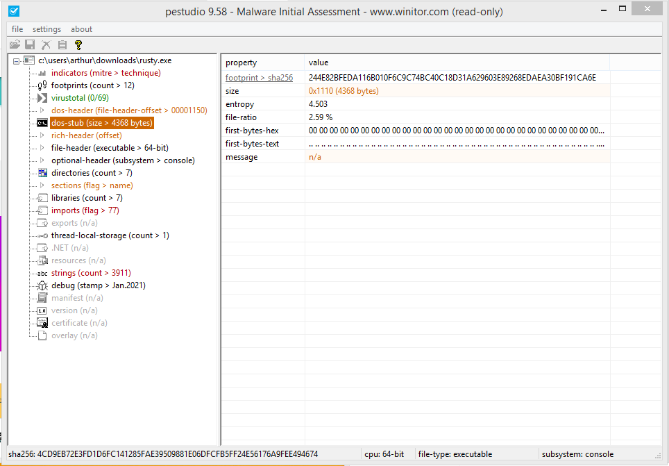
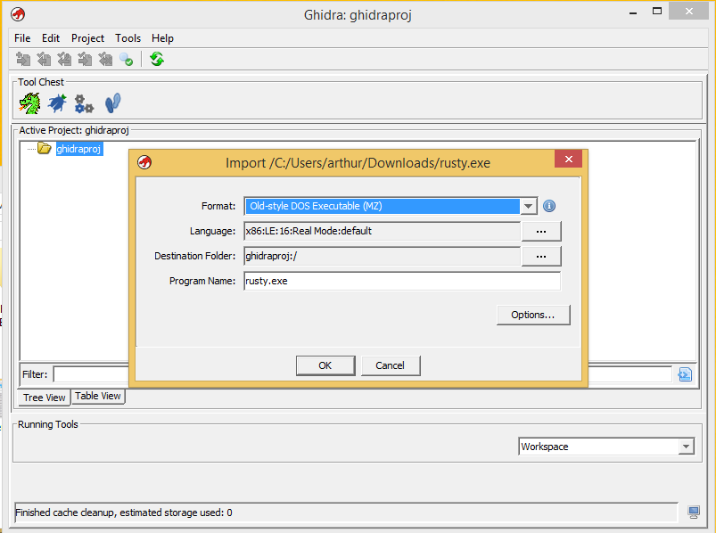
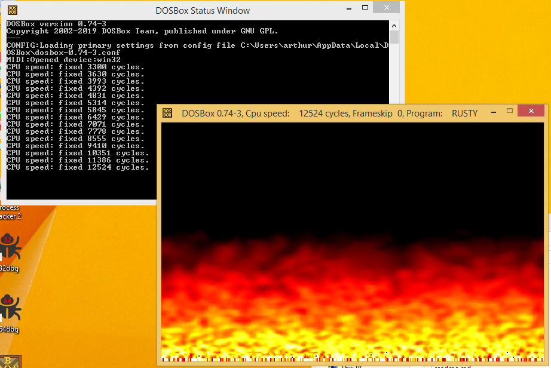
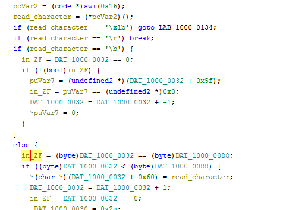
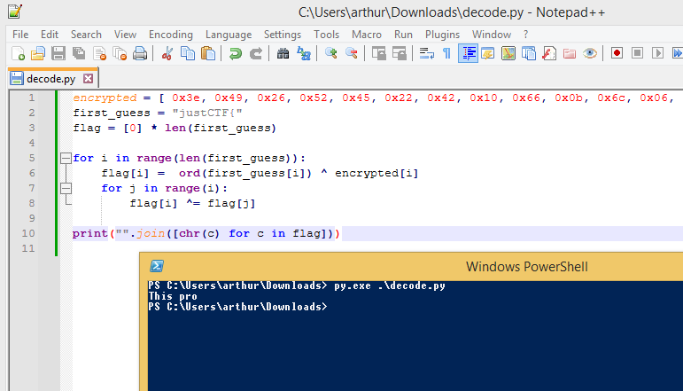
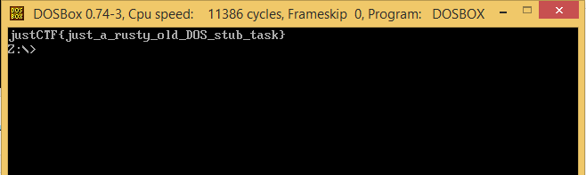

# Rusty

> Looking at Rust code in disassembler/decompiler hurts, so... look somewhere else.

I didn't quite get what the challenge was hinting at, so started by checking out the Rust program first anyway...

## 1. Rust program

Even though, yes, Rust code is not very readable in IDA, I could still find an entry point using the Strings subview:

And yes, it does seem to be a program that checks for a flag:

However, this would be a flag in a completely different format than the other challenges. Also, the message that's shown (even in case you enter this flag) seems to tell you to look elsewhere.

## 2. DOS program

Only then, I thought about the fact that Windows executables actually include a second program: a DOS one for backwards compatibility. Usually, it only prints `This program cannot be run in DOS mode.`, however, PE Studio seems to tell me this time the DOS program is longer than it usually is:

IDA Free does not support inspecting the DOS program, but Ghidra does. Just select the DOS program upon importing the file.

Indeed, it did not look like the usual DOS message. At this point, I intalled the dosbox emulator, and actually tried running this part of the program.

Okay, something is clearly going on. However, I can't seem to figure out more functionality than the flames animation. Checking out the source code now:

The program seems to continously read keyboard input (interrupt call `16h`), and do the following:

* Exit the program when pressing escape.
* Save all characters, except when backspace is pressed (logically, that removes a character).
* Validate the flag upon pressing Enter.

This last step seems to happen using this piece of encrypted data: 

![][screenshot7.png)

The encryption procedure seems to be entirely based on XOR-operations, and thus I figured replicating it in Python and putting in `justCTF{` was the logical next step.

The result `This pro` made me think of the typical DOS message `This program cannot be run in DOS mode.`. And indeed, when entering this I got the flag:

