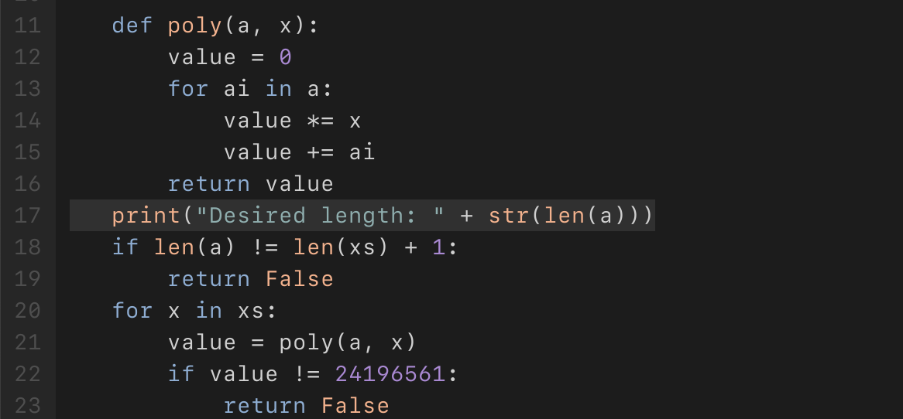

# JustCTF 2021: That's not crypto

I first decompiled the given `.pyc` file using uncompyle6. I stored the result here in `decompiled.py`. It looks like I have to enter the flag, and the program will do some calculation to verify it is right.

I now started making small edits to the script to get to know more about the flag. First, I added the following line to get to know the length of the flag:

This prints 58. This `xs` is the user-supplied flag, so the length of the flag must be 57. That means the correct flag will be `justCTF{xxxxxxxxxxxxxxxxxxxxxxxxxxxxxxxxxxxxxxxxxxxxxxxx}`.

Removing the length check from `validate()`, the function remains usable, and can even be used to check the first N characters of the flag. That can be used for brute forcing, which I did in `solution.py`. In less than a second, it throws out the correct flag: `justCTF{this_is_very_simple_flag_afer_so_big_polynomails}`.

