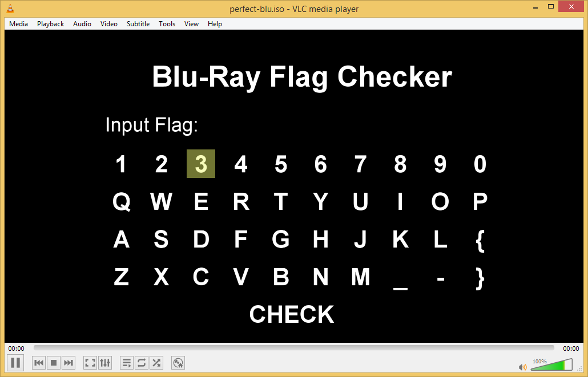
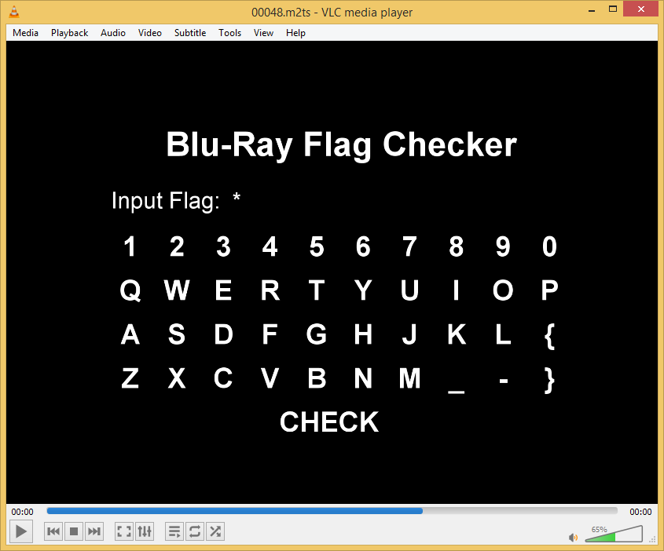
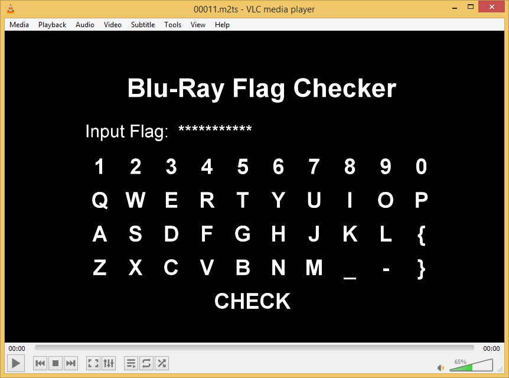
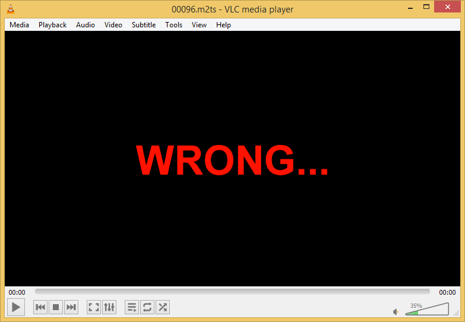
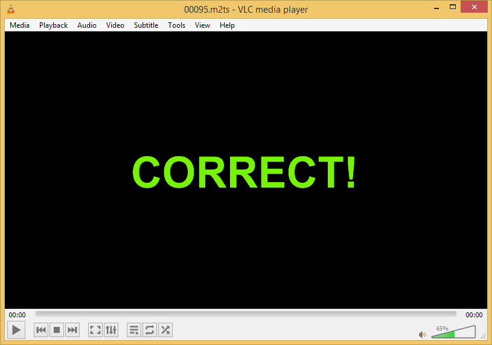
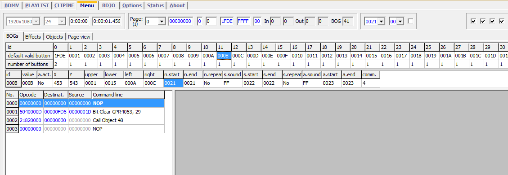
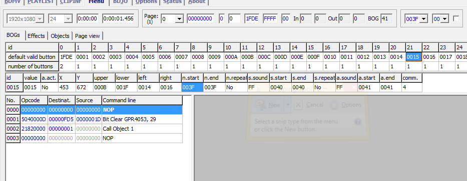
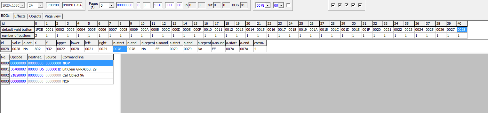

# Perfect Blu

> No, I'm real!

The given archive contains an `.iso` image. I mounted it on a VM, expecting it to be an operating system or something executable, but it actually looked like a (blu-ray?) disk image I usually associate with movies. "Playing" it using VLC, I got the following:



I had never dealt with this kind of reversing challenge, but my first idea was to check out the files on the disk. The important stuff seems to be inside of `STREAMS`.

E.g. Stream 48 looks like where you're supposed to end up after entering one character.



And so on... (the file name numbers don't seem to correlate with the characters entered already.)



There are two special ones: 96 and 95.





After some search around online I found a tool called BDEdit. This tool allowed me to inspect the inner workings in more detail. This is the first frame. Notice:

* The button with id 21 executes `Call Object 1`.
* The button with id 40 executes `Call Object 96`. (The "Wrong ..." message)
* All other buttons execute `Call Object 48` (The "Input flag: *" message)







This makes sense: only button 21 (the button itself shows an `S`) takes the program to a next state (apparently, that's object 1), all the others are bound to end up at `Wrong`.

Now I checked out object 1, there the button to click seems to be the one with id 12, ... and so on. I wrote those all down until eventually I ended up at 95 (the `Correct` message).

See the Python script in `solution.py` for the complete list and the calculation of the final flag:

```
SECCON{JWBH-58EL-QWRL-CLSW-UFRI-XUY3-YHKK-KFBV}
```
