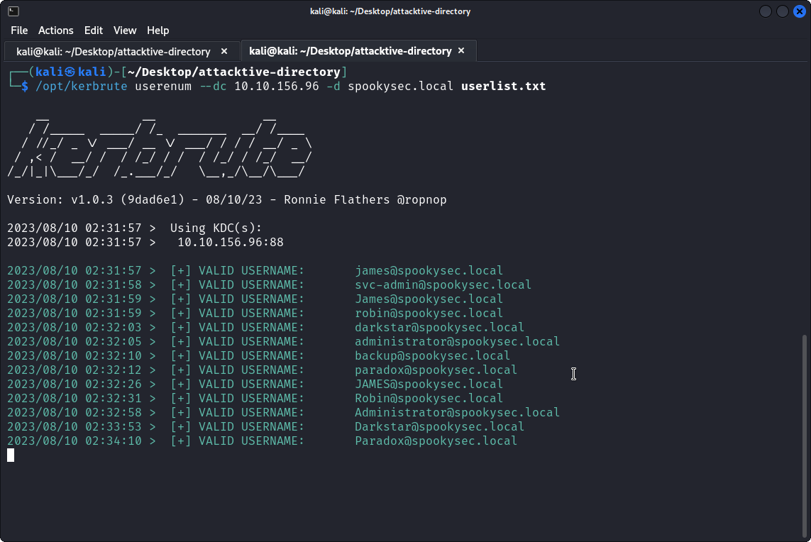
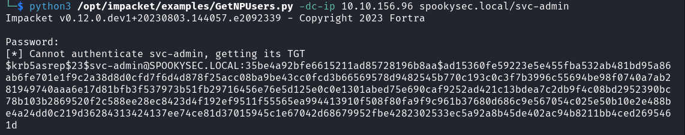
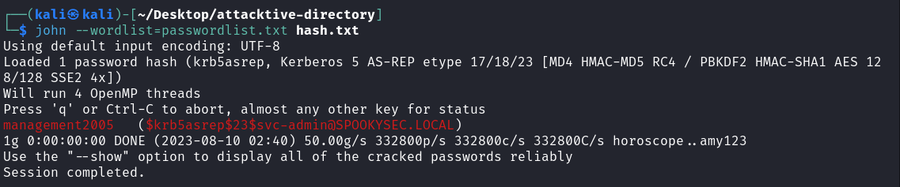
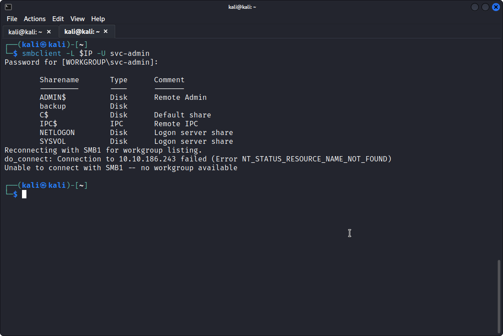
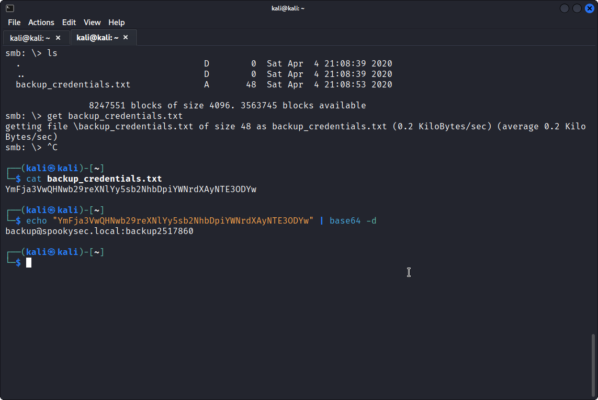
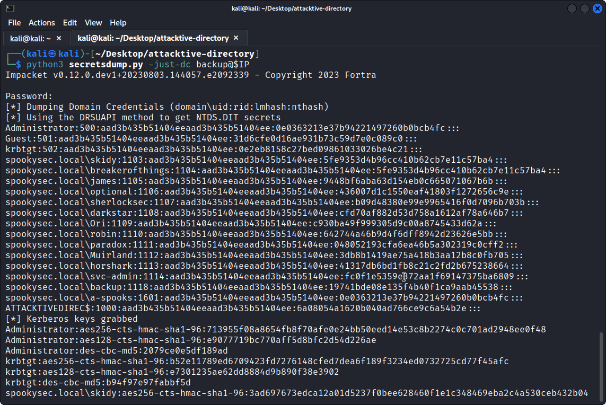
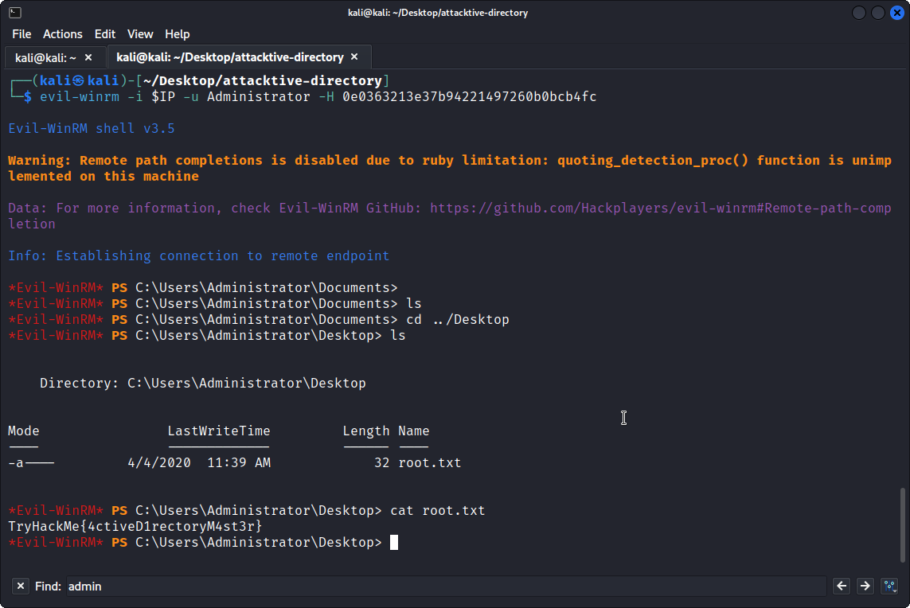

# TryHackMe: Attacktive Directory

*[Link](https://tryhackme.com/room/attacktivedirectory)*

This *Easy* box's instructions are very much written like a walkthrough, so my personal notes here are very limited.

## Task 1: Deploy the machine

This chapter contains nothing new: deploying the machine, connecting to the TryHackMe VPN, ...
I got the following machine IP:

```
10.10.156.96
```

## Task 2: Setup

This chapter contains instructions on installing Impacket, Bloodhound and Neo4j. Impacket is a collection of Python classes for working with network protocols. Bloodhound is a single-page web application that uses graph theory to reveal the hidden and often unintended relationships within an Active Directory environment. Neo4j is a graph database management system.

## Task 3: Welcome to Attacktive Directory

Answers:

* **What tool will allow us to enumerate port 139/445?** `enum4linux`
* **What is the NetBIOS-Domain Name of the machine?** `THM-AD`
* **What invalid TLD do people commonly use for their Active Directory Domain?** `.local`

I stored the `enum4linux` result in `enum4linux.log**.

## Task 4: Enumerating Users via Kerberos

I saved the given wordlists in this directory, and used them like this:



Answers:

* **What command within Kerbrute will allow us to enumerate valid usernames?** `userenum`
* **What notable account is discovered?** `svc-admin`
* **What other notable account is discovered?** `backup`

## Task 5: Abusing Kerberos

I used the following to retrieve a ticket for `svc-admin`:



And then I used John, with the provided password list, to crack the password:



Answers:

* **Which user account can you query a ticket from with no password?** `svc-admin`
* **What type of Kerberos hash did we retrieve from the KDC?** `Kerberos 5 AS-REP etype 23`
* **What mode is the hash?** `18200`
* **What is the user accounts password?** `management2005`

## Task 6: Back to the Basics





* **What utility can we use to map remote SMB shares?** `smbclient`
* **What option will list shares?** `-L`
* **How many remote shares is the server listing?** `6`
* **There is one particular share that we have access to that contains a text file. Which share is it?** `backup`
* **What is the content of the file?** `YmFja3VwQHNwb29reXNlYy5sb2NhbDpiYWNrdXAyNTE3ODYw`
* **Decoding the contents of the file, what is the full contents?** `backup@spookysec.local:backup2517860`


## Task 7: Elevating Privileges within the Domain



* **What method allowed us to dump NTDS.DIT?** `DRSUAPI`
* **What is the Administrators NTLM hash?** `0e0363213e37b94221497260b0bcb4fc`
* **What method of attack could allow us to authenticate as the user without the password?** `pass the hash`
* **Using a tool called Evil-WinRM what option will allow us to use a hash?** `-H`

## Task 8: Flag Submission Panel


