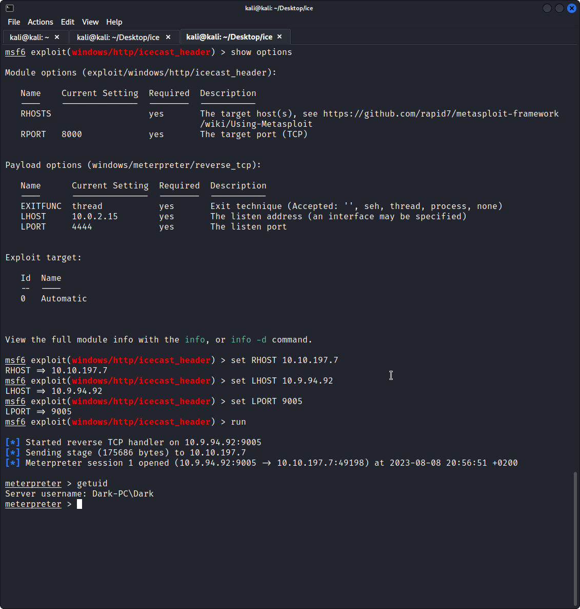
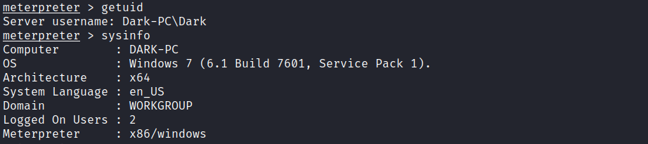
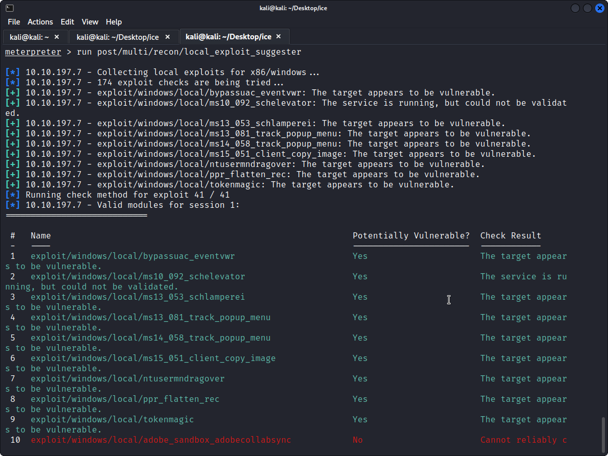
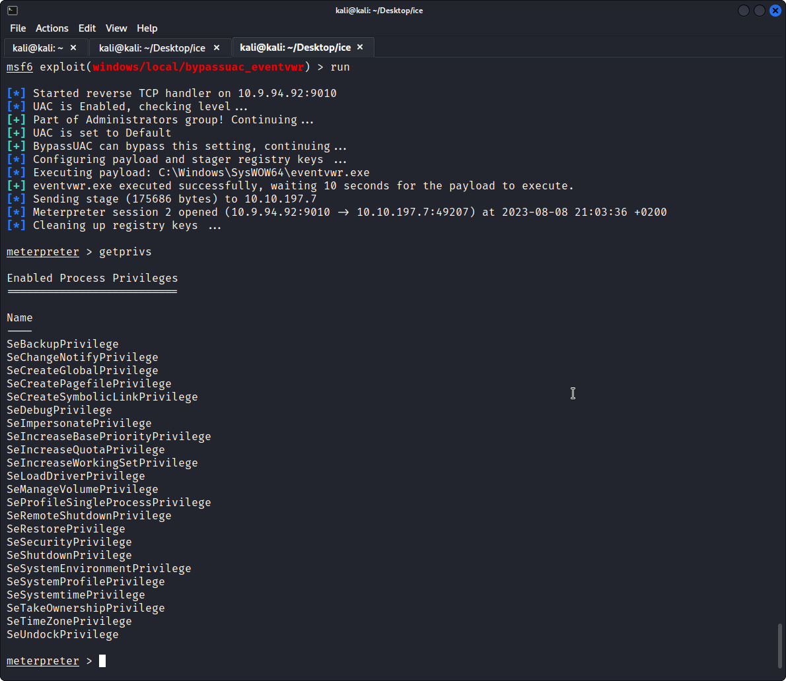
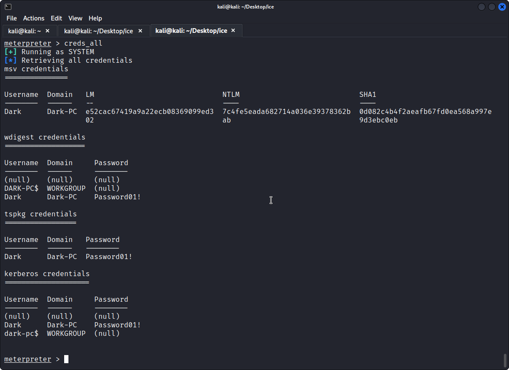

# TryHackMe: ice

> Deploy & hack into a Windows machine, exploiting a very poorly secured media server.

*[Link](https://tryhackme.com/room/ice)*

## Recon

I got the following machine IP:

```
export IP=10.10.197.7
```

I did an NMAP scan with the following parameters, which immediately gave me all the answers TryHackMe was looking for.

```
nmap -sV -sC -O $IP | tee nmap.log
```

Answers:

* **What service did nmap identify as running on port 8000?** Icecast
* **What port is Microsoft Remote Desktop open on?** 3389
* **What does NMAP identify as hostname of this machine?** DARK-PC

## Gain Access

They seem to be looking for [CVE-2004-1561](https://nvd.nist.gov/vuln/detail/CVE-2004-1561), and exploit `exploit/windows/http/icecast_header`.



Answers:

* **What icecast vulnerability did you identify?** Execute code overflow
* **What is the CVE number for this vulnerability?** CVE-2004-1561
* **What metasploit exploit will you use?** `exploit/windows/http/icecast_header`
* **What exploit option do you need to set that is currently blank?** RHOSTS

## Escalate

I used `sysinfo` and `getuid` to get the first few answers:



Then I ran `run post/multi/recon/local_exploit_suggester`, found out about `exploit/windows/local/bypassuac_eventvwr` and ran it. The last answer comes from `getprivs`.




Answers:

* **What's the name of the shell we have now?** Meterpreter
* **What user was running that Icecast process?** Dark
* **What build of Windows is the system?** 7601
* **What architecture is running?** x64
* **What is the full path (starting with exploit/) for the first returned exploit?** `exploit/windows/local/bypassuac_eventvwr`
* **What option do we need to set?** LHOST
* **What permission listed allows us to take ownership of files?** `SeTakeOwnershipPrivilege`

## Looting

I just followed the given instructions carefully to first migrate to a `NT AUTHORITY\SYSTEM` process and then run Minikatz (kiwi).



* **What's the name of the printer service?** `spoolssv.exe`
* **What user is listed from the selected process?** `NT AUTHORITY\SYSTEM`
* **Which command allows up to retrieve all credentials?** `creds_all`
* **What is the password of the `Dark` user?** `Password01!`

## Post-Exploitation

All these answers are just found in the `help` text.

* **What command allows us to dump all of the password hashes stored on the system?** `hashdump`
* **What command allows us to watch the remote user's desktop in real time?** `screenshare`
* **How about if we wanted to record from a microphone attached to the system?** `record_mic`
* **What command allows you to modify timestamps on files?** `timestomp`
* **How do you create a "golden ticket" to log in, using Minikatz?** `golden_ticket_create`

