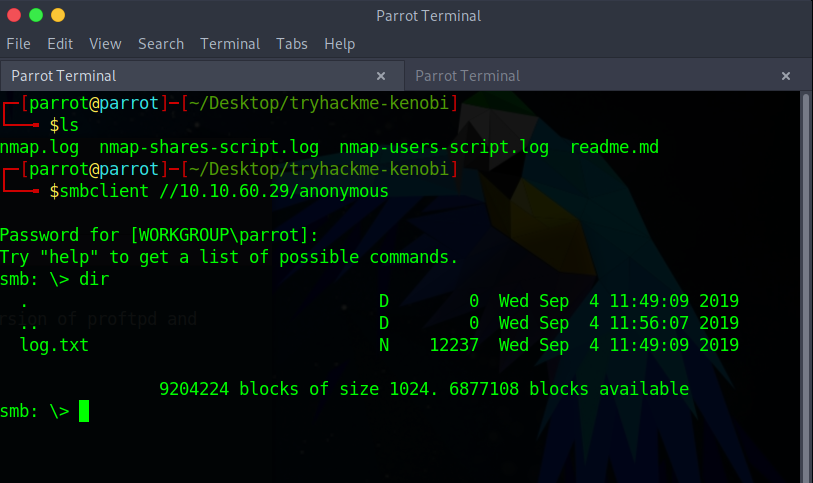
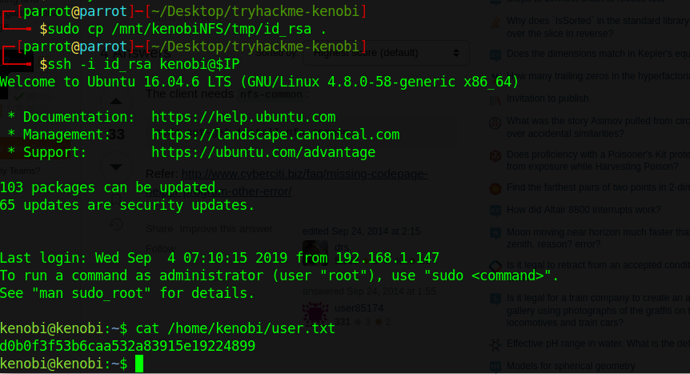
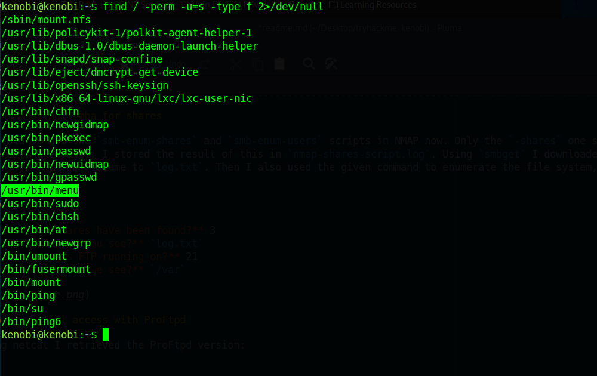
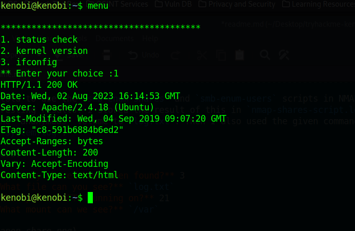
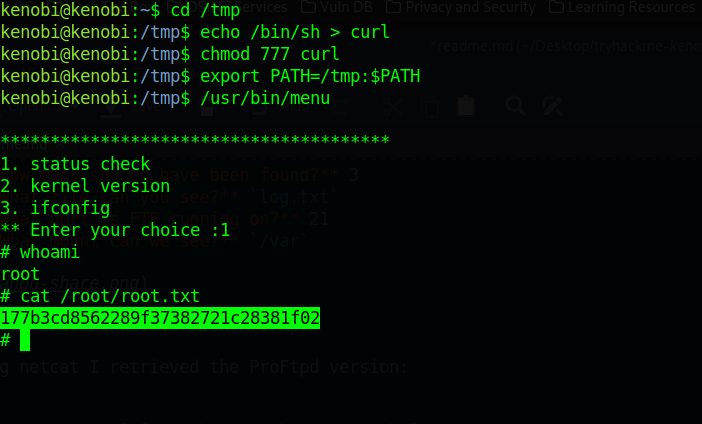

# TryHackMe: Kenobi

> Walkthrough on exploiting a Linux machine. Enumerate Samba for shares, manipulate a vulnerable version of proftpd and escalate your privileges with path variable manipulation.

*[Link](https://tryhackme.com/room/kenobi)*

## Recon

I was given this IP address:

```
10.10.60.29
```

I performed an NMAP scan, see `nmap.log`.

Answers:

* **How many ports are open?** 7

## Enumerating Samba for shares

I'm told to use the `smb-enum-shares` and `smb-enum-users` scripts in NMAP now. Only the `-shares` one seemed to have interesting results. I stored the result of this in `nmap-shares-script.log`. Using `smbget` I downloaded the file I found on the *anonymous* volume to `log.txt`. Then I also used the given command to enumerate the file system, this is in `nmap-file-system.log`. 

Answers:

* **How many shares have been found?** 3
* **What file can you see?** `log.txt`
* **What port is FTP running on?** 21
* **What mount can we see?** `/var`



## Gain initial access with ProFtpd

Using netcat I retrieved the ProFtpd version:

```
┌─[parrot@parrot]─[~/Desktop/tryhackme-kenobi]
└──╼ $nc $IP 21
220 ProFTPD 1.3.5 Server (ProFTPD Default Installation) [10.10.60.29]
```

I found 4 exploits for this specific version using `searchsploit`. I carefully followed the instructions in the TryHackMe to copy the private SSH key and mount the remote, and found the following key file:



## Privilege Escalation with Path Variable Manipulation

This `/usr/bin/menu` with a SUID bit seems strange.



It does the following:



Which I can manipulate by changing the `PATH` variable.


