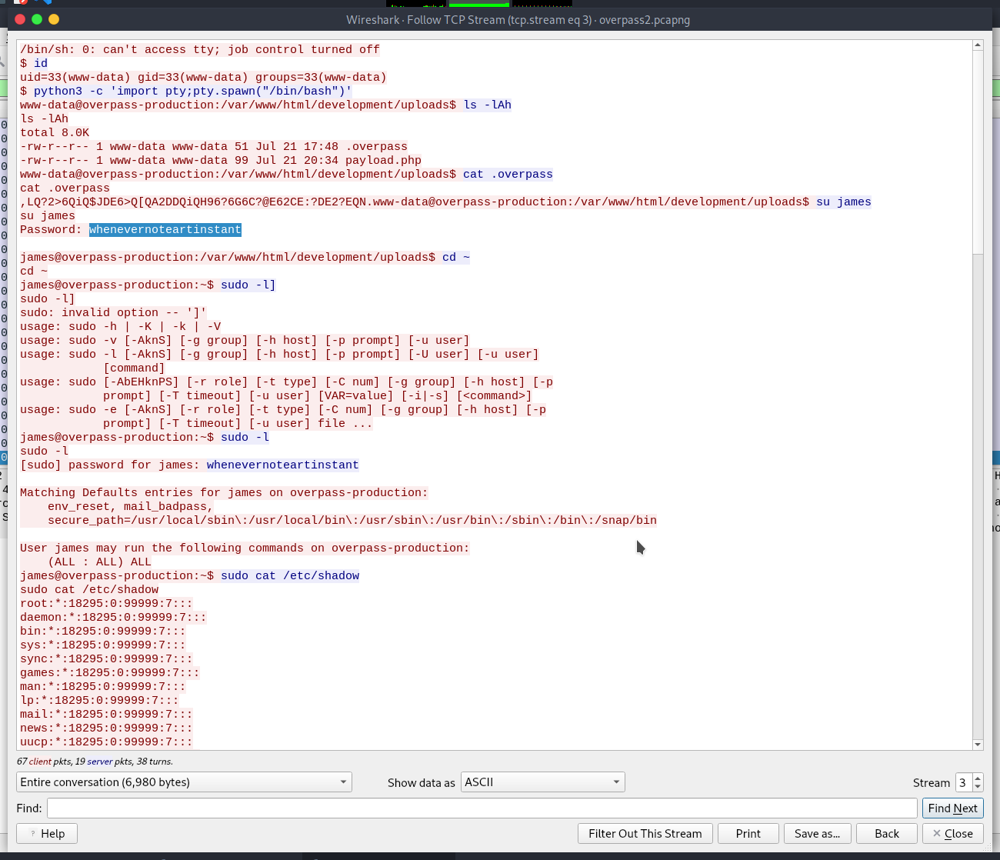
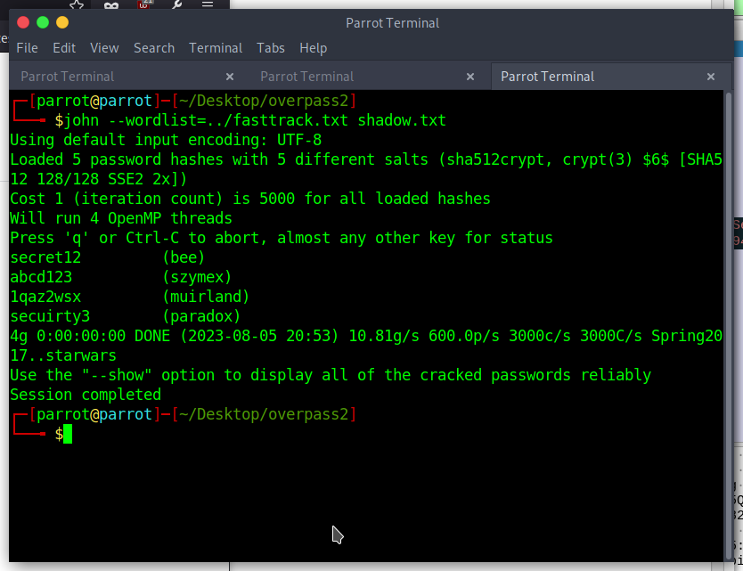
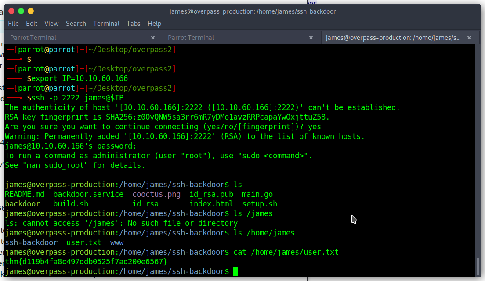
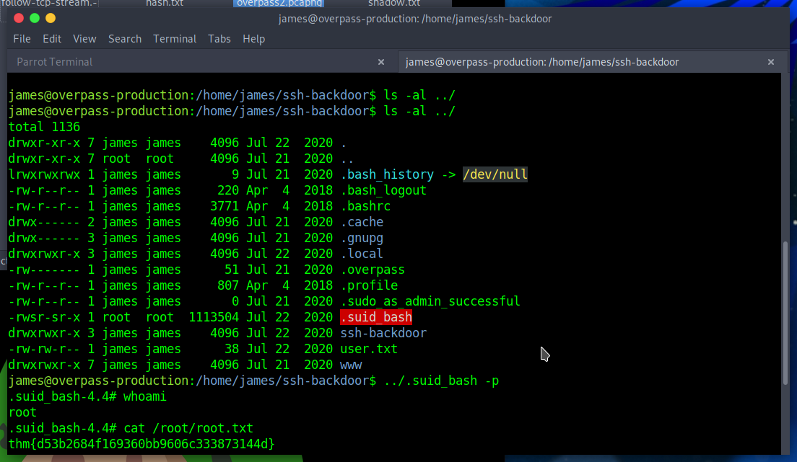
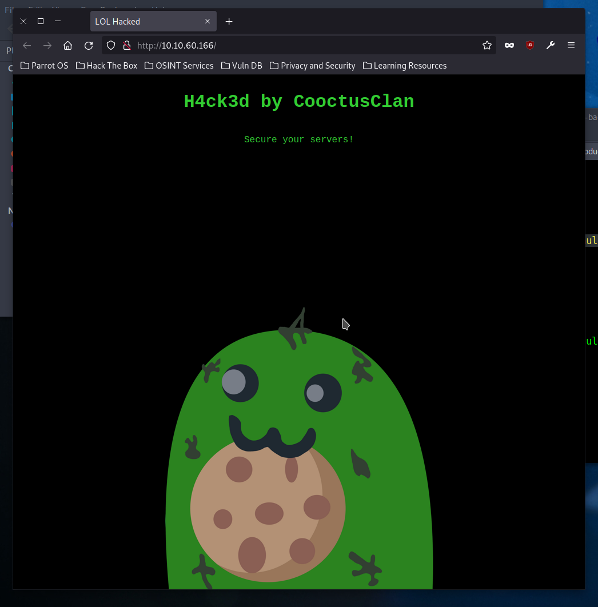

# TryHackMe: Overpass 2

> Overpass has been hacked! The SOC team (Paradox, congratulations on the promotion) noticed suspicious activity on a late night shift while looking at shibes, and managed to capture packets as the attack happened.

## Task 1: Forensics - Analyse the PCAP

All the answers are clear in the PCAP file. I like using Wireshark to analyse these. The *Follow TCP stream* function is very useful to get the TCP traffic of the reverse shell in a readable format:

There's one  more question:

> Using the fasttrack wordlist, how many of the system passwords were crackable?

I just downloaded the fasttrack wordlist online and cracked them myself:

## Task 2: Research - Analyse the code

The answers to these questions are in the [backdoor source code](https://github.com/NinjaJc01/ssh-backdoor), found on GitHub. I cracked the hash (SHA512 with a salt) using John the Ripper. The password was `november16`.

## Task 3: Attack - Get back in!

I used the attackers backdoor and his password to get back in, and `cat` the user flag. Privilege escalation was possible because I found a bash copy with SUID bit set.

The attackers indeed defaced the website:

