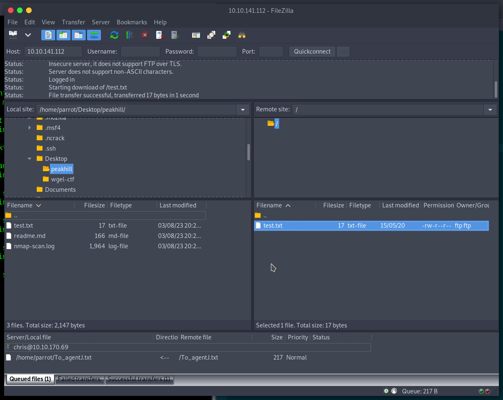
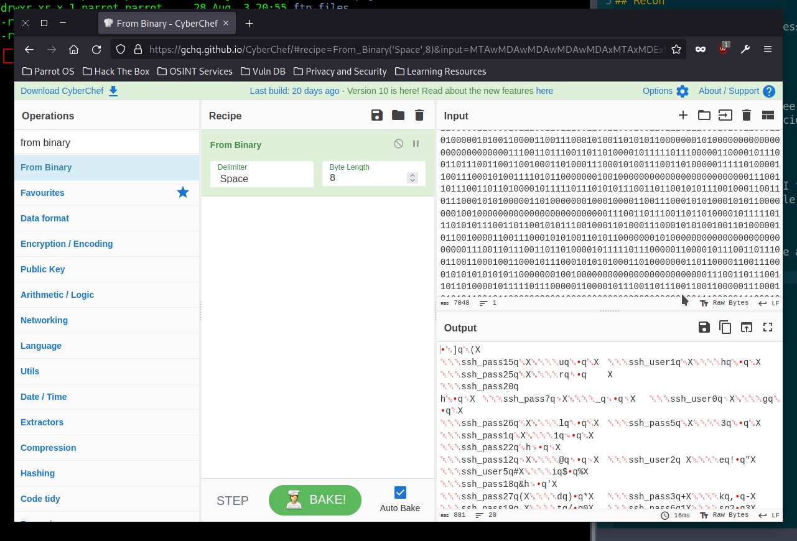
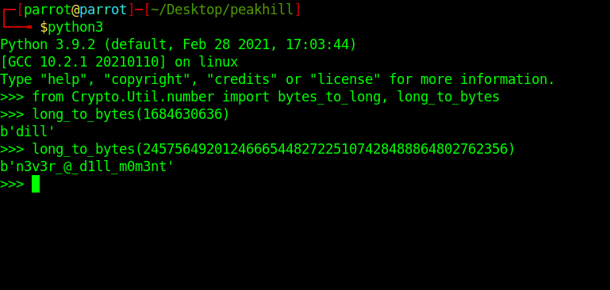
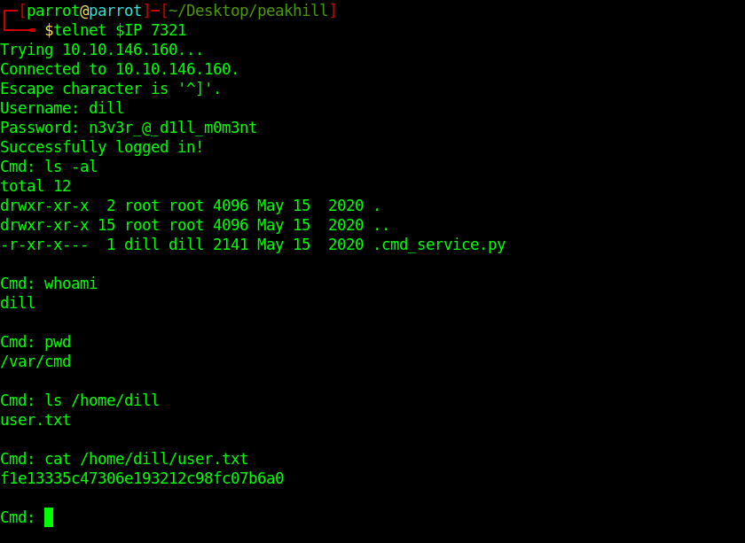
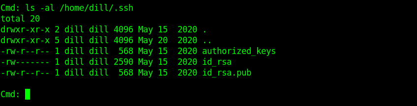
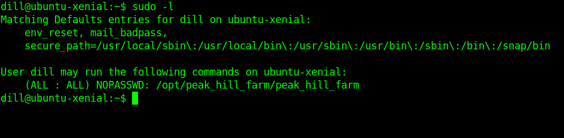
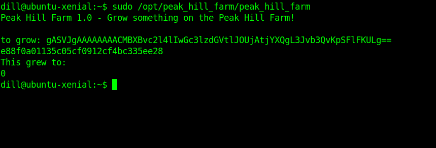

# TryHackMe: Peak Hill

*[Link](https://tryhackme.com/room/peakhill)*

## Recon

I got the following IP address:

```
10.10.141.112
```

I first did an NMAP scan, see `nmap-scan.log`. The FTP server with anonymous
access enabled looked suspicious. I used Filezilla to log in, and only found the
FTP server test file.



Or at least, so I thought! I forgot to make dotfiles visible in the FileZilla
settings. Then I found a file called `.creds`.

## Unciphering `.creds`

The `.creds` file looks like a binary literal. I used CyberChef to decode that:



Now this looks like a [pickled](https://docs.python.org/3/library/pickle.html)
Python object. I wrote a script in `unpickle.py` to unpickle it. It contained an
object like this:

```
[('ssh_pass15', 'u'), ('ssh_user1', 'h'), ('ssh_pass25', 'r'), ('ssh_pass20', 'h'), ...
```

The script then assembles the complete ssh_pass and ssh_user variables. The
result was the following:

```
┌─[parrot@parrot]─[~/Desktop/peakhill]
└──╼ $python3 unpickle.py 
User: gherkin
Password: p1ckl3s_@11_@r0und_th3_w0rld
```

This was a valid SSH login. There was a file in the `gherkin` home folder called
`cmd_service.pyc` (Python bytecode), which I copied to my machine to inspect.
 
## Investigating the `pyc` file

I installed `uncompyle6` and ran it on the file I found, and saved the result in
`cmd_service.py`. The file seems to be a service prompting for a username and
password, and these lines seem important:


```
username = long_to_bytes(1684630636)
password = long_to_bytes(2457564920124666544827225107428488864802762356)
```

These translate to the following.



Actually running the service using a telnet connection, these credentials seem
right! 

## User Flag



## Root Flag

I also found a `.ssh` folder in the `dill` root.



I copied `id_rsa` and used it to log in using SSH. There's one command we can
run with sudo permissions, which will probably be a privilege escalation vector.



I tried some silly input and the following interesting error message was thrown:

```
dill@ubuntu-xenial:~$ sudo /opt/peak_hill_farm/peak_hill_farm
Peak Hill Farm 1.0 - Grow something on the Peak Hill Farm!

to grow: mqsdkjfmqaksjdfmkjqsdmfjkqmsdkf
failed to decode base64
```

I did some trial and error: it's not a system command, no buffer overflow, ...
It looks like we must enter a Python function to execute, again as a Pickle.

I wrote the script `create-payload.py` to make a function that executes
`cat /root/root.txt` and dump it as a Pickle in base64. This worked!


 
I used this more detailed tutorial on Python Pickle exploitation: [Link](https://davidhamann.de/2020/04/05/exploiting-python-pickle/).

